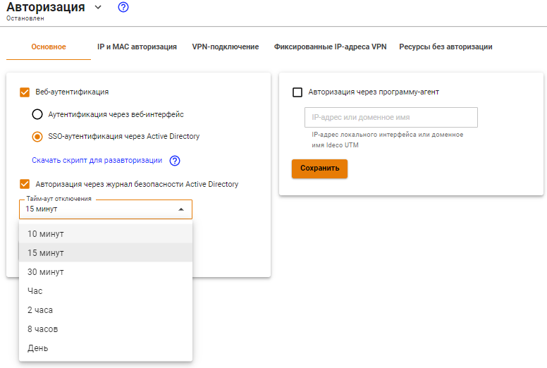

# Авторизация пользователей

## Общая информация

Существует несколько способов авторизации, с которыми вы можете ознакомиться в текущем подразделе.

Все виды авторизации на Ideco UTM являются IP-based \(работают на основе IP адреса хоста\) и любая сессия авторизации привязана к IP хоста, с которого она установлена. Под одной пользовательской учетной записью возможна одновременная авторизация до 3-х устройств \(динамическими способами авторизации, по веб, Kerberos/NTLM, логам безопасности контроллеров домена Active Directory, VPN\).

Пользователь автоматически разавторизуется при не активности \(отсутствии соединений с сетью Интернет\) в течение 15 минут \(кроме подключений по VPN\).

Вы можете изменить время автоматической разавторизации с помощью настройки **Тайм-аут разавторизации**, перейдя в раздел **Пользователи -&gt; Авторизация**:


Для применения нового тайм-аута разавторизации требуется перезагрузка Ideco UTM.


Также вы можете авторизовать пользователей, подключающихся по VPN по протоколам[ IPSec IKEv2](../../services/vpn-tunnel-protocols/client-to-site/ipsec-ikev2.md), [SSTP](../../services/vpn-tunnel-protocols/client-to-site/sstp.md), [L2TP IPSec](../../services/vpn-tunnel-protocols/client-to-site/l2tp-ipsec.md) и [PPTP.](pptp.md)

