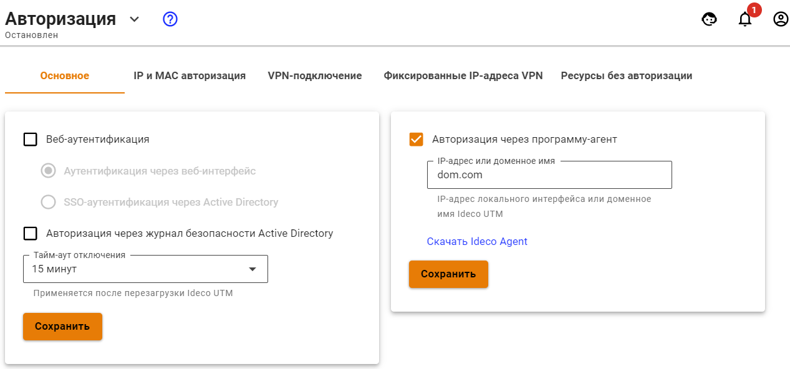
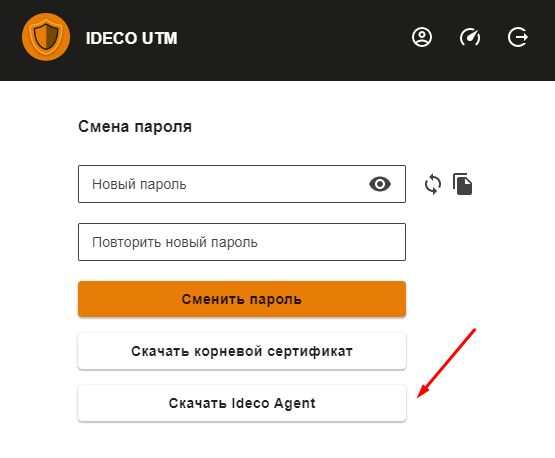

# Авторизация через Ideco Agent

**Ideco Agent** - специализированная программа-агент для управления доступом пользователей в сеть Интернет. Доступ будет обеспечен только в то время, когда пользователь авторизован с помощью этой программы. Программа должна быть установлена на рабочей станции пользователя или запускаться с удаленного сервера при входе в систему.

Для авторизации с помощью программы-агента необходимо включить настройку **Авторизация через программу-агент** в разделе **Пользователи -&gt; Авторизация** и заполнить поле **IP-адрес или доменное имя**. В него нужно ввести IP-адрес одного из локальных интерфейсов Ideco UTM или доменное имя Ideco UTM. После включения настройки программу IdecoAgent можно скачать по ссылке ниже либо из личного кабинета пользователя.

Пример окна с настройкой авторизации через программу-агент представлен на скриншоте ниже:

Необходимым условием успешной авторизации с помощью IdecoAgent является указание в настройках сетевой карты в качестве шлюза и в качестве сервера DNS локального адреса интернет-шлюза Ideco UTM. При необходимости нужно разрешить в межсетевом экране подключение на сетевой порт 800/TCP из внутренней сети.

После запуска программы необходимо ввести логин и пароль пользователя. Состояние авторизации отображается иконкой в системном лотке. Возможные состояния представлены в следующей таблице.

| Индикатор статуса | Описание |
| :---: | :--- |
|  | Программа не активна |
|  | Идет подключение к серверу |
|  | Доступ в интернет разрешен |
|  | Сработал лимит предупреждения |
|  | Сработал лимит отключения |
|  | Ошибка. Доступ в интернет запрещен |

В контекстном меню иконки доступны пункты, описанные в таблице ниже:

| Пункт меню | Значение |
| :--- | :--- |
| Подключить | Отобразить информацию о подключении к сети Интернет  |
| Отключить | Отключиться от сервера |
| Информация | Отобразить информацию о подключении к сети Интернет  |
| Запускаться при входе в систему | Установить автоматический запуск программы при входе в Windows |
| О программе | Вывод информации о программе авторизации  |


При использовании Ideco Agent в домене Active Directory рекомендуется расположить IdecoAgent.exe на общем сетевом ресурсе и установить в политике входа в домен запуск приложения IdecoAgent.exe с ключом domain. Таким образом, запуск агента будет централизован, и не потребуется его установка на каждый компьютер. 



При смене IP-адреса или доменного имени, которые вы заполняли при настройке авторизации с помощью IdecoAgent обязательно нужно повторно скачать Ideco Agent, поскольку адрес встраивается в приложение при скачивании. 


