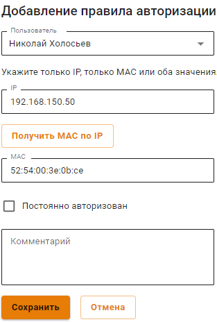

# IP и MAC авторизация

## Общая информация


Правила **IP и MAC авторизации** также создают аналогичную привязку в [DHCP-сервере](../../../services/dhcp.md#nastroika-dhcp-servera-s-privyazkoi-ip-k-mac) Ideco UTM. Но если одни и те же IP и MAC адреса будут использоваться во включенных правилах DHCP-сервера, то правила DHCP-сервера будут выполняться в первую очередь.


Для настройки IP и MAC авторизации, необходимо:

1\. В разделе **Авторизация -> IP и MAC авторизация** нажмите **Добавить**.

2\. Создайте правило привязки **IP и MAC авторизации**:


Установите флаг **Постоянно авторизован**, чтобы обеспечить непрерывный доступ в интернет, даже если пользователь не активен.

Созданные в этом разделе правила отражаются в [карточке пользователя](../../user-tree/customization-of-users.md).

Подробнее об авторизации пользователей только по IP-адресу или MAC-адресу в статьях [Авторизация по IP-адресу](ip-authorization.md) и [Авторизация по MAC-адресу](mac-authorization.md).

