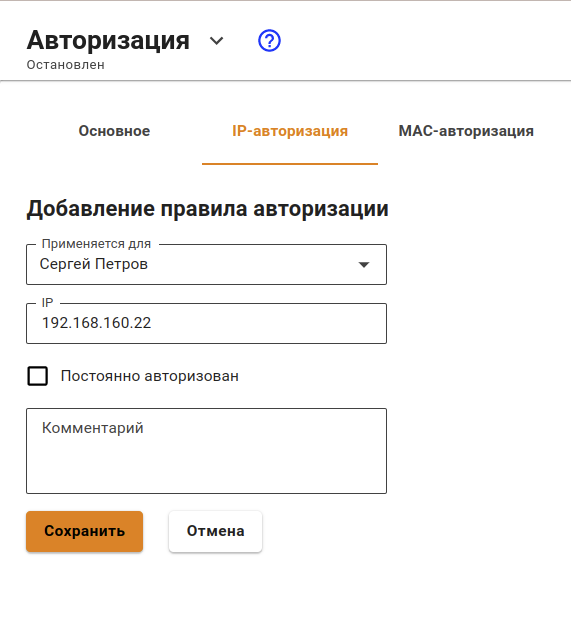
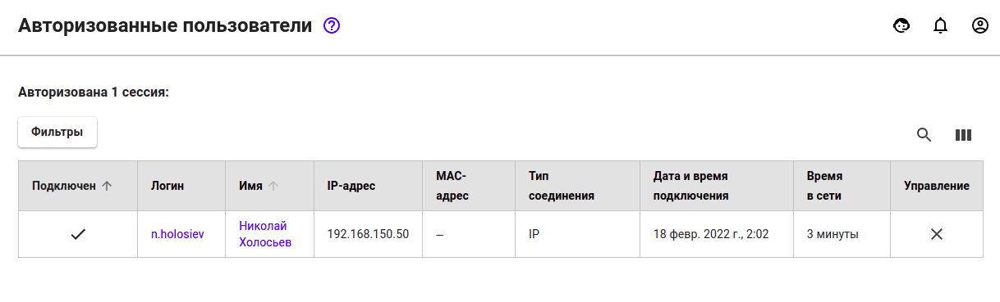
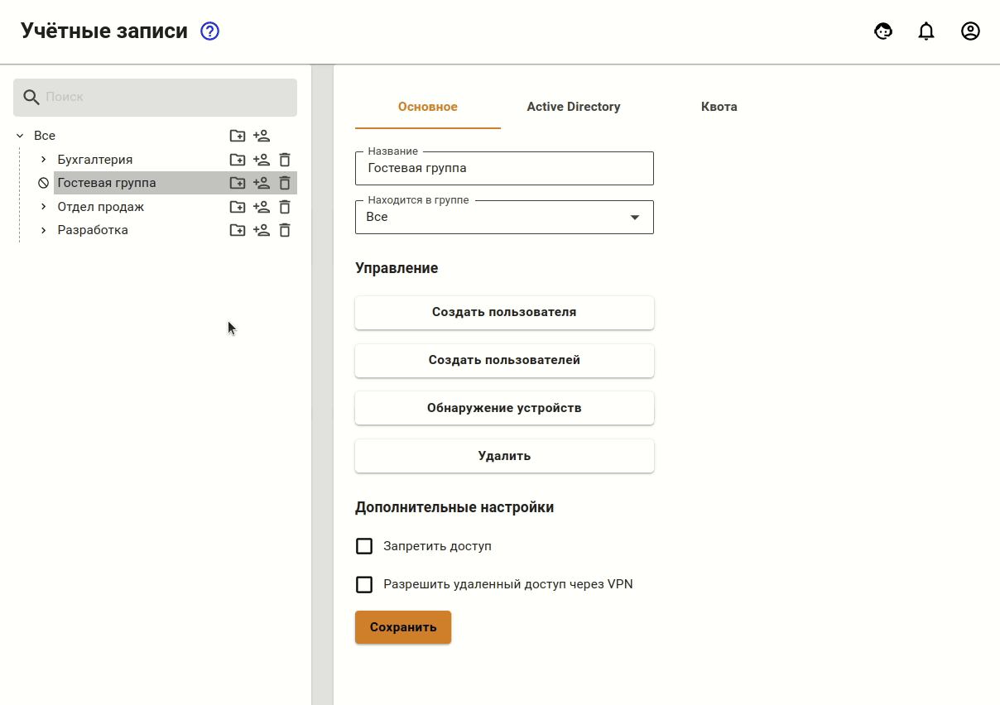
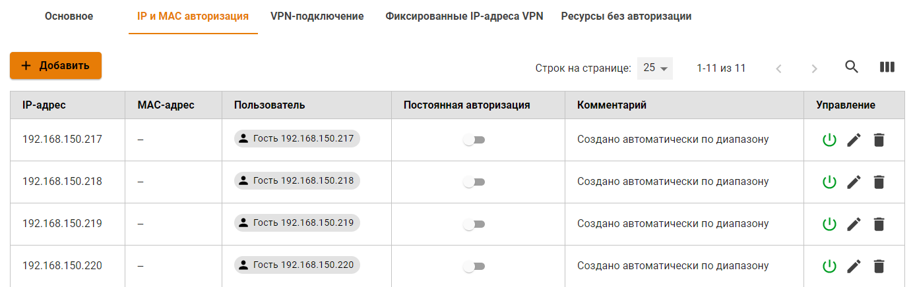

# Авторизация по IP-адресу

## Настройка авторизации по IP

Авторизация по IP подразумевает, что авторизованный пользователь будет получать доступ до Интернет-ресурсов без ввода логина и пароля, а просто инициировав подключение к этим ресурсам.

Также можно авторизовать сетевые устройства (такие, как камеры видеонаблюдения, сетевые принтеры и прочее), которые находятся в разных с Ideco UTM широковещательных доменах и требуют доступ в Интернет.


Если устройством является маршрутизатор и в нем включен SNAT, то при авторизации его внешнего IP на UTM, все пользователи за этим маршрутизатором получат доступ в Интернет.

Пользователи, которые находятся за маршрутизатором в локальной сети UTM, не могут авторизоваться по связке IP-адрес - MAC-адрес, так как маршрутизатор не обрабатывает трафик уровня L2.

Если настроена авторизация по IP-адресу, то этот IP не будет выдаваться [DHCP](../../../services/dhcp.md).


Чтобы авторизовать пользователя по IP-адресу:

1\. [Создайте](../../user-tree/user-management.md) пользователя в Ideco UTM или [импортируйте](../../active-directory/user-import.md) его из Active Directory, который будет авторизован по IP.

2\. Перейдите в раздел **Пользователи -> Авторизация -> IP и MAC авторизация**.

3\. Создайте правило-связку **IP-адрес <--> Пользователь**, как показано на скриншоте.


IP-адрес пользователя, который будет использоваться при создании сессии. У компьютера/устройства IP-адрес должен совпадать с указанным в правиле. 



Если пользователем является сетевое оборудование (видеокамеры, сервера и прочее), то желательно настроить **Постоянную авторизацию**,\
при этом сессия пользователя будет создана после загрузки UTM и сетевому оборудованию не нужно делать запрос в Интернет. У такого оборудования стоит настроить статический IP-адрес или DHCP с привязкой по IP-адресу.

Это требуется, например, для ресурсов [опубликованных через DNAT](../../../publishing-resources/portmapping.md).


После того как пользователь делает запрос в Интернет, на UTM будет автоматически создана сессия с типом авторизации `IP` в разделе **Мониторинг -> Авторизованные пользователи**.


У сессий с типом авторизации `IP` не заполняется поле **MAC-адрес**, потому что\
при данном типе авторизации уже имеется IP-адрес, необходимый для создания сессии авторизации.



Вы можете воспользоваться поиском устройств для автоматического создания пользователей при их попытке выхода в Интернет. Для этого воспользуйтесь статьей [Обнаружение устройств](../../device-discovery.md).


Под одним пользователем можно авторизовать только одно устройство по IP-адресу (одновременно с данным типом авторизации под одним пользователем можно авторизовать еще два устройства любым другим методом авторизации).

## Добавление группы устройств с авторизацией по IP

Вы можете добавлять пользователей из диапазона IP-адресов (например, из сети, раздаваемой точками доступа по Wi-Fi). Для этого необходимо:

1\. Создать отдельную группу в дереве пользователей.

2\. Выбрать созданную группу. В неё будут создаваться пользователи для устройств.

3\. Во вкладке **Основное** нажмите кнопку **Создать пользователей**.

Откроется окно с настройками создаваемых пользователей. Заполните следующие поля:

1. **Префикс имени.** Пользователи будут созданы с именем вида "Пользователь IP-адрес".
2. **Префикс логина.** Пользователи будут созданы с логином вида "user\_ip-адрес".
3. **IP-адрес первого и последнего пользователей.**


В случае, если некоторые IP-адреса из диапазона уже используются другими пользователями Ideco UTM, они будут пропущены при создании, и пользователей в итоге создастся меньше, чем адресов в диапазоне.


Пользователи будут созданы с настройками созданной группы и IP-адресом\
из диапазона. Помимо дерева пользователей, в разделе **Пользователи -> Авторизация ->**\
**IP и MAC авторизация** для каждого пользователя будут автоматически создано правило-связка **IP-адрес <--> Пользователь**, как представлено на скриншоте:


Если у Вас используется авторизации по IP со статической привязкой в DHCP,\
то предпочтительно будет перенести такие правила на [авторизацию по MAC-адресу](mac.md).

