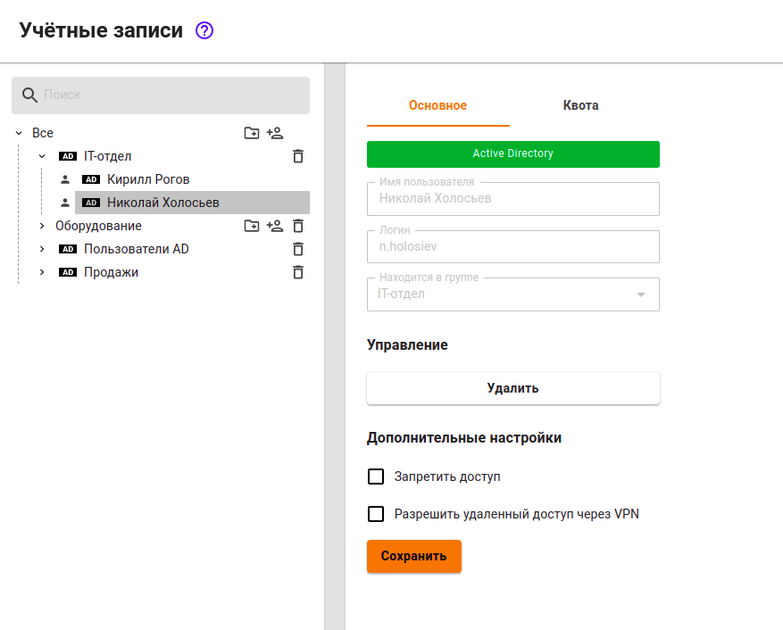

# Авторизация по IP-адресу

## Настройка авторизации по IP

Авторизация по IP подразумевает, что авторизованный доступ до Интернет-ресурсов пользователь будет получать без ввода логина и пароля, а просто иницировав подключение этим ресурсам. 


Авторизовывать по IP можно сетевые устройства (такие как роутер), после чего все пользователи за этим роутером смогут выйти в Интернет.


Также можно авторизовывать сетевые устройства (такие как камеры видеонаблюдения, сетевые принтеры и прочее), которые находятся в разных с Ideco UTM широковещательных доменах, и которым требуется доступ в Интернет.

Чтобы авторизовать пользователя по IP-адресу:

1\. Создайте пользователя в Ideco UTM или импортируйте его из Active Directory, который будет авторизовываться по IP.

2\. Перейдите в раздел **Пользователи -> Авторизация -> IP-авторизация**.

3\. Создайте правило-связку **IP-адрес <--> Пользователь**, как показано на скриншоте.


Если в качестве пользователя выступает стороннее сетевое оборудование (видеокамеры, сервера и прочее) стоит настроить **Постоянную авторизацию**,\
при этом сессия пользователя будет создана после загрузки UTM и сетевому оборудованию не нужно делать запрос в Интернет. У такого оборудования должен быть настроен статический IP-адрес или DHCP с привязкой по IP-адресу.

Это требуется, например, для ресурсов [опубликованных через DNAT](../../publishing-resources/portmapping.md).


После того, как пользователь делает запрос в Интернет, на UTM будет автоматически создана сессия с типом авторизации `IP` в разделе **Мониторинг -> Авторизованные пользователи**.


У сессий с типом авторизации `IP` не заполняется поле **MAC-адресс**, потому что\
при данном типе авторизации уже имеется IP-адрес, необходимый для создания сессии авторизации.



Вы можете воспользоваться поиском устройств для автоматического создания пользователей при их попытке выхода в Интернет. Для этого воспользуйтесь статьей [Обнаружение устройств](../device-discovery.md).


Под одним пользователем можно авторизовать только одно устройство по IP-адресу (одновременно с данным типом авторизации под одним пользователем можно авторизовать еще два устройства любым другим методом авторизации).

## Добавление группы устройств с авторизацией по IP

Вы можете добавлять пользователей из диапазона IP-адресов (например, из сети, раздаваемой точками доступа по Wi-Fi). Для этого необходимо:

1\. Создать отдельную группу в дереве пользователей.

2\. Выбрать созданную группу. В неё будут создаваться пользователи для устройств.

3\. Во вкладке **Основное** нажмите кнопку **Создать пользователей**.

Откроется окно с настройками создаваемых пользователей. Заполните следующие поля:

1. **Префикс имени.** Пользователи будут созданы с именем вида "Пользователь IP-адрес".
2. **Префикс логина.** Пользователи будут созданы с логином вида "user\_ip-адрес".
3. **IP-адрес первого и последнего пользователей.**


В случае, если некоторые IP-адреса из диапазона уже используются другими пользователями Ideco UTM, они будут пропущены при создании и пользователей в итоге создастся меньше, чем адресов в диапазоне.


Пользователи будут созданы с настройками, созданной группы и указанным\
IP-адресом. Помимо дерева пользователей, в разделе **Пользователи -> Авторизация ->**\
**IP-авторизация** для каждого пользователя будут автоматически создано правило с IP-авторизацией из ранее выбранного диапазона, как представлено на скриншоте:


Если у Вас используется авторизации по IP со статической привязкой в DHCP,\
то предпочтительно будет перенести такие правила на [авторизацию по MAC-адресу](./mac.md).  

