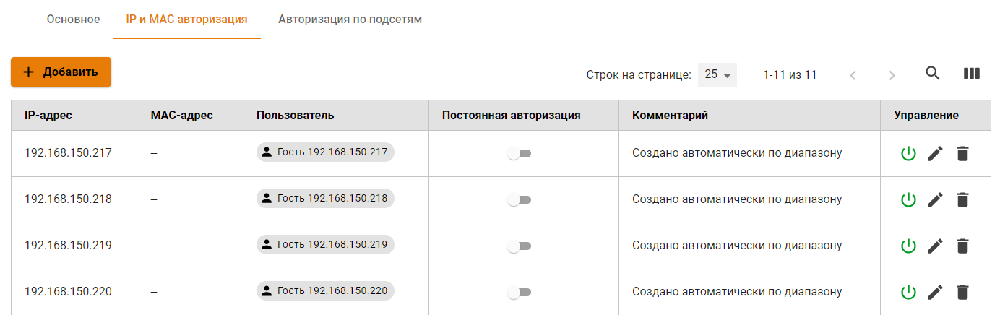

# Авторизация по IP-адресу

## Настройка авторизации по IP

Данный тип авторизации предполагает, что авторизация устройства пользователя будет осуществляться по его IP-адресу.

Для того чтобы у пользователя появилась возможность авторизовываться по IP-адресу, необходимо выполнить следующие действия:

1. Перейдите в раздел **Пользователи -&gt; Авторизация -&gt; IP-авторизация**.
2. Создайте правило-связку **IP-адрес == Пользователь** на подобии того, как продемонстрировано на скриншоте.

3. Назначьте IP-адрес устройству, с которого пользователь будет получать доступ в сеть Интернет.


Вы можете воспользоваться поиском устройств для автоматического создания пользователей при их попытке выхода в Интернет. Для этого воспользуйтесь статьей [Обнаружение устройств](../device-discovery.md).


Под одним пользователем можно авторизовать только одно устройство по IP-адресу \(одновременно с данным типом авторизации можно авторизовать еще два устройства любым другим методом авторизации\).

## Добавление группы устройств с авторизацией по IP

Вы можете добавлять пользователей из диапазона IP-адресов \(например, сети, раздаваемой точками доступа беспроводным устройствам по Wi-Fi\). Для этого необходимо выполнить следующие действия:

1. Выбрать группу в дереве пользователей, в которую вы хотите добавить устройства.
2. Во вкладке **Основное** нажать кнопку **Создать пользователей**.

1. Откроется окно с настройками создаваемых пользователей. Заполните следующие поля:
2. **Префикс имени.** Пользователи будут созданы с именем вида "Пользователь IP-адрес".
3. **Префикс логина.** Пользователи будут созданы с логином вида "user\_ip-адрес".
4. **IP-адрес первого и последнего пользователей.**

В случае, если некоторые IP-адреса из диапазона уже используются другими пользователями Ideco UTM, они будут пропущены при создании.

Пользователи будут созданы с настройками, наследуемыми от группы и указанным IP-адресом. Помимо дерева пользователей, в разделе **Пользователи -> Авторизация -> IP-авторизация** будут автоматически созданы правила с IP-авторизацией для каждого пользователя отдельно, как представлено на скриншоте ниже:

