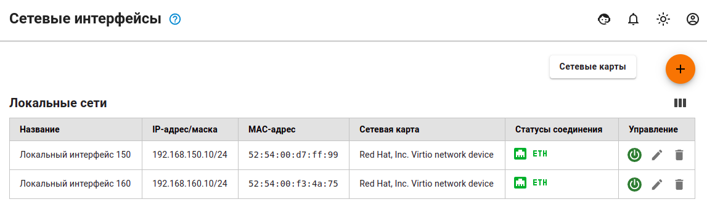
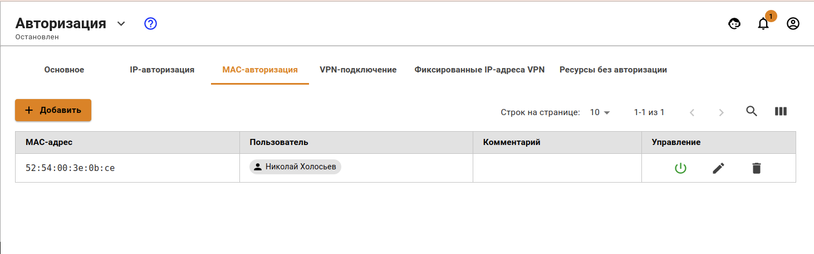
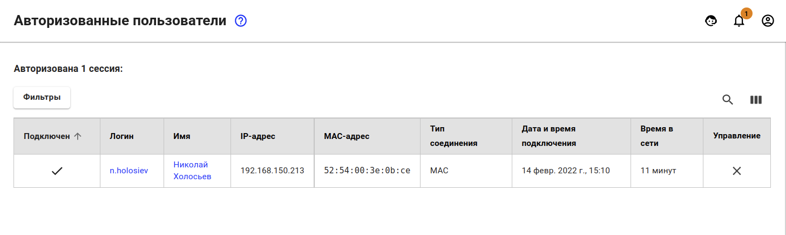
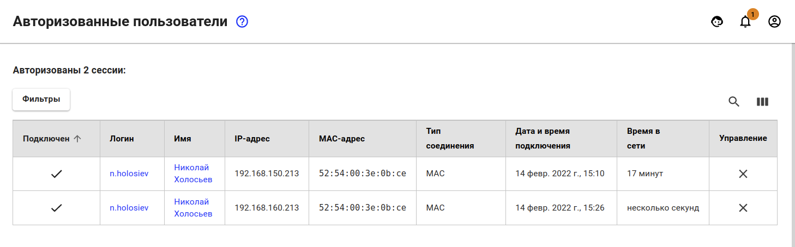

# Авторизация по MAC-адресу

Данный тип авторизации подойдет для тех устройств, у которых время от времени меняется местоположение между локальными сетями внутри организации (к примеру, рабочие ноутбуки сотрудников) или сетевых устройств, которым выдается IP-адрес посредством DHCP, на котором не настроена привязка IP+MAC.


Чтобы устройство могло авторизоваться на UTM по MAC-адресу, они оба должны находиться в одном шикоровещательном домене и шлюзом для устройств выступает UTM.



Пользователи, находящиеся за роутером в локальной сети UTM, не могут авторизоваться MAC-адресу, так как роутер разделяет шикоровещательные домены и не обрабатывает трафик уровня L2. Такие пользователи могут авторизоваться только по IP-адресу.


## Настройка авторизации по MAC

Чтобы авторизовать пользователя по MAC-адресу, необходимо выполнить следующие действия:

1\. Необходимо узнать MAC-адрес устройства. Для этого в командной строке Windows введите команду: `ipconfig /all | findstr Address`

2\. Удостовериться, что устройство и UTM находятся в одном широковещательном домене. \
Для этого на UTM в разделе **Управление сервером -> Терминал** введите команду: `ip neigh`


Данная команда выводит ARP-таблицу UTM'а и, наличие записи с MAC-адресом устройства и статусом REACHEBLE говорит о имеющейся L2 доступности между UTM и устройством.


3\. Создать правило-связку **Пользователь <--> MAC-адрес** в разделе: \
**Пользователи -> Авторизация -> MAC-авторизация**:


Для MAC-авторизации невозможно настроить постоянную авторизацию. \
Это технически невозможно, т.к. для создания авторизованной сессии необходим \
IP-адрес. Поэтому рекомендуется использовать MAC-авторизацию в комбинации с [DHCP-сервером](../../services/dhcp.md).


Результат можно будет посмотреть в разделе: **Мониторинг -> Авторизованные пользователи**, там отобразится сессия с типом авторизации MAC.

## Поведение MAC-авторизации при перемещении устройства между локальными сетями

В организациях часто возникает ситуация, когда необходимо перещаться между локальными сетями с ноутбукам на руках и при этом оставаться всегда в сети. В таких случаях, авторизация по MAC-адресу прекрасно себя показывает.


У Вас должен быть настроен собственный DHCP-сервер или на Ideco UTM. \
В раздаваемых реквизитах, шлюзом должен выступать локальный интерфейс \
Ideco UTM.


Возьмем за пример ситуацию, когда пользователю `Николай Холосьев` понадобилось переместиться с ноутбуком между локальными сетями:

* На UTM имеются настроенные следующим образом локальные интерфейсы:

* У данного пользователя настроено правило авторизации по MAC-адресу:

* Также у него есть одна активная сессия в разделе **Авторизованные пользователи**

* Далее пользователь переходит из одной локальной сети в другую. Ему выдаются другие сетевые реквизиты от DHCP-сервера, в которых шлюзом указан UTM, и при обнаружении любой активности со стороны пользователя, у него появится вторая сессия \
  с авторизацией по MAC-адресу.


Если у пользователя не появляется доступ и вторая сессия с авторизацией по \
MAC-адресу, то вероятнее всего это могло произойти из-за того, что у пользователя не обновились сетевые реквизиты.

Сбросьте старые сетевые реквизиты от DHCP-сервера и получите новые с помощью команды: `ipconfig /release && ipconfig /renew`.


## Настройка авторизации по MAC-адресу для сетевого принтера и других сетевых устройств


Сетевые принтеры и прочие сетевые устройства, которым необходим доступ \
во Интернет, должны быть авторизованы на UTM. Такие устройства можно назвать статическими и для них отлично подойдет авторизация по MAC-адресу.


Для того, чтобы авторизовать сетевой принтер, необходимо создать пользователя для этого принтера вручную или через [Обнаружение устройств](../device-discovery.md).

Для сетевого принтера в разделе **Пользователи -> Авторизация -> MAC-авторизация** необходимо создать правило **Пользователь <--> MAC-адрес**

При обнаружения активности от сетевого принтера или другого устройства, \
его пользователь сразу же появится в **Мониторинг -> Авторизованные пользователи**


В современных телефонах имеется опция **Рандомизация MAC-адреса**. Эта опция будет мешать при авторизации телефона по MAC-адресу. Рекомендуется эту опцию отключать, либо использовать другие типы авторизации (например: [Веб-авторизации](authorization/web-authorization.md))

