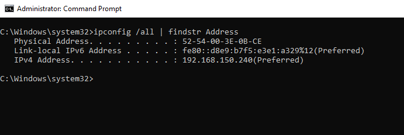
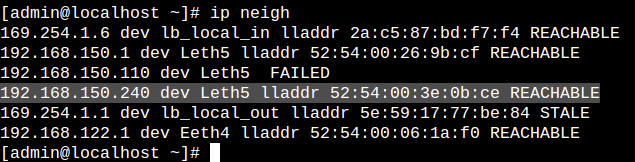
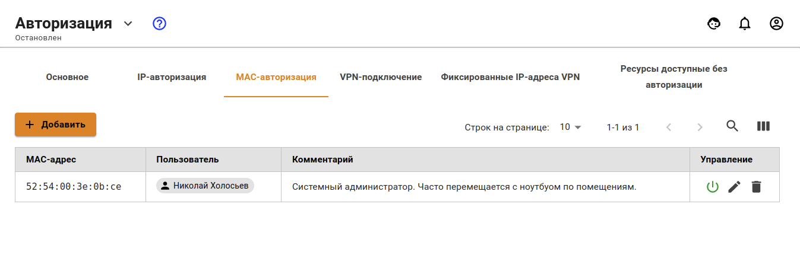
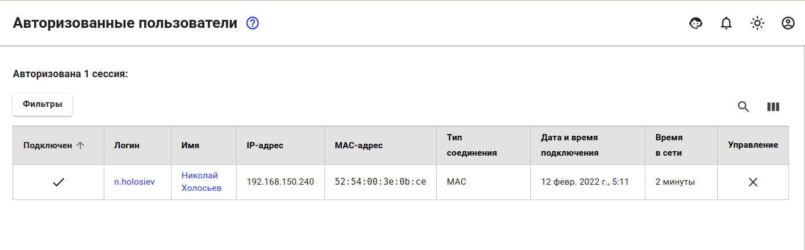
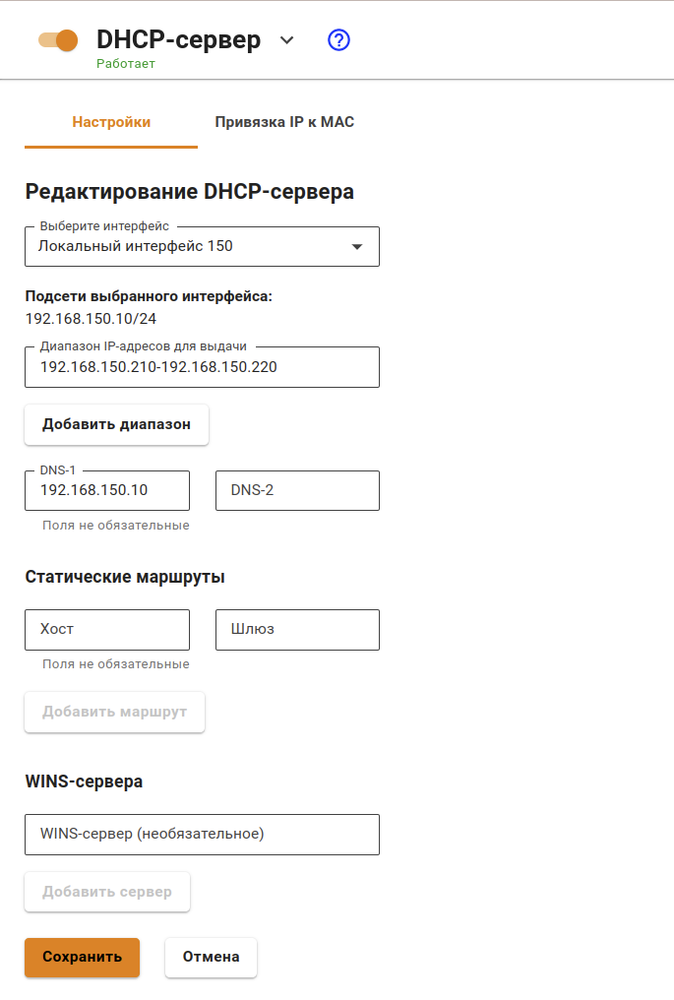
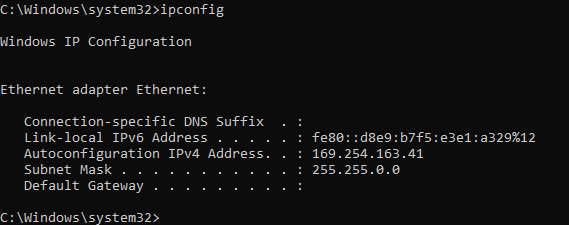
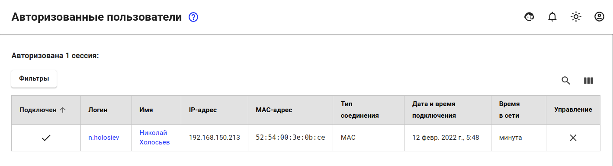
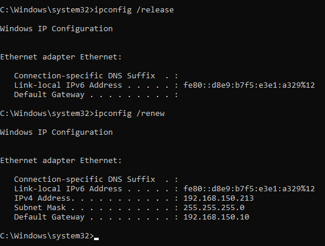
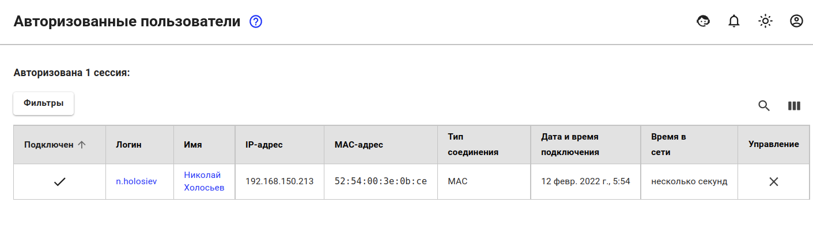

# Авторизация по MAC-адресу

Данный тип авторизации подойдет для тех устройств, у которых время от времени меняется местоположение между локальными сетями внутри организации (к примеру, рабочие ноутбуки сотрудников) или сетевых устройств, которым выдается IP-адрес посредством DHCP, на котором не настроена привязка IP+MAC.

Такой способ подразумевает, что авторизация устройства будет производить посредством MAC-адреса устройства.


Важный момент, чтобы устройство могло авторизоваться на UTM по MAC-адресу, они оба должны находиться в одном шикоровещательном домене.



Пользователи, которые находятся за роутером в локальной сети UTM, не могут авторизоваться MAC-адресу, так как роутер разделяет шикоровещательные домены и не обрабатывает трафик уровня L2. Такие пользователи могут авторизоваться только по IP-адресу.


## Настройка авторизации по MAC

Для того, чтобы у устройства появилась возможность авторизовываться по MAC-адресу, необходимо выполнить следующие действия:

1 Необходимо узнать MAC-адрес устройства. Для этого в командной строке Windows введите команду: `ipconfig /all | findstr Address`

2 Удостовериться, что устройства находятся в одном широковещательном домене. Для этого на UTM в разделе **Управление сервером -> Терминал** введите команду: `ip neigh`

3 Создать правило-связку **Пользователь == MAC-адрес** в разделе **Пользователи -> Авторизация -> MAC-авторизация** на подобии того, как продемонстрировано на скриншоте.

После выполнения вышеописанного порядка действия, в разделе **Мониторинг -> Авторизованные пользователи** отобразится сессия с типом авторизации MAC.

.


Можно дополнительно настроить правило с IP-авторизацией для устройства. Такой способ не будет создавать дополнительную сессию для другого типа авторизации, однако сессия будет создаваться с типом авторизации `MAC`, т.к. такой варинт авторизации является приоритетнее, чем авторизация по `IP`.


## Авторизация по MAC при настроенном на Ideco UTM DHCP-сервере

При настроенном DHCP-сервере на Ideco UTM IP-адрес, выдаваемый пользователю, для которого создано правило авторизации по MAC-адресу, будет привязываться к его MAC-адресу.

Привязка IP-адреса к MAC-адресу продемонстирована на следующем примере:

1 На скриншоте ниже продемонстрирована стандартная настройка DHCP-сервера на Ideco UTM.

2 На DHCP-клиенте удостоверяемся, что на нем отсутствует IP-адрес.

3 После успешного получения IP-адреса DHCP-клиентом, авторизованная сессия автоматически появилась на странице **Авторизованные пользователи**.

4 Проверям, что привязка IP+MAC действительно создалась. Для этого вручную прерываем аренду адреса и повторно запрашивая его у DHCP-сервера.

Как видно из скриншота выше, IP-адрес выдался тот же, что и запрашивался в самый первый раз. Дополнительно проверяем страницу **Авторизованные пользователи**.

По колонке **Дата и время подключения** можно удостовериться, что после переаренды IP-адреса у DHCP-сервера, сессия обновляется.