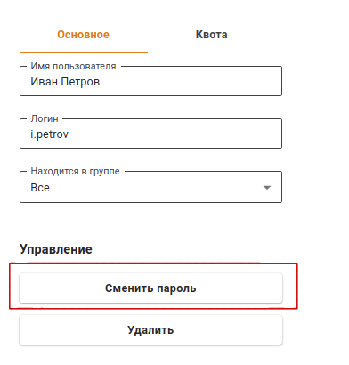
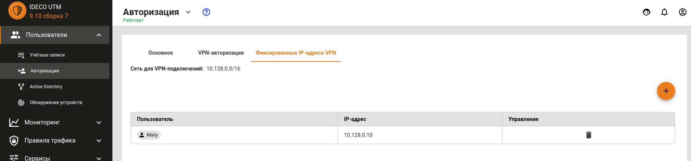

# Авторизация по PPPoE

Авторизация по протоколу PPPoE предполагает авторизацию по защищенному сетевому туннелю между сетевым устройством пользователя и сервером Ideco UTM. Аутентификация пользователя осуществляется по связке Логин/Пароль. При данном типе авторизации не требуется назначение IP-адреса рабочей станции, так как IP-адрес будет автоматически назначен в случае успешной аутентификации и создания защищенного сетевого туннеля.

Для настройки авторизации по протоколу PPPoE необходимо выполнить следующие действия: 

1. Перейдите в раздел **Пользователи -&gt; Авторизация**. 
2. Откройте вкладку **VPN-авторизация**. 
3. Установите флажок у пункта **Авторизация PPPoE** и нажмите кнопку **Сохранить**.

Редактирование логина и пароля возможно на вкладке **Пользователи -&gt; Учетные записи** при выделении нужного пользователя.

IP-адрес пользователю назначается автоматически из пула адресов для VPN, настраиваемого в разделе **Пользователи -&gt; Авторизация -&gt; VPN-авторизация** \(например 10.128.0.0/16\).

Чтобы настроить **статическую** привязку адресов выдаваемых по VPN определенным пользователям, необходимо перейти в раздел **Пользователи -&gt; Авторизация -&gt; Фиксированные IP-адреса VPN**, нажать иконку  и указать нужного пользователя и IP-адрес. Пример настройки фиксированного IP-адреса VPN представлен на скриншоте ниже:


Авторизация по PPPoE возможна только в одном ethernet-сегменте с локальными интерфейсами Ideco UTM. 


