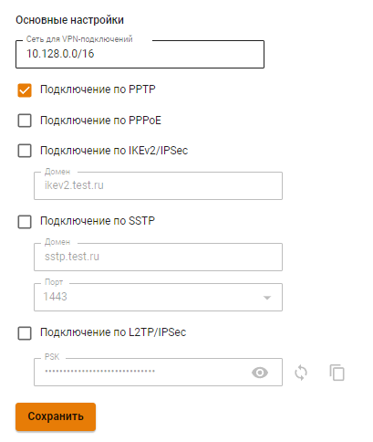
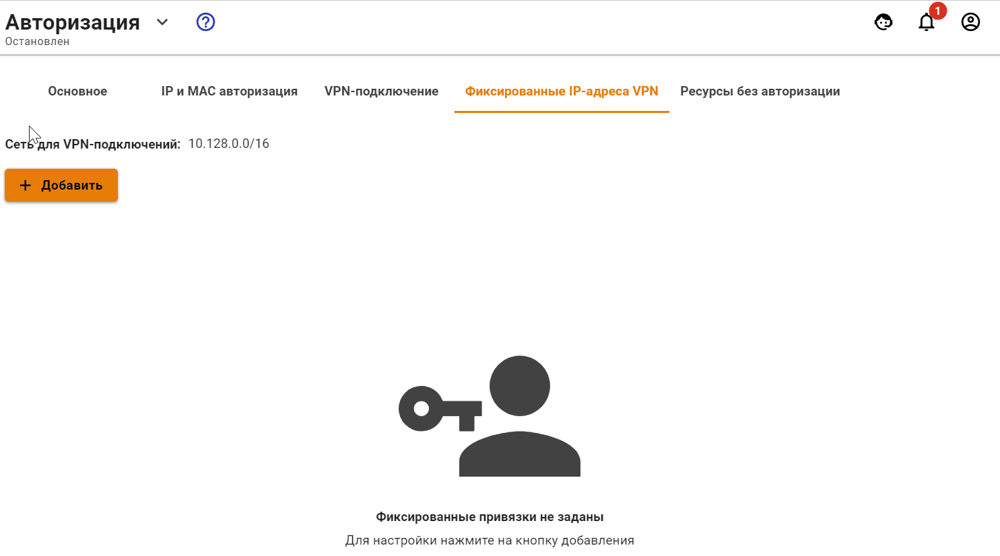

# Авторизация по PPTP

Авторизация по протоколу PPTP предполагает авторизацию по защищенному сетевому туннелю между сетевым устройством пользователя и интернет-шлюзом Ideco UTM.

* Для аутентификации пользователя применяется связка логин/пароль пользователя Ideco UTM или пользователя из Active Directory.
* Для авторизации по протоколу PPTP необходимо назначить IP-адрес сетевому устройству, а также настроить на нем подключение по протоколу PPTP с указанием IP-адреса интернет-шлюза Ideco UTM в качестве адреса PPTP-сервера.

При успешной аутентификации и установлении PPTP-туннеля сетевому устройству будет автоматически назначен дополнительный IP-адрес для получения доступа к ресурсам сети интернет. Использование авторизации по PPTP никак не отражается на возможности доступа сетевого устройства к ресурсам локальной сети.

Для настройки авторизации по протоколу PPTP необходимо выполнить следующие действия:

1. Перейдите в раздел **Пользователи -> Авторизация -> VPN-авторизация**.
2. Установите флажок у пункта **Авторизация PPTP** и нажмите кнопку **Сохранить**.

Редактирование логина и пароля возможно на вкладке **Пользователи -> Учетные записи** при выделении нужного пользователя.

IP-адрес пользователю назначается автоматически из пула адресов для VPN, настраиваемого в разделе **Пользователи -> Авторизация -> VPN-авторизация** (например, 10.128.0.0/16).

Чтобы настроить **статическую** привязку адресов, выдаваемых по VPN определенным пользователям, необходимо перейти в раздел **Пользователи -> Авторизация -> Фиксированные IP-адреса VPN**, нажать иконку  и указать нужного пользователя и IP-адрес. Пример настройки фиксированного IP-адреса VPN представлен ниже:

При подключении из сети интернет рекомендуем использовать [IPSec IKEv2](../../services/vpn-tunnel-protocols/client-to-site/ipsec-ikev2.md), [L2TP IPSec](../../services/vpn-tunnel-protocols/client-to-site/l2tp-ipsec.md) или [SSTP](../../services/vpn-tunnel-protocols/client-to-site/sstp.md) для более надежного шифрования трафика.

Смотрите также инструкцию по настройке [PPTP](../../services/vpn-tunnel-protocols/client-to-site/pptp.md) для подключения из сети Интернет.
