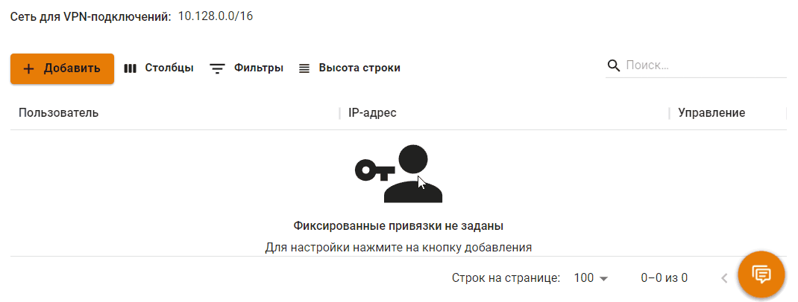

# VPN-подключение


Название службы раздела **VPN-подключение**: `ideco-accel-l2tp`; `ideco-accel-pptp`; `ideco-accel-sstp`; `ideco-vpn-servers-backend`; `ideco-vpn-authd`. \
Список служб для других разделов доступен по [ссылке](../../../server-management/terminal.md).

Инструкция по настройке VPN-подключения через [Ideco Agent клиент для Windows](../../ideco-agent.md).



Не рекомендуем использовать для VPN-подключений кириллические логины.


Для получения доступа извне (из дома, отеля, другого офиса) к локальной сети предприятия, которая находится за Ideco UTM, можно подключиться по VPN с этой машины (компьютера или мобильного устройства) к серверу Ideco UTM.

Для client-to-site VPN наш сервер поддерживает четыре протокола туннельных соединений: [IKEv2](ipsec-ikev2.md), [SSTP](sstp.md), [L2TP/IPsec](l2tp-ipsec.md), [PPTP](pptp.md).


В целях безопасности не рекомендуется использовать протокол PPTP (он оставлен для совместимости с устаревшими операционными системами и оборудованием, а также для авторизации в локальной сети, где нет требований к строгому шифрованию трафика).


**Рекомендуемым в плане скорости и безопасности является протокол IKEv2.**

Вы можете использовать [личный кабинет пользователя](user-lk.md) для раздачи инструкций по созданию пользовательских VPN-подключений.

## Основное

В поле **Сеть для VPN-подключений** указывается подсеть, в рамках которой будут динамически присваиваться IP-адреса. Маска подсети должна быть в диапазоне от 16 до 30.

### Основные настройки

В основных настройках выберите протоколы, по которым смогут подключаться пользователи. Подробнее о настройках в статьях: [PPTP](pptp.md), [PPPoE](pppoe.md), [IKEv2/IPSec](ipsec-ikev2.md), [SSTP](sstp.md) и [L2TP/IPSec](l2tp-ipsec.md).


Не рекомендуем использовать тип подключения PPTP. Этот способ подключения КРАЙНЕ небезопасен, оставлен исключительно для совместимости со старыми решениями. Используйте IPsec-IKEv2.



Инструкции по настройке VPN-подключений на разных ОС, доступны по [ссылке](../../../../recipes/popular-recipes/README.md).


### Передача маршрутов

Маршруты, переданные Ideco UTM для VPN-клиента, имеют меньшую метрику (т.е. высокий приоритет). В меню передача маршрутов существует 5 опций для регулировки передачи маршрутов.

#### Не отправлять

При включении данной опции клиентам не будут передаваться никакие маршруты, то есть никакой трафик не будет проходить через UTM.
#### Отправлять весь трафик на Ideco UTM

При включении этой опции клиентам будет передаваться маршрут 0.0.0.0/0, то есть весь трафик будет проходить через UTM.

#### Отправлять маршруты до всех локальных сетей

При включении опции клиентам будут передаваться маршруты до всех локальных сетей UTM, в том числе подключенных через IPSec и маршрутизируемых.
#### Отправлять маршруты до локальных сетей Ideco UTM

При включении опции клиентам будут переданы маршруты только до локальных сетей UTM, без учета IPSec и маршрутизируемых.
#### Отправлять только указанные 

При включении опции предоставляется возможность выбрать, какие маршруты нужно отправлять клиентам.


Если маршруты VPN-клиентов пересекаются с маршрутами, передаваемыми Ideco UTM, то выберите **Не отправлять** или **Отправлять только указанные**.


## Фиксированные IP-адреса VPN


Если создать фиксированную привязку для какого-либо пользователя, то для него будет возможна только одна активная VPN сессия.


Например: хост в локальной сети, к которому могут подключиться пользователи только с определенными IP-адресами. Для предоставления прямого доступа по VPN-подключению к этому хосту, перейдите в раздел **Пользователи -> Авторизация -> Фиксированные IP-адреса VPN**, нажмите **Добавить**, заполните поля **Пользователь** и **IP-адрес** и нажмите **Применить**.

