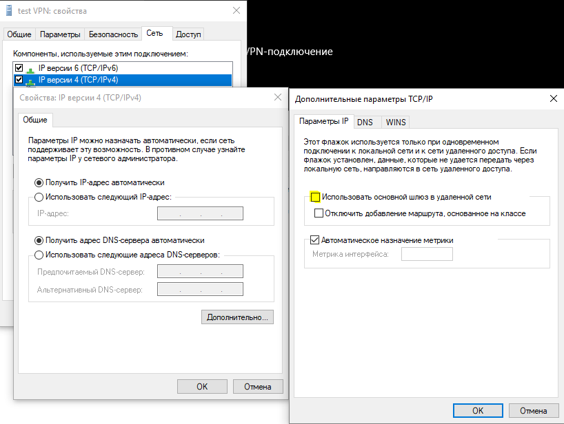
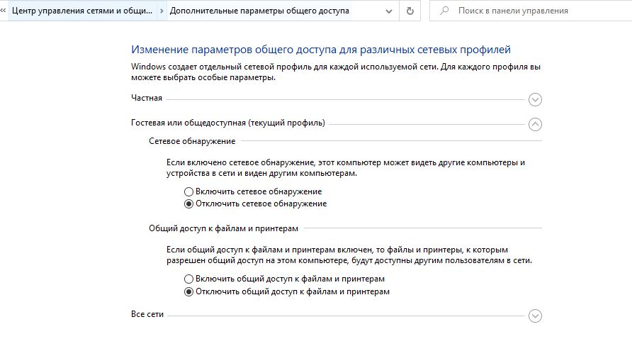
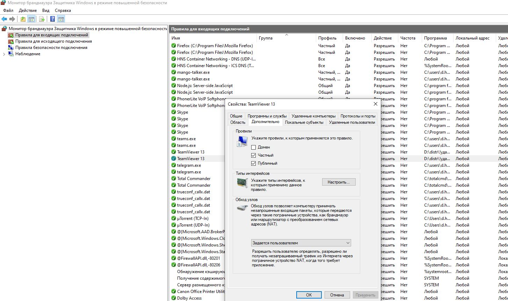
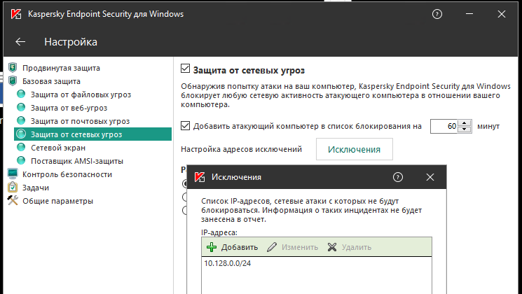
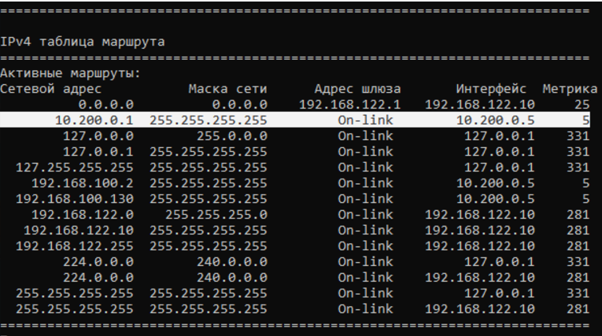
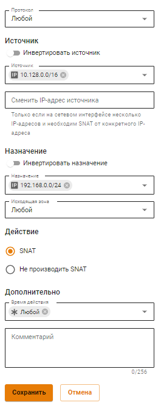

# Особенности маршрутизации и организации доступа

## Если по VPN необходим доступ только к ресурсам локальной сети

В случае, если в Интернет необходимо выходить напрямую через своего провайдера, а через VPN получать доступ только к ресурсам корпоративной сети на компьютерах, подключающихся по VPN, необходимо выполнить следующие настройки.

* В свойствах VPN-подключения убрать флаг **Использовать основной шлюз в удаленной сети**. Вкладка **Сеть -> IP версии 4 -> Дополнительно -> Параметры IP**:

*   Прописать маршрут до корпоративной сети (**в Windows 7, 8, 8.1, 10 автоматически будут создан маршрут основанный на классе, в зависимости от адреса, который подключение получит по VPN. Например, маршрут будет добавлен для сети 10.0.0.0/8, если по VPN сервер получит адрес из сети 10.128.0.0/16**). Для IPsec-IKEv2 можно настроить автоматическое получение маршрута.

    Пример маршрута, если корпоративная сеть `172.16.0.0/16`, а сеть для VPN-подключений настроенная на Ideco UTM `10.128.0.0/16` (и из этой же сети выдается IP-адрес VPN-подключению), то маршрут будет таким: `route -p add 172.16.0.0 mask 255.255.0.0 10.128.0.1`
*   В некоторых случаях маршрут может не работать, тогда есть пинг до защищённого интерфейса (`10.128.0.1`), но нет пинга до хостов в локальной сети. В этом случае при создании маршрута нужно указать номер интерфейса VPN-подключения. Итоговый маршрут будет таким:

    `route -p add 172.16.0.0 mask 255.255.0.0 10.128.0.1 if nn` \
    где, **nn**-номер интерфейса VPN-подключения, посмотреть который можно при активном VPN-подключении в выводе в консоли команды route print раздел "Список интерфейсов".

## Если не удается получить доступ к компьютерам в локальной сети Ideco UTM

* Убедитесь, что локальная сеть (или адрес на сетевой карте) на удалённой машине не пересекается с локальной сетью организации. Если пересекается, то доступа к сети организации не будет (трафик по таблице маршрутизации пойдёт в физический интерфейс, а не в VPN). **Адресацию необходимо менять.**
*   На компьютерах локальной сети в качестве основного шлюза должен быть прописан Ideco UTM. Если это не так, то необходимо прописать соответствующий маршрут вручную на устройствах, чтобы сетевые пакеты шли на Ideco UTM для VPN-сети.

    **Например:** `route -p add 10.128.0.0 mask 255.255.0.0 10.1.1.1` \
    где: `10.128.0.0/16` - адрес VPN-сети Ideco UTM (настраивается в разделе **Пользователи -> VPN-подключения**), а `10.1.1.1` - IP-адрес локального интерфейса Ideco UTM.
* Проверьте настройки файрвола (**таблица FORWARD**) в Ideco UTM на предмет запрещающих правил.
* Компьютеры и серверы на ОС Windows могут ограничивать доступ к сетевым папкам с помощью правил настроек профилей сети (причем как на стороне подключающегося по VPN компьютера, так и на стороне компьютеров и серверов локальной сети):

**Включите доступ к файлам и принтерам для профиля «Все сети» и «Частных сетей».**

Сделайте это с помощью PowerShell (запущенного с повышением прав до администратора), выполнив команду: `Enable-NetFirewallRule -Group "@FirewallAPI.dll,-28502"`.

*   Брандмауэр Защитника Windows может блокировать доступ определенных программ или сервисов (включая RDP) до внешних сетей.

    Проверьте это в настройках входящих и исходящих подключений (необходимо разрешить доступ из частых и локальных сетей):

*   Антивирусное ПО на компьютере может блокировать доступ к нему из не локальных сетей. Либо блокировать доступ конкретных программ.

    Например, для **Kaspersky Endpoint Security** нужно добавить сеть для VPN-подключений (по умолчанию `10.128.0.0/16`) в исключения:

## Если нет доступа к локальной сети Филиала
Если нет доступа к локальным сетям **Филиала** при подключении пo VPN в **Главном Офисе** (при подключении **Главного офиса** и **Филиала** по IPsec):

* Убедитесь, что VPN-сети **Филиала** и **Главного офиса** не пересекаются;
* Проверьте настройки **Главного Офиса**, обратившись к [статье](../../../services/ipsec/branch-office-and-main-office.md#shag-2.-sozdanie-podklyucheniya-v-glavnom-ofise).

## Если за UTM есть маршрутизатор, выступающий в качестве ядра локальной сети

Если между UTM и хостами локальной сети в качестве ядра сети присутствует роутер, клиенты из VPN-сети не смогут получить доступ к хостам этой локальной сети, даже если на UTM создано правило маршрутизации:

* `192.168.0.0/24` - сеть за роутером, к которой требуется получить доступ из VPN-сети;
* `172.16.0.2` - адрес роутера в локальной сети UTM.

Причина в том, что хост (`192.168.0.10`) получает пакеты из VPN-сети с адресом источника `src 10.128.0.1`. Ответ с адресом назначения `dst 10.128.0.1` попадает на роутер, но у роутера отсутствует маршрут до указанной сети и трафик не проходит.

Чтобы обеспечить доступ, нужно настроить на роутере маршрут от нужной локальной сети до VPN-сети. Для этого укажите в качестве назначения VPN-сеть (`10.128.0.0\16`), в качестве шлюза - UTM (`172.16.0.1`).

Если настроить на роутере маршрут невозможно, можно создать на UTM SNAT-правило вида:

Для этого: 

1\. Перейдите в раздел **Правила трафика -> Файрвол -> SNAT** и нажмите **Добавить**. 

2\. Укажите следующие параметры:

* Источник - VPN-сеть (`10.128.0.0\16`);
* Назначение - сеть за роутером, к которой требуется получить доступ из VPN-сети (`192.168.0.0/24`);
* Шлюз - локальный адрес UTM (`172.16.0.1`).

3\. Нажмите **Сохранить**.

В этом случае при отправке пакетов на роутер UTM подменит IP-адрес источника своим. За счет этого роутер направит ответ от хоста в локальной сети на UTM, который затем перенаправит его в VPN-сеть. 


При этом у хостов из локальной сети `192.168.0.0/24` не будет доступа к VPN-сети `10.128.0.0\16`.
 
