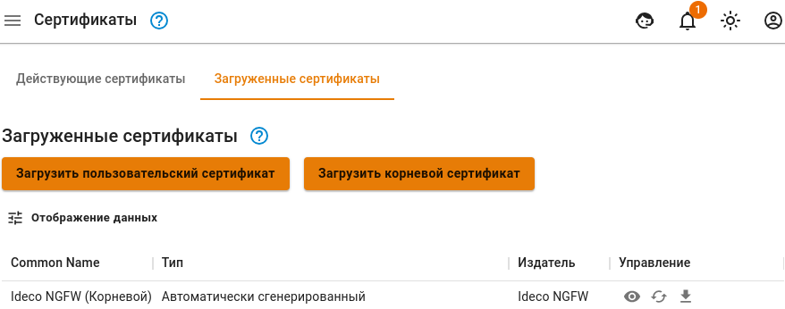
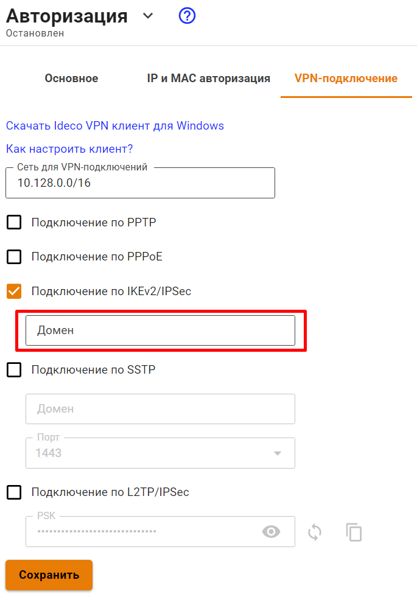

# Подключение по IKEv2/IPsec


Данный протокол VPN является предпочтительным и рекомендованным для всех сценариев использования.

Инструкции по настройке VPN-подключений на разных ОС, доступны по [ссылке](../../../../recipes/popular-recipes/vpn/README.md).



Не рекомендуем использовать для VPN-подключений кириллические логины.


## Настройка VPN-сервера в Ideco UTM

Если корневой сертификат UTM не находится в доверенных, то скачайте и установите его на компьютер пользователя. Скачать сертификат можно одним из способов:

*   В личном кабинете, введя логин/пароль пользователя:

    
*   В разделе **Сервисы -> Сертификаты -> Загруженные сертификаты**:

    

1\. Для включения авторизации по IKEv2 установите соответствующий флаг **Подключение по IKEv2/IPsec** в разделе веб-интерфейса **Пользователи -> VPN-подключение -> Основное**.

2\. В соответствующем поле укажите доменное имя или IP-адрес и нажмите **Сохранить**. \
Важно: в разделе **Сервисы -> Сертификаты -> Загруженные сертификаты** загрузите сертификат с указанием полного доменного имени в расширении SAN. Wildcard сертификат не может быть использован.

3\. У пользователей, которым необходимо подключаться извне по VPN установите флаг **Разрешить удаленный доступ через VPN** в дереве пользователей. Указанный там логин и пароль будут использоваться для подключения.

4\. Передача маршрутов клиентам до ваших локальных сетей происходит автоматически. Для управления доступом к сетям используйте [Файрвол](../../../access-rules/firewall.md).

## Поддержка IPsec IKEv2 в клиентских ОС

* Microsoft **Windows 7** (2009 г.). Требует установки корневого сертификата Let's Encrypt;
* Apple **MacOS X 10.11** "El Capitan" (2015 г.);
* Linux [NetworkManager plugin](https://wiki.strongswan.org/projects/strongswan/wiki/NetworkManager) (c 2008 г.);
* Google **Android 11** (2020 г.). На более старых версиях можно использовать приложение [StrongSwan](https://play.google.com/store/apps/details?id=org.strongswan.android);
* Apple **iOS 9** (iPhone 4S) (2015 г.);
* **KeeneticOS 3.5;**
* Mikrotik;
* Cisco routers.