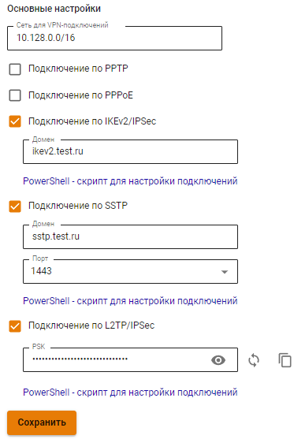
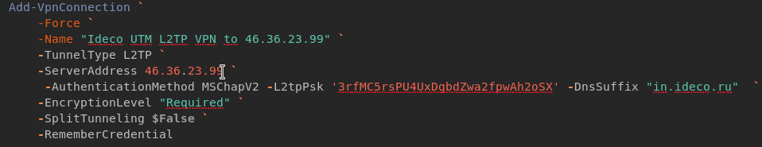

# Инструкция по запуску PowerShell скриптов

Если используете Windows 7, необходимо создать подключение вручную(см. статью [Создание VPN-подключений на стороне пользователя вручную](../../../../recipes/popular-recipes/vpn/connection-for-windows7.md)).

## Какой протокол VPN выбрать?

При нескольких вариантах возможных подключений по VPN выбирайте протоколы по следующим критериям:

1. **IKEv2/IPsec** - самый лучший в плане производительности и надежности подключения протокол;
2. **SSTP** - протокол основанный на TCP и SSL. Выберите его, если подключение по IKEv2 не проходит через провайдера;
3. **L2TP/IPsec** - надежный в плане шифрования, но не самый оптимальный в плане скорости и производительности протокол.

## Как запустить PowerShell скрипт?

1\. Скачайте скрипт одним из вариантов:

**Из Ideco NGFW:**

* Перейдите в раздел **Пользователи -> VPN-подключение -> Основное**;
* Установите флаг у требуемого протокола подключения, если требуется, заполните поля и нажмите **Сохранить**;
* Кликните по ссылке **PowerShell - скрипт для настройки подключений**: 
* Перенесите скачанный файл на устройство, на котором требуется создать VPN-подключение.

**В личном кабинете пользователя:**

* Скачайте скрипт, кликнув по ссылке **Скачать скрипт для создания подключения**: .png>)
* Перейдите к выполнению пункта 2.


Для подключения по VPN к Ideco NGFW с белым IP адресом достаточно действий, указанных ниже. Если Ideco NGFW выходит в интернет через маршрутизатор, воспользуйтесь пунктом [Подключение по VPN к Ideco NGFW с доступом в интернет через маршрутизатор](running-powershell-scripts.md#podklyuchenie-po-vpn-k-ideco-utm-s-dostupom-v-internet-cherez-marshrutizator).


2\. Щелкните правой кнопкой мыши по скаченному файлу и в контекстном меню выберите **Свойства**.

.png>)

3\. Поставьте галочку **Разблокировать** справа в нижнем углу свойств файла (по умолчанию ОС блокирует выполнение скаченных из интернета файлов):

.png>)

4\. Нажмите правой кнопкой мыши на файл и выберите **Выполнить в PowerShell** в контекстном меню:

.png>)

При появлении ошибки «Выполнение сценариев отключено в этой системе», нужно включить выполнение сценариев, выполнив команду в PowerShell (вызовите его через меню «Пуск»): `Set-ExecutionPolicy Unrestricted`;

5\. Ответьте **Да** на вопрос о внесении изменений в компьютер;

6\. Подключение создано. Нажмите **Подключиться** в списке сетей.

.png>)

## Подключение по VPN к Ideco NGFW с доступом в интернет через маршрутизатор

Для работы скрипта выполните действия:

1. Сделайте проброс портов 4500 и 500 в IP-адрес Ideco NGFW в локальной сети маршрутизатора.
2. Загрузите скрипт на компьютер, воспользовавшись 1 пунктом инструкции [Как запустить Powershell скрипт](running-powershell-scripts.md#kak-zapustit-powershell-skript).
3. Поменяйте в загруженном скрипте IP-адрес Ideco NGFW на внешний IP-адрес маршрутизатора:

**46.36.23.99** - IP-адрес Ideco NGFW в локальной сети маршрутизатора.\
**5.189.21.1** - внешний IP-адрес маршрутизатора.

4. После выполнения действий следуйте инструкции [Как запустить Powershell скрипт](running-powershell-scripts.md#kak-zapustit-powershell-skript) с 4 пункта.

### Что делать, если запустить скрипт не получается?

Возможно не хватает прав на запуск скриптов или PowerShell не установлен в системе.

Воспользуйтесь инструкцией для создания подключения в [Windows 10](../../../../recipes/popular-recipes/vpn/connection-for-windows10.md) и [Windows 7](../../../../recipes/popular-recipes/vpn/connection-for-windows7.md) вручную.
