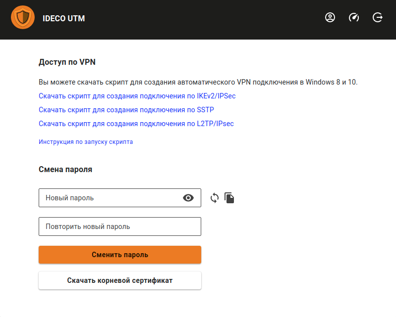

# Личный кабинет пользователя

Для быстрой настройки пользовательских подключений вы можете включить доступ к веб-интерфейсу Ideco UTM.

В личном кабинете, доступном по реквизитам учетных записей Ideco UTM \(локальных или доменных, в случае [интеграции с Active Directory](../../active-directory/README.md) \) пользователи смогут скачать готовые PowerShell-скрипты для создания пользовательских подключений и ссылку на инструкцию по настройке VPN и запуску скриптов.

Включить доступ из сети Интернет к личному кабинету и веб-интерфейсу администрирования Ideco UTM можно в разделе **Управление сервером -&gt; Администраторы**, включив настройку **Доступ к веб-интерфейсу из внешней сети**. После включения параметра личный кабинет и веб-интерфейс администрирования будут доступны по IP-адресу внешнего интерфейса Ideco UTM.


Если внешний IP-адрес Ideco UTM не входит в «белые» сети, то нужно пробросить порт 8443 на вышестоящем устройстве.


При входе под учетной записью пользователей \(в том числе импортированных из Active Directory\) они получат возможность скачать скрипты создания VPN-подключений и ссылку на инструкцию по их выполнению.

Также они получат возможность удаленного администрирования сервера Ideco UTM.

