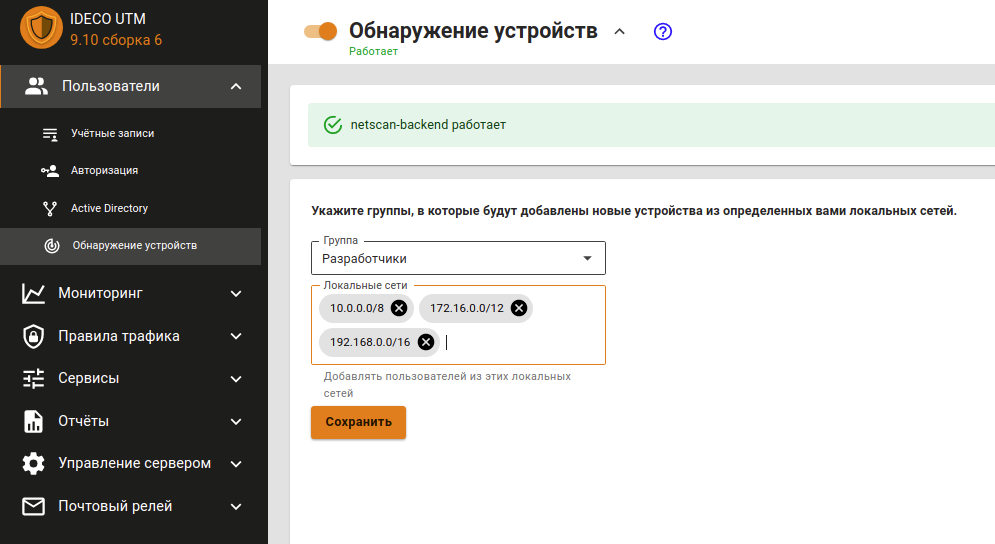

# Обнаружение устройств


Имя службы раздела **Обнаружение устройств**: `ideco-netscan-backend.service`. \
Список служб для других разделов, доступен по [ссылке](../server-management/terminal.md).



**Обнаружение устройств** создает авторизацию по MAC для локальных адресов в одном Ethernet-сегменте. Если устройство находится в локальной сети за роутером, то **Обнаружение устройств** создаст авторизацию по IP-адресу.

Данный модуль не осуществляет сканирования сети в поисках устройств, а работает в пассивном режиме.


При попытке выхода в Интернет будет создан пользователь в указанной группе с именем, соответствующим NetBIOS-имени компьютера. Если NetBIOS-имя определить не удалось, то по IP-адресу.

При необходимости можно ограничить локальные сети, пользователи из которых будут автоматически добавлены и авторизованы на Ideco UTM. Например, таким образом можно авторизовать пользователей, подключающихся по Wi-Fi или другой открытой сети.


При подключении к UTM, как к прокси серверу, система обнаружения устройств работать не будет.

