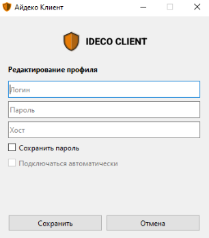
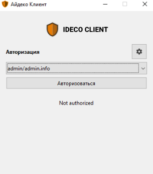

# Ideco агент


Название службы раздела **Ideco агент**: `ideco-agent-backend`; `ideco-agent-server`; `ideco-agent-websocket`. \
Список служб для других разделов доступен по [ссылке](../server-management/terminal.md).

Использует протокол Wireguard.



Установить программу Ideco агент можно только на ОС семейства Windows с 8 версии и новее.


Ideco агент управляет доступом пользователей в сеть Интернет из локальной сети и по VPN. Доступ будет обеспечен только в то время, когда пользователь авторизован с помощью этой программы.


Программа должна быть установлена на рабочей станции пользователя или может запускаться с удаленного сервера при входе в систему.

Ideco агент управляет доступом пользователей в сеть Интернет локальной сети и по VPN.

Порты для подключения, если UTM за NAT:
* 80 TCP - для работы сертификатов let's encrypt;
* 14765 TCP и 3051 UDP  - для работы Ideco агента.


## Установка Ideco агент

* Перейдите в раздел **Пользователи –> Ideco-agent**, переведите опцию **Ideco агент** в положение включен, введите доменное имя в соответствующей строке и нажмите **Сохранить**. Появится кнопка **Скачать Ideco агент**:

* В личном кабинете пользователя по кнопке **Скачать Ideco VPN-клиент для Windows** или **Скачать Ideco агент** для пользователя Active Directory:

 

Сохраните и запустите двойным кликом файл установки программы *IdecoAgent.msi*.

Если требуется заранее установить адрес подключения, запустите файл из командной строки с ключом `utm_address=имя_домена` (перейдите в директорию с файлом `cd [путь до файла]` и вызовите файл с ключом `IdecoAgent.msi utm_address=имя_домена`);

## Настройка профиля для первого запуска

1. После установки запустите Ideco агент. Программа установит связь с сервером и предложит ввести имя профиля, логин, пароль и домен:

 

2. Нажмите **Создать**, чтобы инициировать сессию пользователя для подключения;
3. Для авторизации выберите имя профиля, введенное на 1 шаге, и нажмите **Подключиться**.


Если при настройке профиля не была активирована опция **Сохранить пароль**, то при следующем подключении по этому профилю будет запрошен ввод пароля.


## Редактирование и удаление профиля

1. Перейдите в раздел **Настройки**, кликнув по ;
2. Выберите профиль для редактирования, нажав , и внесите изменения в поля формы;
3. Сохраните изменения в полях формы, нажав кнопку **Сохранить**.

Если пользователь подключается вне локальной сети, информация о сессии появится в разделах [Авторизованные пользователи](../monitor/authorized-users.md) и [VPN пользователи](../monitor/authorized-users.md/#vpn-polzovateli).

Если подключение из локальной сети, то Ideco агент создаст сессию веб-аутентификации. Информация о сессии будет доступна в разделе [Авторизованные пользователи](../monitor/authorized-users.md).

При появлении ошибки **Unknown error** убедитесь, что пользователь еще не авторизован данным способом. Например, при подключении из локальной сети была создана сессия по [веб-аутентификации](authorization/web-authorization.md) и с этого же устройства пользователь запускает программу Ideco агент.
