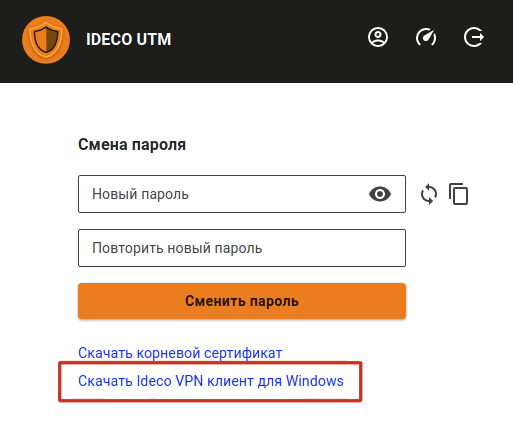

# Ideco агент


Название службы раздела **Ideco агент**: `ideco-agent-backend`; `ideco-agent-server`; `ideco-agent-websocket`. \
Список служб для других разделов доступен по [ссылке](../server-management/terminal.md).

Использует протокол Wireguard.



Установить программу Ideco agent можно только на ОС семейства Windows начиная с 8 версии и новее.


Ideco agent управляет доступом пользователей в сеть Интернет из локальной сети и по VPN. Доступ будет обеспечен только в то время, когда пользователь авторизован с помощью этой программы.

## Новая версия Ideco агент


Программа должна быть установлена на рабочей станции пользователя или запускаться с удаленного сервера при входе в систему.

Ideco Agent управляет доступом пользователей в сеть Интернет локальной сети и по VPN.

Порты для подключения, если UTM за NAT:
* 80 TCP - для работы сертификатов let's encrypt;
* 14765 TCP и 3051 UDP  - для работы Ideco агента.


В версии UTM 13.0 и выше реализована новая версия программы Ideco agent. Скачать ее можно несколькими способами:

* Перейдите в раздел **Пользователи –> Ideco-agent**, переведите в положение включен, введите доменное имя в соответствующей строке и нажмите **Сохранить**. Появится кнопка **Скачать Ideco агент**:

* В личном кабинете пользователя по кнопке **Скачать Ideco VPN клиент для Windows** или **Скачать Ideco агент** для пользователя Active Directory:

 

1\. Сохраните и запустите двойным кликом файл установки программы *IdecoAgent.msi*. \
Если требуется заранее установить адрес подключения, то запустите файл из командной строки с ключом `utm_address=имя_домена` (перейдите в директорию с файлом `cd [путь до файла]` и вызовите файл с ключом `IdecoAgent.msi utm_address=имя_домена`);

2\. После установки запустите IdecoAgent. Программа установит связь с сервером и предложит ввести логин, пароль и домен:

3\. После нажатия на **Авторизация** пользователь будет авторизован.

Если пользователь подключается вне локальной сети, то информация о сессии появится в разделах [Авторизованные пользователи](../monitor/authorized-users.md) и [VPN пользователи](../monitor/authorized-users.md).

Если подключение из локальной сети, то Ideco агент создаст сессию веб-аутентификации. Информация о сессии будет доступна в разделе [Авторизованные пользователи](../monitor/authorized-users.md).

При появлении ошибки **Unknown error** убедитесь, что пользователь еще не авторизован данным способом. Например, при подключении из локальной сети была создана сессия по [веб-аутентификации](authorization/web-authorization.md) и с этого же устройства пользователь запускает программу Ideco агент.

## Старая версия Ideco Agent

Если до обновления на UTM версии 13.0 и выше вы уже устанавливали и использовали программу Ideco Agent, то в разделе **Пользователи -> Ideco агент**  у вас будет доступна настройка старой версий Ideco Agent. Подробнее об этой настройке ниже.

Общая информация о старой версии Ideco Agent

Для авторизации с помощью программы-агента переведите тогл в положение включен  в разделе **Пользователи -> Ideco агент** и заполнить поле **Имя домена**.  После сохранения настройки, программу Ideco Agent можно скачать по кнопке **Скачать Ideco агент**:

Для успешной авторизации необходимо у пользователя указать в настройках сетевой карты в качестве шлюза и в качестве сервера DNS IP-адрес интернет-шлюза Ideco UTM.


При необходимости стоит разрешить в межсетевом экране подключение на сетевой порт 800/TCP из внутренней сети.


После запуска программы необходимо ввести логин и пароль пользователя. Состояние авторизации отображается иконкой в системном лотке. Возможные состояния представлены в следующей таблице.

|               Индикатор состояния агента               | Описание                           |
| :----------------------------------------------------: | ---------------------------------- |
|  | Программа не активна               |
|  | Идет подключение к серверу         |
|  | Доступ в интернет разрешен         |
|  | Сработал лимит предупреждения      |
|  | Сработал лимит отключения          |
|  | Ошибка. Доступ в интернет запрещен |

В контекстном меню иконки доступны пункты, описанные в таблице ниже:

| Пункт меню                      | Значение                       |
| ------------------------------- | ------------------------------ |
| Подключить                      | Отобразить информацию о подключении к сети Интернет             |
| Отключить                       | Отключиться от сервера        |
| Информация                      | Отобразить информацию о подключении к сети Интернет     |
| Запускаться при входе в систему | Установить автоматический запуск программы при входе в Windows     |
| О программе                     | Вывод информации о программе авторизации  |


При использовании Ideco Agent в домене Active Directory рекомендуется расположить IdecoAgent.exe на общем сетевом ресурсе и установить в политике входа в домен запуск приложения IdecoAgent.exe с ключом domain. Таким образом, запуск агента будет централизован, и не потребуется его установка на каждый компьютер.



При смене IP-адреса или доменного имени Ideco UTM, которые вы заполняли при настройке авторизации с помощью Ideco Agent обязательно нужно повторно скачать Ideco Agent, поскольку адрес встраивается в приложение при скачивании.


Установка старой версии Ideco Agent

Настройка VPN-подключения к Ideco UTM включает в себя следующие действия:

1\. Убедитесь, что на ОС Windows установлена версия .NET Framework версии 4.8. В ином случае программа Ideco VPN может запросить установить более новую версию .NET. Для этого перейдите в **Панель управления -> Установка и удаление программ -> Включение и отключение компонентов Windows**.

2\. Настройте правило [обратного прокси](../services/reverse-proxy.md) в веб-интерфейсе Ideco UTM.

3\. В поле **Запрашиваемый адрес в Интернете** введите домен сервера Ideco UTM в формате: `домен/wireguard`.

4\. В поле **Адрес в локальной сети** укажите URL `https://127.0.0.1:8443/wireguard`.

Пример правила представлен на скриншоте ниже:

5\. Скачать и установить программу Ideco VPN.

Скачать Ideco VPN агент можно только в веб-интерфейсе Ideco UTM. Перейдите в раздел **Пользователи -> Ideco агент** и перейдите по ссылке **Скачать Ideco агент**.

После скачивания установите и запустите программу двойным нажатием левой кнопкой мыши на иконку программы.

Откроется окно, в котором вам необходимо заполнить поля **Сервер** (доменное или IP-адрес вашего сервера), **Логин** и **Пароль**.

Если вы хотите подключиться к серверу по IP-адресу, а не по доменному имени сервера, сначала установите корневой сертификат в хранилище сертификатов локального компьютера, иначе при попытке соединения появится ошибка **"Не удалось получить последнюю версию"**.\
Добавление сертификата в хранилище сертификатов локального компьютера представлено ниже:

При успешном подключении появится окно с информацией о соединении (название сервера и время сессии).

## Возможные ошибки при подключении

Если при подключении с ОС Windows 10 к VPN серверу Ideco возникает ошибка (например, сервер не отвечает). А попытки подключения по протоколам PPTP, L2TP, IKEv2 не помогают решить проблему, то, возможно, возникла ошибка службы RASMAN (Remote Access Connections Manager) для Always on VPN.\
Эта проблема признана Microsoft и по последним данным исправлена в обновлении для Windows 10 1903 — KB4522355 ([https://support.microsoft.com/en-us/help/4522355/windows-10-update-kb4522355](https://support.microsoft.com/en-us/help/4522355/windows-10-update-kb4522355)). Вы можете скачать и установить данное обновление вручную или через Windows Update/WSUS.\
Если обновление не помогло, переустановите виртуальные адаптеры **WAN miniports** в диспетчере устройств. Для этого выполните следующие действия:

1\. Запустите **Диспетчер устройств** (devmgmt.msc).

2\. Разверните секцию **Сетевые адаптеры (Network Adapters).**

3\. Последовательно щелкните правой кнопкой по следующим адаптерам и удалите их (**Uninstall device**): **WAN Miniport (IP)**, **WAN Miniport(IPv6)** и **WAN Miniport (PPTP)**.

4\. После удаления выберите в меню **Действие -> Сканировать на предмет изменений оборудования** **(Action -> Scan for Hardware changes)** и дождитесь, пока Windows не обнаружит и не установит драйвера для этих виртуальных устройств.

5\. После этого сбросьте сетевые настройки Windows 10: **Настройки -> Сеть и Интернет -> Сброс сети -> Сбросить сейчас (Settings -> Network & Internet -> Network Reset -> Reset now).**

