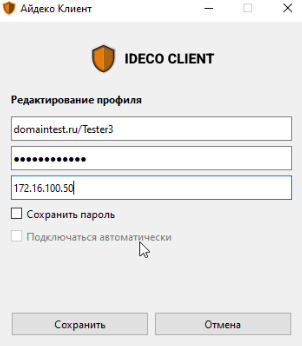

# Ideco агент


Название службы раздела **Ideco агент**: `ideco-agent-backend`; `ideco-agent-server`; `ideco-agent-websocket`. \
Список служб для других разделов доступен по [ссылке](../server-management/terminal.md).

Использует протокол Wireguard.



Нужна помощь при настройке Ideco UTM? Получите быстрый ответ от [чат-бота](https://gpt-docs.ideco.ru/) нашей документации!



Установить программу Ideco агент можно только на ОС семейства Windows с 8 версии и новее.


Ideco агент управляет авторизацией пользователей при подключении к Ideco UTM в локальной сети и по VPN из внешних сетей.


Программа должна быть установлена на рабочей станции пользователя.

Порты для подключения, если UTM за NAT:
* 80 TCP - для работы сертификатов let's encrypt;
* 14765 TCP и 3051 UDP  - для работы Ideco агента.

Для корректного подключения активируйте в карточке пользователя опцию **Разрешить удаленный доступ через VPN**.


## Установка Ideco агент

* Перейдите в раздел **Пользователи –> Ideco-agent**, переведите опцию **Ideco агент** в положение включен, введите доменное имя в соответствующей строке и нажмите **Сохранить**. Появится кнопка **Скачать Ideco агент**:

* В личном кабинете пользователя по кнопке **Скачать Ideco VPN-клиент для Windows** или **Скачать Ideco агент** для пользователя Active Directory:

 

Сохраните и запустите двойным кликом файл установки программы *IdecoAgent.msi*.

Если требуется заранее установить адрес подключения, запустите файл из командной строки с ключом `utm_address=имя_домена` (перейдите в директорию с файлом `cd [путь до файла]` и вызовите файл с ключом `IdecoAgent.msi utm_address=имя_домена`);

## Настройка профиля для первого запуска

1. После установки запустите Ideco агент. Программа установит связь с сервером и предложит ввести данные. Дальнейший формат ввода логина и хоста зависит от количества доменов, в которые введен УТМ:

UTM введен в один домен:

Введите **логин** в домене, в качестве **хоста** укажите домен.

 

UTM введен в несколько доменов:

Введите **логин** в формате **имя_домена/имя_пользователя**, в качестве **хоста** укажите **IP УТМ**.

2. Нажмите **Сохранить**, чтобы создать новый профиль пользователя для авторизации;
3. Для авторизации выберите профиль пользователя из выпадающего списка и нажмите **Авторизоваться**.

## Редактирование профиля

1. Перейдите в раздел **Настройки**, кликнув по ;
2. Выберите профиль для редактирования, нажав , и внесите изменения в поля формы;
3. Сохраните изменения в полях формы, нажав кнопку **Сохранить**.

## Особенности работы Ideco агент

* Опцией автоматического подключения может обладать только один профиль. При активации опции автоподключения другому профилю у предыдущего автоподключение будет отключено.
* Если компьютер уже находится в домене, то Агент создаст для текущего пользователя SSO-профиль с включенным автоподключением. В ином случае нужно будет добавить стандартный профиль, воспользовавшись [инструкцией](#nastroika-profilya-dlya-pervogo-zapuska);
* Ошибка с текстом **Неизвестная ошибка** возникает при попытке повторной авторизации уже авторизованного по IP пользователя.


Чтобы исключить взаимодействие пользователя с приложением нужно установить Агент на доменный компьютер с ключом хоста UTM. В этом случае авторизация для пользователей этого компьютера будет происходить через их SSO-профиль по-умолчанию в "бесшумном" режиме автоподключения.


При подключении из локальной и внешней сети пользователи появятся в разных разделах:
* При подключении из внешней сети информация о сессии появится в разделах [Авторизованные пользователи](../monitor/authorized-users.md) и [VPN пользователи](../monitor/authorized-users.md/#vpn-polzovateli);
* При подключении из локальной сети информация о сессии появится только в разделе [Авторизованные пользователи](../monitor/authorized-users.md).
