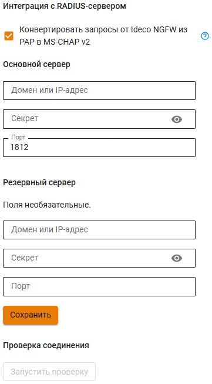

# Интеграция с RADIUS-сервером


При отключенной интеграции с RADIUS-сервером пользователи RADIUS не смогут аутентифицироваться на NGFW.


## Настройка интеграции


Доступна аутентификация только VPN-пользователей NGFW через RADIUS-сервер. 

Аутентификация на RADIUS-cервере доступна только по протоколу MS-CHAPv2 с генерацией MPPE-ключей.

Для взаимодействия с основным RADIUS-сервером по умолчанию используется порт 1812.


Для настройки интеграции с RADIUS-сервером выполните действия:

1. Перейдите в раздел **Пользователи -> RADIUS** и включите опцию **RADIUS**.
2. Укажите доменное имя или IP-адрес внутреннего RADIUS-сервера и секрет (пароль доступа). Если требуется, поменяйте порт, по которому будет происходить подключение к серверу:

3. Нажмите **Сохранить**.


При наличии в сети двух RADIUS-серверов настройте один как резервный с указанием порта подключения.

При отсутствии ответа от основного RADIUS-сервера запрос об аутентификации будет перенаправлен на резервный RADIUS-сервер. 


## Механизм добавления пользователей в дерево Ideco NFGW

1. При подключении пользователя к Ideco NGFW происходит поиск пользователя в дереве пользователей NGFW. 
2. Если пользователь не будет найден в дереве NGFW, NGFW отправит запрос к RADIUS-серверу на аутентификацию пользователя.
3. При отсутствии группы **RADIUS** на Ideco NGFW группа будет пересоздаваться при аутентификации пользователей RADIUS-сервера. 
4. После аутентификации пользователь будет добавлен в группу **RADIUS** на Ideco NGFW.

Если пользователь уже есть в группе **RADIUS**, то запрос на аутентификацию сразу будет отправлен на **RADIUS-сервер**.


Группу и пользователей **RADIUS** можно использовать для создания правил фильтрации трафика и других задач.



Ограничения для группы и пользователей RADIUS

* Запрещено менять параметры пользователя, за исключением полей **Имя**, **Комментарии** и опции **Запретить доступ**;
* Запрещено перемещать пользователей в другие группы;
* Запрещено перемещать других пользователей NGFW в группу **RADIUS**;
* Запрещена настройка IP и MAC авторизации для пользователей группы;
* Недоступна двухфакторная аутентификация для пользователей группы;
* Не доступна авторизация пользователей группы в личном кабинете и веб-почте.

