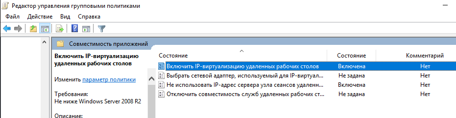

# Пользователи терминального сервера

## Авторизация терминального сервера

Если у администратора нет необходимости в отдельной авторизации пользователей терминального сервера, и к ним могут быть применены одинаковые настройки доступа (контент-фильтра и пользовательского файрвола), то можно авторизовать сервер, как одного пользователя.

Лучший вариант для этого - [авторизация по IP-адресу](authorization/ip.md).

Обратите внимание, что при большом количестве пользователей на сервере терминалов может потребоваться [увеличить количество одновременных сессий](https://docs.microsoft.com/ru-ru/windows-server/remote/remote-desktop-services/troubleshoot/remote-desktop-service-currently-busy#check-the-connection-limit-policy) с одного адреса в дополнительных параметрах безопасности.

## Авторизация пользователей терминального сервера

Возможна **раздельная авторизация пользователей** терминального сервера (работающего под управлением ОС Windows Server 2008 R2 и Windows Server 2012) с помощью авторизации через [Ideco Agent](authorization/ideco-agent.md) или по [SSO (NTLM)](active-directory/active-directory-user-authorization.md#veb-avtorizaciya-sso-ili-ntlm). При этом сам сервер по IP авторизовать не нужно.

Для раздельной авторизации пользователей терминального сервера на сервере терминалов нужно настроить **Remote Desktop IP Virtualization**, а на сервере Ideco UTM настроить авторизацию пользователей через [Ideco Agent](authorization/ideco-agent.md) или [веб-авторизацию (SSO или NTLM)](active-directory/active-directory-user-authorization.md#veb-avtorizaciya-sso-ili-ntlm). Авторизация пользователей терминального сервера по логам контроллера домена AD пока не реализована.

### Настройка Remote Desktop IP Virtualization на Windows Server 2012

Для работы функции [Remote Desktop IP Virtualization](https://social.technet.microsoft.com/wiki/ru-ru/contents/articles/22770.windows-server-2012-r2-ip.aspx) на одном из Windows-серверов должна быть добавлена роль DHCP-сервера (с другими DHCP-серверами данная функция может работать некорректно) и выделена область IP-адресов для пользователей терминального сервера.

В **Редакторе управления групповыми политиками** необходимо перейти по пути:
**Computer Configation –> Policies –> Administrative Templates –> Windows Components -> Remote Desktop Service –> Remote Desktop Session Host –> Application Compatibility**

Путь для русскоязычной версии: **Конфигурация компьютера –> Административные шаблоны –> Компоненты Windows -> Служба удаленных рабочих столов –> Узел сеансов удаленных рабочих столов –> Совместимость приложений**. Включить опцию **Turn on Remote Desktop IP Virtualization (Включить IP-виртуализацию удаленных рабочих столов)** в групповой политике с параметром **Per Session (Для сеансов)**:

Рекомендуется также включить опцию **Do not use Remote Desktop Session Host server IP address when virtual IP address is not available (Не использовать IP-адрес сервера узла сеансов удаленных рабочих столов, если виртуальный IP-адрес недоступен)**.

Командой `gpupdate /force` выполнить обновление всех политик.

Проверить, что настройки изменились, можно командой в PowerShell:

`Get-WmiObject -Namespace root\cimv2\TerminalServices -query "select * from Win32_TSVirtualIP"`

Где значения должны быть: `VirtualIPActive = 1` (вкл. виртуализация) и `VirtualIPMode=0` (для сессии).

Воспользуйтесь [альтернативным](https://social.technet.microsoft.com/wiki/ru-ru/contents/articles/22770.windows-server-2012-r2-ip.aspx) вариантом установки, если описанный выше вариант не подходит.
