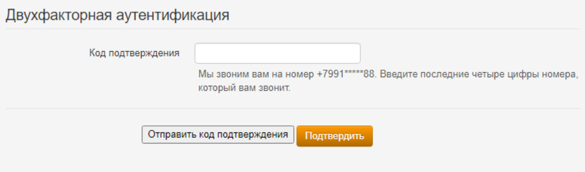

# Двухфакторная аутентификация


Название службы раздела **Двухфакторная аутентификация**: `ideco-web-authd.service`. \
Список служб для других разделов доступен по [ссылке](../server-management/terminal.md).



Если перевести раздел **Двухфакторной аутентификации** в положение **включен**, аутентификация всех пользователей по VPN-подключению будет осуществляться через двухфакторную аутентификацию, вне зависимости от наличия сохраненного номера телефона в карточке пользователя.


## TOTP-токен

Для авторизации пользователю потребуется отсканировать QR код или использовать токен. 

### Настройка Ideco UTM

Включите двухфакторную аутентификацию в разделе **Пользователи -> Двухфакторная аутентификация** и установите флаг **Разрешить удаленный доступ через VPN** в карточке пользователя или карточке папки.

Если в карточке пользователя отсутствует флаг **Разрешить удаленный доступ через VPN**, пользователь сможет настроить двухфакторную аутентификацию, но не сможет авторизоваться. 


Флаг **Инициализация секретного ключа только из локальной сети** запретит генерацию QR кода в личном кабинете пользователя из внешней сети.


### Аутентификация пользователя

Для аутентификации потребуется приложение: Яндекс.Ключ  или Google Authenticator . 

1\. Войдите в личный кабинет UTM, указав логин и пароль пользователя;

2\. Нажмите кнопку **Настроить двухфакторную аутентификацию** и далее **Сгенерировать QR код**:

3\. Войдите в приложение для аутентификации и отсканируйте код или введите ключ настройки (расположен под QR кодом). При вводе ключа настройки выберите тип ключа **По времени**. Если выбрать тип **По счетчику**, то пользователь не сможет авторизоваться. 

Если вернуться в личный кабинет не отсканировав QR код, то повторно он появится только после сброса секретного ключа в карточке пользователя.

4\. Подключитесь по VPN и откройте браузер и введите код из приложения в соответствующее поле:

Для последующей авторизации выполните действия из пункта четыре.

## SMS Aero

### Настройка Ideco UTM

Перед настройкой Ideco UTM потребуется зарегистрироваться в [личном кабинете](https://smsaero.ru/) SMS Aero. 

1\. Перейдите в раздел **Пользователи -> Учетные записи**.

2\. Откройте карточку пользователя и убедитесь, что заполнено поле **Телефон** и установлен флаг **Разрешить удаленный доступ через VPN**.

3\. Перейдите в раздел **Пользователи -> VPN-подключение**, установите и сохраните необходимые настройки.

4\. Перейдите в раздел **Пользователи -> Двухфакторная аутентификация** и переведите переключатель в левом верхнем углу в положение **включен**.

5\. Введите e-mail и API-ключ от [личного кабинета](https://smsaero.ru/) SMS Aero и нажмите **Сохранить**.

### Настройка пользователя

1\. Проведите настройку VPN-подключения на устройстве, воспользовавшись [инструкцией](../../recipes/popular-recipes/vpn/README.md);

2\. Если вы хотите, чтобы подключение использовалось только для ресурсов подключаемой сети, то убедитесь, что настройки VPN-подключения соответствуют следующим пунктам:

**Для Windows**:
* Перейдите в раздел **Параметры сети и интернет -> VPN -> Настройка параметров адаптера**;
* Нажмите правой кнопкой мыши по созданному подключению и выберите **Свойства**;
* Перейдите во вкладку **Сеть**;
* Нажмите на **IP версии 4 (TCP/IPv4) -> Свойства -> Дополнительно**;
* Снимите флаг с пункта **Использовать основной шлюз из удалённой сети**;
* Нажмите **ОК**.

**Для Ubuntu**:
* Перейдите в раздел **Настройки -> Сеть**;
* Откройте настройки VPN-подключения;
* Перейдите во вкладку **IPv4**;
* Установите флаг в пункте **Использовать это подключение для ресурсов этой сети**.

3\. Включите созданное VPN-подключение;

4\. При переходе в браузер, откроется страница авторизации: 

5\. Нажмите **Отправить код подтверждения**. На указанный в карточке пользователя UTM номер телефона поступит звонок и **последние 4 цифры входящего номера являются кодом**:
* Если номер телефона в карточке пользователя отсутствует, то на странице аутентификации появится предупреждение: \
  
* Если номер телефона в карточке пользователя сохранен, то на странице аутентификации появится сообщение **Мы звоним вам на номер +7ХХХ*****88. Введите последние цифры номера, который вам звонит**: \
  

6\. На указанный номер телефона поступит звонок. Укажите последние 4 цифры номера и нажмите **Подтвердить**:

Если последние 4 цифры указаны неверно, то появится соответствующее предупреждение:

7\. Если подключение успешно выполнено, то появится следующее окно:


При включенной двухфакторной аутентификации невозможен доступ с сетей, находящихся за подключенным пользователем без NAT на стороне клиента.
