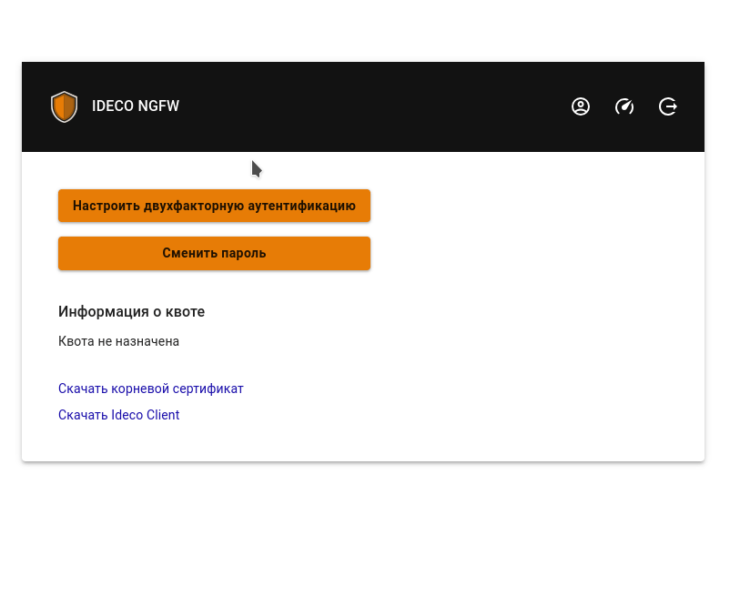
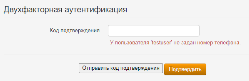

# Двухфакторная аутентификация


Название службы раздела **Двухфакторная аутентификация**: `ideco-web-authd`. \
Список служб для других разделов доступен по [ссылке](../server-management/terminal.md).



Если перевести раздел **Двухфакторной аутентификации** в положение **включен**, аутентификация всех пользователей по VPN-подключению будет осуществляться через двухфакторную аутентификацию, вне зависимости от наличия сохраненного номера телефона в карточке пользователя.

При включенной двухфакторной аутентификации невозможен доступ с сетей, находящихся за подключенным пользователем без NAT на стороне клиента.


## Домен для двухфакторной аутентификации

Чтобы указать домен для двухфакторной аутентификации, выполните действия:

1. Перейдите в раздел **Пользователи -> Авторизация**.
2. Включите веб-аутентификацию.
3. Введите домен в поле **Доменное имя Ideco UTM**.

Если веб-аутентификация не нужна, то ее можно отключить, оставив домен в поле **Доменное имя Ideco UTM**.


## TOTP-токен

Для аутентификации пользователю потребуется отсканировать QR-код или использовать токен. 


Пользователь может генерировать TOTP токен без включения двухфакторной авторизации.


Настройка Ideco UTM

Включите двухфакторную аутентификацию в разделе **Пользователи -> Двухфакторная аутентификация** и установите флаг **Разрешить удаленный доступ через VPN** в карточке пользователя или карточке папки.

Если в карточке пользователя отсутствует флаг **Разрешить удаленный доступ через VPN**, пользователь сможет настроить двухфакторную аутентификацию, но не сможет аутентифицироваться. 

Флаг **Инициализация секретного ключа только из локальной сети** запретит генерацию QR-кода в личном кабинете пользователя из внешней сети.

 

Аутентификация пользователя

Для аутентификации потребуется приложение: [Яндекс.Ключ](https://mobile.yandex.ru/apps/android/key) или [Google Authenticator](https://googleauthenticator.org/). 

1\. Войдите в личный кабинет UTM, указав логин и пароль пользователя;

2\. Нажмите кнопку **Настроить двухфакторную аутентификацию** и далее **Сгенерировать QR-код**:

3\. Войдите в приложение для аутентификации, отсканируйте код или введите ключ настройки (расположен под QR-кодом). При вводе ключа настройки выберите тип ключа **По времени**. Если выбрать тип **По счетчику**, то пользователь не сможет аутентифицироваться. 

Если вернуться в личный кабинет не отсканировав QR-код, то повторно он появится только после сброса секретного ключа в карточке пользователя.

4\. Подключитесь по VPN, зайдите на любой сайт, отличный от личного кабинета пользователя, и введите код из приложения в появившееся поле:

 

## SMS Aero

Настройка Ideco UTM

Перед настройкой Ideco UTM потребуется зарегистрироваться в [личном кабинете](https://smsaero.ru/) SMS Aero. 

1\. Перейдите в раздел **Пользователи -> Учетные записи**.

2\. Откройте карточку пользователя и убедитесь, что заполнено поле **Телефон** и установлен флаг **Разрешить удаленный доступ через VPN**.

3\. Перейдите в раздел **Пользователи -> VPN-подключение**, установите и сохраните необходимые настройки.

4\. Перейдите в раздел **Пользователи -> Двухфакторная аутентификация** и переведите переключатель в левом верхнем углу в положение **включен**.

5\. Введите e-mail и API-ключ от [личного кабинета](https://smsaero.ru/) SMS Aero и нажмите **Сохранить**.

 

Настройка пользователя

1\. Проведите настройку VPN-подключения на устройстве, воспользовавшись [инструкцией](../../recipes/popular-recipes/vpn/README.md);

2\. Если требуется, чтобы подключение использовалось только для ресурсов подключаемой сети, то убедитесь, что настройки VPN-подключения соответствуют следующим пунктам:

**Для Windows**:
* Перейдите в раздел **Параметры сети и интернет -> VPN -> Настройка параметров адаптера**;
* Нажмите правой кнопкой мыши по созданному подключению и выберите **Свойства**;
* Перейдите во вкладку **Сеть**;
* Нажмите на **IP версии 4 (TCP/IPv4) -> Свойства -> Дополнительно**;
* Снимите флаг с пункта **Использовать основной шлюз из удалённой сети**;
* Нажмите **ОК**.

**Для Ubuntu**:
* Перейдите в раздел **Настройки -> Сеть**;
* Откройте настройки VPN-подключения;
* Перейдите во вкладку **IPv4**;
* Установите флаг в пункте **Использовать это подключение для ресурсов этой сети**.

3\. Включите созданное VPN-подключение;

4\. При переходе в браузер откроется страница аутентификации: 

5\. Нажмите **Отправить код подтверждения**. На указанный в учетной записи номер телефона поступит СМС с кодом:
* Если номер телефона в карточке пользователя отсутствует, то на странице аутентификации появится предупреждение: 
  

* Если номер телефона в карточке пользователя сохранен, то на указанный номер телефона поступит СМС. Введите код из СМС и нажмите **Подтвердить**:

Если код указан неверно, то появится соответствующее предупреждение:

6\. Если подключение успешно выполнено, то появится следующее окно:

 


Для настройки таймкодов отправки сообщений перейдите в личный кабинет SMS Aero во вкладку **Настройки** и переведите опцию **Исключать множественную отправку** в положение включен. Затем введите лимит и период отправки сообщений.



## Мультифактор

Настройка Ideco UTM

Перед настройкой Ideco UTM потребуется зарегистрироваться в [системе управления Мультифактором](https://admin.multifactor.ru/account/login), установить приложение [Multifactor](https://play.google.com/store/apps/details?id=ru.multifactor.app&pli=1) и активировать его, отсканировав QR-код. \
Помимо приложения Multifactor, для аутентификации можно использовать Telegram, Яндекс.Ключ, Биометрию и U2F. Подробное описание регистрации и аутентификации этими методами доступно в [документации Multifactor](https://multifactor.ru/docs/methods/).

1\. В веб-интерфейсе UTM перейдите в раздел **Пользователи -> Двухфакторная аутентификация**

2\. Выберите **Интеграция с Мультифактор**

3\. Заполните **API Key** и **API Secret**. Скопировать значение полей можно в личном кабинете Multifactor (Настройки -> Расширенное API -> Включить API).

4\. Нажмите **Сохранить**.

Для дальнейшей аутентификации пользователям потребуется установить и настроить приложения, указанные администратором в настройках группы. Корректировать способы аутентификации для пользователей можно в личном кабинете Multifactor, в разделе **Группы -> Параметры -> Редактировать**.

 

Настройка пользователя

**Настройка аутентификации**

1\. Проведите настройку VPN-подключения на устройстве, воспользовавшись [инструкцией](../../recipes/popular-recipes/vpn/README.md);

2\. Включите созданное VPN-подключение;

3\. При переходе в браузер откроется страница аутентификации:

4\. После нажатия **Далее** появится страница с предложением установить приложение на устройство. Если приложение установлено, нажмите **Далее**;

5\. Отсканируйте QR-код или откройте ссылку, появившуюся на экране.

**Аутентификация**

1\. Нажмите **Выполнить вход**:

2\. В окне **Двухфакторная аутентификация** можно менять способ аутентификации:

3\. В зависимости от выбранного способа, подтвердите вход.

 
