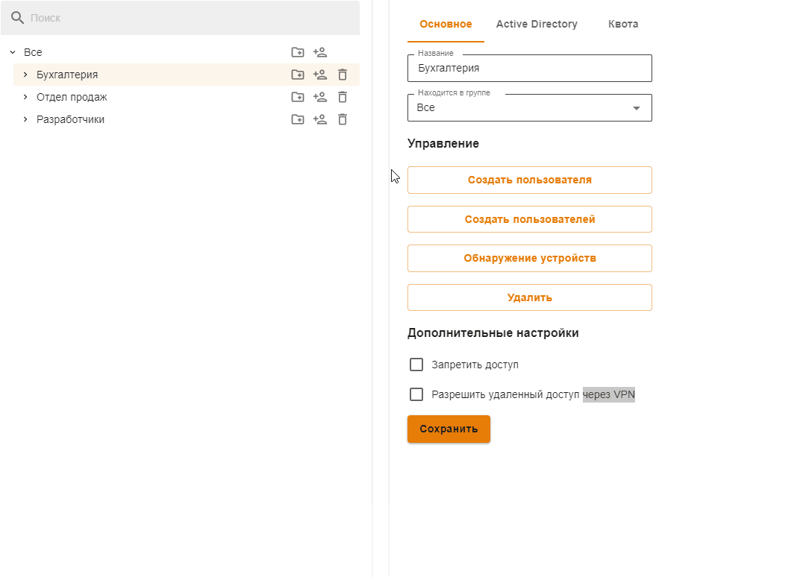
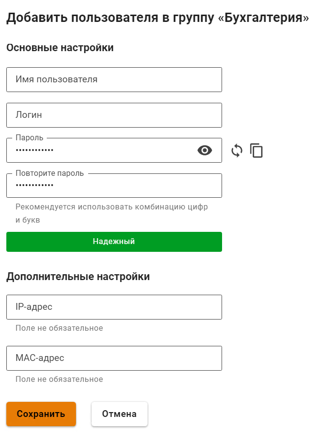
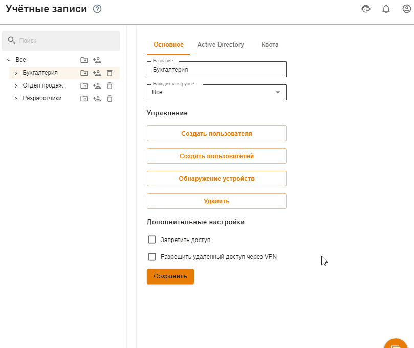
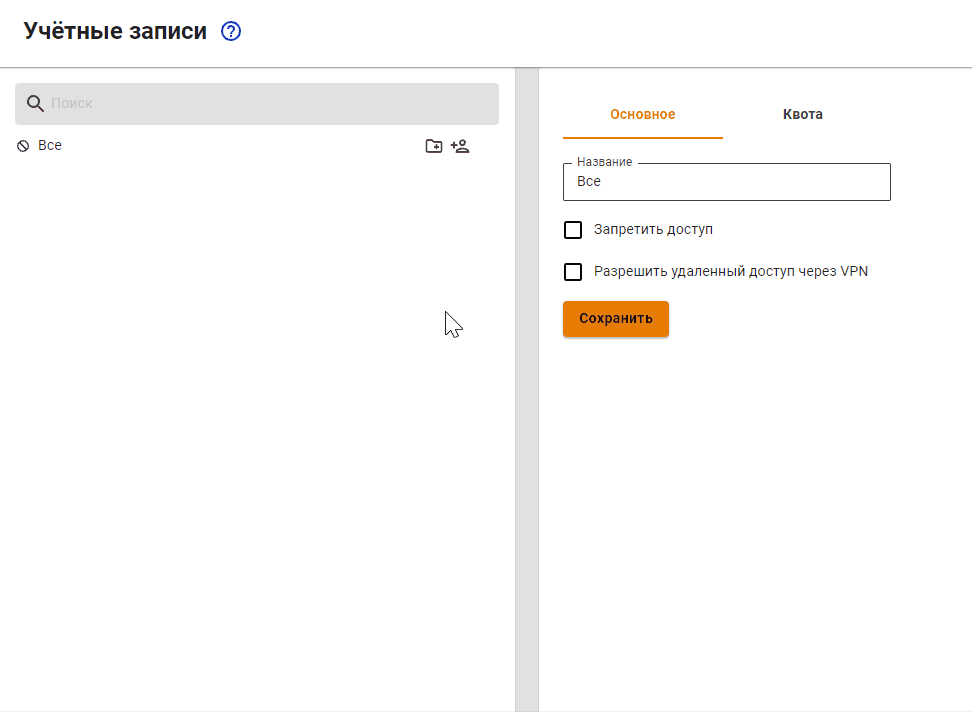
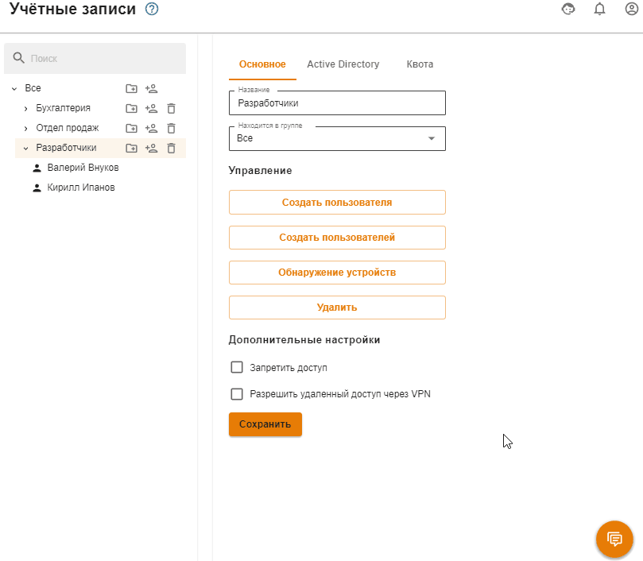
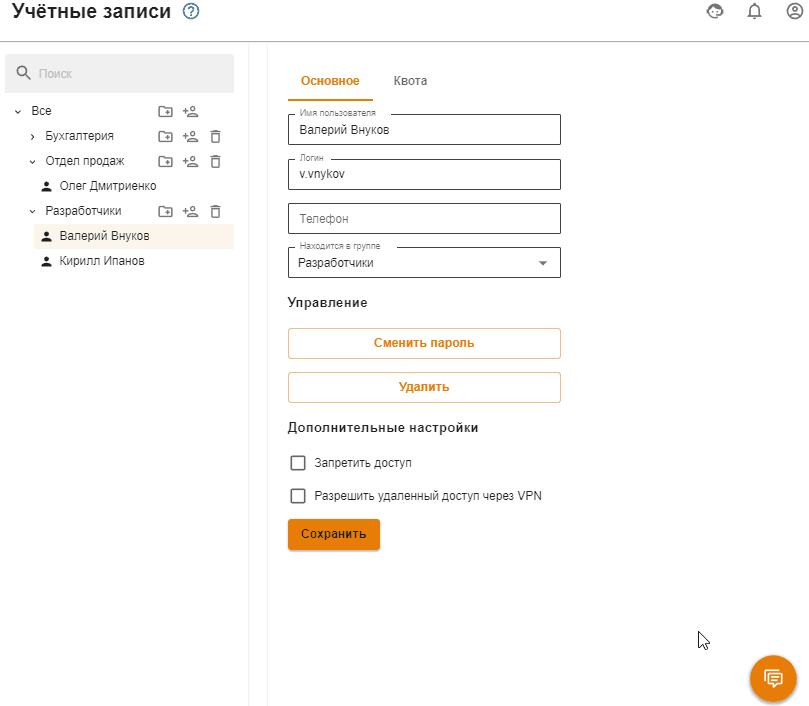

# Управление пользователями

## Общее

В дереве пользователей есть соответствующие кнопки, чтобы управлять группами и учетными записями:

| Обозначение | Описание |
| :---: | :--- |
|  | Создать учетную запись пользователя |
|  | Создать группу |
|  | Удалить учетную запись пользователя или группу |

## Создание учетной записи пользователя

Чтобы создать учетную запись в определенной группе, нажмите в ней на иконку создания пользователя. Внешний вид элементов управления был проиллюстрирован в таблице выше.

Второй способ создания пользователя в группе - выбрать нужную группу, и нажать на кнопку **Создать пользователя** в правой части окна во вкладке **Основное**.

Далее перед вами появится окно с формой создания учетной записи пользователя, в котором нужно определить ряд параметров. Форма создания учетной записи пользователя показана ниже.

В таблице ниже представлен перечень параметров учетной записи:

| Параметр | Описание |
| :--- | :--- |
| Имя пользователя | Укажите имя пользователя, для которого создается учетная запись, например, Иванов Иван. Максимальное количество символов - 128 |
| Логин | Укажите логин, который будет применяться пользователем для прохождения процедуры авторизации в различных службах Ideco UTM. Логин необходимо вводить латинскими символами в нижнем регистре, например: i.ivanov. Максимальное количество символов - 32 |
| Пароль | Укажите пароль. Рекомендуем использовать пароли, учитывая требования к созданию сложности паролей: минимальная длина - 10 символов; использование строчных и заглавных латинских символов; использование цифр и специальных символов. Можно автоматически сгенерировать пароль |
| Повторите пароль | Повторно укажите пароль для проверки. При автоматической генерации пароля он будет автоматически продублирован в это поле |
| IP-адрес/MAC-адрес | Данная привязка будет отображена в разделе **Авторизация -> IP и MAC-авторизация**. Но если данный IP-адрес или MAC-адрес будет использоваться в правилах [DHCP-сервера](../services/dhcp.md), то правило DHCP-сервера будет выполняться в приоритете. |

Для учетных записей, импортированных из MS Active Directory (AD), проверка пароля осуществляется средствами AD. Настройка авторизации пользователей Active Directory производится в соответствующем [разделе](active-directory/active-directory-user-authorization.md).

Создать пользователя в группе из Active Directory из Ideco UTM нельзя. При необходимости добавить дополнительного пользователя в группу Active Directory, это необходимо делать в дереве пользователей на контроллере домена.


Посмотреть или восстановить пароль учетной записи пользователя нельзя, допускается только его изменение.


Теперь, когда вы определили все параметры, нажмите кнопку **Сохранить**. Создастся учетная запись, у которой автоматически будут установлены значения некоторых параметров группы, в которой она была создана.

## Создание группы

Для создания группы нужно нажать на соответствующий элемент управления, который находятся справа от названия группы (вы можете создать как группу в корне дерева, так и дочернюю).

Откроется окно, в котором вам нужно будет указать название новой группы и нажать кнопку **Сохранить**. Пример добавления группы приведен ниже:

## Массовое создание пользователей с авторизацией по IP

Возможно массовое создание пользователей для их авторизации по IP. Подробнее об этом можно прочитать в [статье](authorization/ip.md), посвященной этому типу авторизации.

Либо можно воспользоваться [поиском устройств](device-discovery.md) для их автоматического создания при попытке выхода в сеть Интернет.

## Удаление учетной записи пользователя или группы

Для удаления учетной записи пользователя необходимо навести курсор на пользователя и нажать на соответствующий элемент управления. Также можно выбрать нужного вам пользователя и нажать на кнопку **Удалить** на вкладке **Основное**.

Удаление группы осуществляется аналогичным образом.

## Перемещение учетной записи пользователя

Чтобы переместить учетную запись пользователя в другую группу, выделите этого пользователя и на вкладке **Основное** найдите поле **Находится в группе**. Из выпадающего списка выберите группу, в которую надо переместить пользователя, и нажмите на кнопку **Сохранить**.

