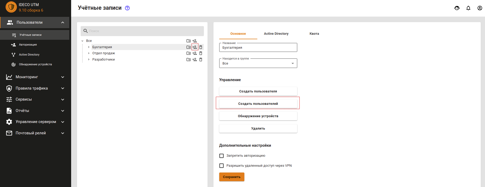
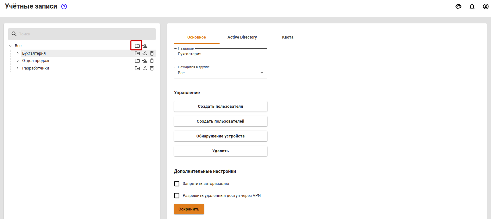
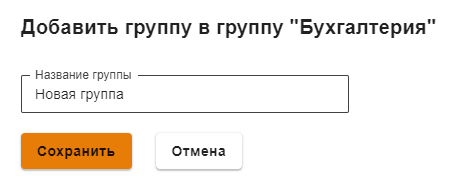
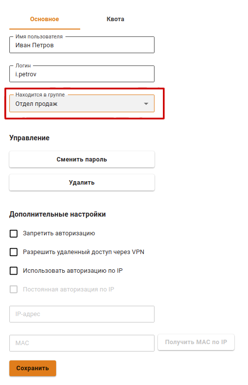

# Управление пользователями

## Общее

Для управления группами и учетными записями в дереве пользователей на каждой группе есть соответствующие кнопки:

| Обозначение | Описание |
| :---: | :--- |
|  | Создать учетную запись пользователя |
|  | Создать группу |
|  | Удалить учетную запись пользователя или группу |

## Создание учетной записи пользователя

Чтобы создать учетную запись в определенной группе, нажмите в ней на иконку создания пользователя. Внешний вид элементов управления был проиллюстрирован в таблице выше. Второй способ создания пользователя в группе - выбрать нужную группу, и нажать на кнопку **Создать пользователя** в правой части окна во вкладке **Основное**.

Далее перед вами появится окно создания учетной записи пользователя, в котором нам нужно определить ряд параметров. В таблице ниже представлен перечень параметров учетной записи:

| Параметр | Описание |
| :--- | :--- |
| Имя пользователя | Укажите имя пользователя, для которого создается учетная запись, например, Иванов Иван. Максимальное количество символов - 128 |
| Логин | Укажите логин, который будет применяться пользователем для прохождения процедуры авторизации в различных службах Ideco UTM. Логин необходимо вводить латинскими символами в нижнем регистре, например: i.ivanov. Максимальное количество символов - 32 |
| Пароль | Укажите пароль. Рекомендуем использовать пароли, учитывая требования к созданию сложности паролей: минимальная длина - 10 символов; использование строчных и заглавных латинских символов; использование цифр и специальных символов. Можно автоматически сгенерировать пароль |
| Повторите пароль | Повторно укажите пароль для проверки. При автоматической генерации пароля он будет автоматически продублирован в это поле |

Форма создания учетной записи пользователя показана ниже.

Логин и пароль используются для авторизации пользователя.

Для учетных записей, импортированных из MS Active Directory \(AD\), проверка пароля осуществляется средствами AD. Настройка авторизации пользователей Active Directory производится в соответствующем [разделе](active-directory/active-directory-user-authorization.md).


Посмотреть или восстановить пароль учетной записи пользователя нельзя, допускается только его изменение. 


Теперь, когда вы определили все параметры, нажмите кнопку **Сохранить**. Создастся учетная запись, у которой автоматически будут установлены значения некоторых параметров группы, в которой она была создана.

## Создание группы

Для создания группы нужно нажать на соответствующий элемент управления, который находятся справа от названия группы \(вы можете создать как группу в корне дерева, так и дочернюю\).

Откроется окно, в котором вам нужно будет указать название новой группы и нажать кнопку **Сохранить**. Окно добавления группы показано на скриншоте ниже:

## Массовое создание пользователей с авторизацией по IP

Возможно массовое создание пользователей для их авторизации по IP. Подробнее об этом можно прочитать в [статье](authorization/ip.md), посвященной этому типу авторизации.

Либо можно воспользоваться [поиском устройств](../services/device-discovery.md) для их автоматического создания при попытке выхода в сеть Интернет.

## Удаление учетной записи пользователя или группы

Для удаления учетной записи пользователя необходимо навести курсор на пользователя и нажать на соответствующий элемент управления. Также можно выбрать нужного вам пользователя и нажать на кнопку **Удалить** на вкладке **Основное**.

Удаление группы осуществляется аналогичным образом.

## Перемещение учетной записи пользователя или группы

Чтобы переместить учетную запись пользователя в другую группу, выделите этого пользователя и на вкладке **Основное** найдите поле **Находится в группе**. Из выпадающего списка выберите группу, в которую надо переместить пользователя, и нажмите на кнопку **Сохранить**.

## Авторизованные пользователи

В разделе **Мониторинг -&gt; Авторизованные пользователи** отображен список всех пользователей, которые авторизовались в UTM, в виде таблицы. 

Пример таблицы с авторизованными разными способами пользователями представлен на скриншоте ниже:

В столбце **Управление** можно разавторизовать пользователя при необходимости.

## VPN пользователи

В разделе **Мониторинг -&gt; VPN пользователи** отображен список всех пользователей, у которых в [настройках пользователя ](customization-of-users.md#kategoriya-osnovnoe)включен пункт **Разрешить удаленный доступ по VPN**, и которые были авторизованы по VPN.

