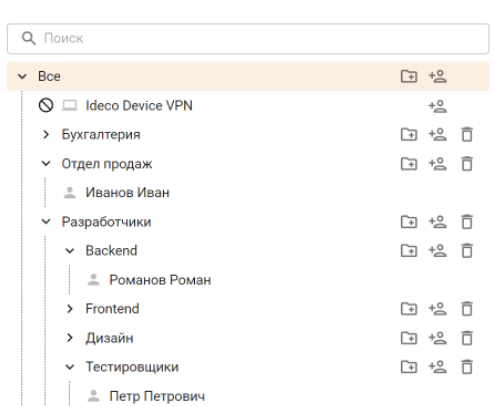

# Учетные записи

Пользователи в веб-интерфейсе Ideco UTM отображаются в виде дерева и могут быть организованы в группы. Уровень вложенности групп не ограничен. Дерево учетных записей пользователей доступно в разделе **Пользователи -> Учетные записи**.

В Ideco UTM реализован принцип наследования, что позволяет легко задавать и изменять общие для пользователей параметры, определяя их для родительской группы. Принцип наследования очень удобен для выполнения операций управления, осуществляемых по отношению ко всем пользователям группы.

Пример дерева пользователей представлен ниже:

Цвет пиктограммы пользователя зависит от состояния учетной записи пользователя:

<table><thead><tr><th width="75" align="center">Состояние учетной записи пользователя</th><th>Описание</th></tr></thead><tbody><tr><td align="center"></td><td>В данный момент времени пользователь прошел процедуру авторизации, и ему был предоставлен доступ в Интернет</td></tr><tr><td align="center"></td><td>В <a href="customization-of-users.md">настройках пользователей</a> выбран запрет на авторизацию</td></tr><tr><td align="center"></td><td>В данный момент времени пользователь не прошел процедуру авторизации, и ему не был предоставлен доступ в Интернет</td></tr></tbody></table>
