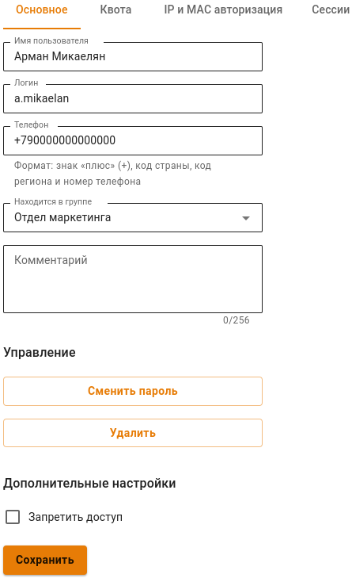
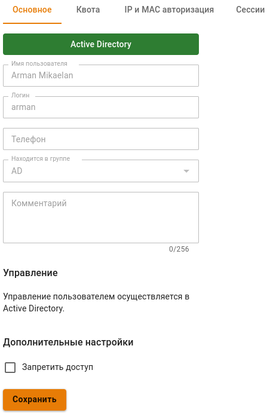
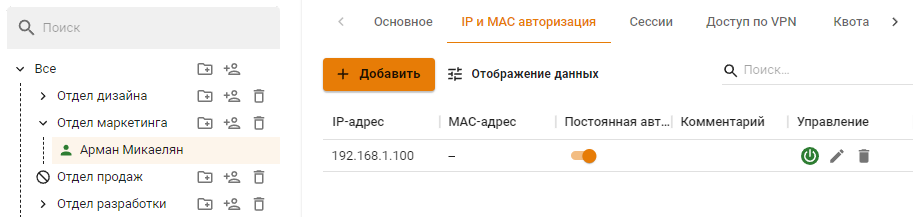
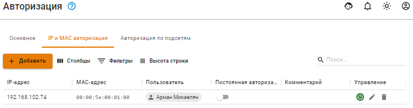
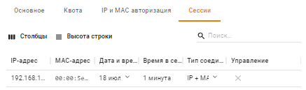
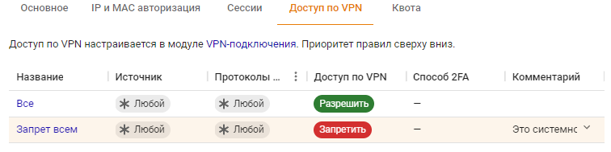
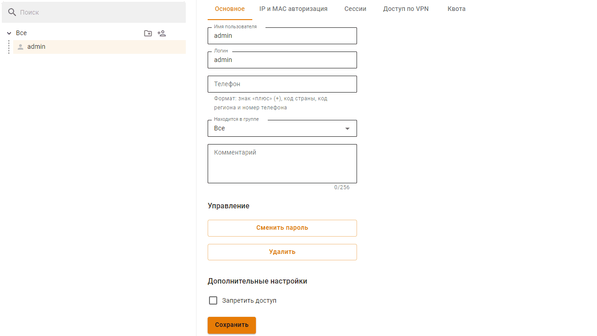
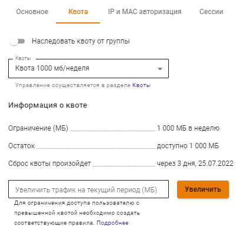

# Настройка пользователей

## Общее

Настройка пользователей осуществляется в разделе **Пользователи -> Учетные записи**.

Для редактирования параметров УЗ пользователя или групп пользователей выберите нужный объект в дереве пользователей. В правой части экрана появятся параметры выделенного объекта и будут отличаться списком категорий:

* Категории для **УЗ пользователя**:
  * Основное;
  * IP и MAC авторизация;
  * Сессии
  * Доступ по VPN
  * Квота;
* Категории для **Группы пользователей**:
  * Основное;
  * Active Directory/Samba DC;
  * ALD Pro
  * Квота.

## Группы пользователей

### Основное

В категории представлена возможность:

* **Изменить название и вложенность группы**. Для этого в соответствующем поле введите новое название и укажите группу, в которую требуется переместить эту группу;
* **Создать пользователя**. При нажатии на одноименную кнопку появится форма создания пользователя;
* **Обнаружение устройств**. При нажатии на одноименную кнопку откроется раздел [Обнаружение устройств](../device-discovery.md);
* **Удаление группы**. Вместе с группой удаляются УЗ пользователей группы и привязки по IP- и MAC-адресам;
* **Запретить доступ**. При активации опции всем пользователям группы будет запрещен доступ в интернет;

### Active Directory/Samba DC

Категория содержит информацию об имени домена и типе группы. Процесс настройки синхронизации с Active Directory/Samba DC и импорт пользователей описан в статье Интеграция с [Active Directory/Samba DC](../active-directory/).

### ALD Pro
Категория содержит информацию об имени домена ALD Pro и типе группы. Процесс настройки синхронизации с ALD Pro и импорт пользователей описан в статье Интеграция с [ALD Pro](../ald-pro.md). 

### Квота

Категория позволяет распространить квоту на всех пользователей этой группы, у которых в персональной квоте включена опция **Наследовать квоту от группы**.\
Для каждой группы пользователей есть аналогичная опция. Группы наследуют квоту, установленную в вышестоящей группе.


Настройка квот трафика описана в разделе [Квоты](../../access-rules/quotas.md#nastroika-polzovatelya-i-gruppy).


## УЗ пользователей

### Основное

Раздел основных настроек включает множество параметров, определяющих статус учетной записи пользователя. Базовые параметры:

* **Имя пользователя** - имя пользователя, например, Иванов Иван. Максимальное количество символов - 128;
* **Логин** - будет применяться пользователем для авторизации в различных службах Ideco NGFW. Логин необходимо вводить латинскими символами в нижнем регистре. Максимальное количество символов - 32;
* **Телефон** - телефон для [двухфакторной аутентификации](broken-reference). Формат: знак "плюс" (+), код страны, код региона и номер телефона;
* **Находится в группе** - используйте это поле для перемещения пользователя в другую группу;
* **Запретить доступ** - при установке этого флага пользователь не сможет авторизоваться, соответственно - пользоваться ресурсами сети интернет, почтой и личным кабинетом;

Для пользователей, экспортированных из [Active Directory](../active-directory/) и [ALD Pro](../ald-pro.md), во вкладке **Основное** нельзя редактировать имя, логин, телефон, перемещать в другую группу и менять пароль. Пример импортированного из AD пользователя представлен на скриншоте:

### IP и MAC авторизация

Данная категория содержит правила авторизации по IP и MAC, созданные для определенного пользователя в двух разделах:

* Пользователи -> Учетные записи -> IP и MAC авторизация:\
  
* Пользователи -> [Авторизации](../authorization/) -> [IP и MAC авторизация](../authorization/ip-and-mac-authorization/):\
  


Правила **IP и MAC авторизации** также создают аналогичную привязку в [DHCP-сервере](../../services/dhcp.md) Ideco NGFW. Но если одни и те же IP- и MAC-адреса будут использоваться во включенных правилах DHCP-сервера, то правила DHCP-сервера будут выполняться в первую очередь.


### Сессии

Содержит таблицу с информацией обо всех активных сессиях пользователях:

При нажатии на  в столбце **Управление** NGFW разорвет сессию пользователя.\
Аналогичная таблица расположена в разделе **Мониторинг ->** [**Авторизованные пользователи**](../../monitor/authorized-users.md).

### Доступ по VPN

Категория позволяет просматривать правила доступа VPN, которые настраиваются в разделе **VPN-подключения -> Доступ по VPN**.


Для перехода к общей таблице доступа VPN из дерева пользователей выполните действия:



### Квота

Категория позволяет просматривать и увеличивать квоту пользователя в случае использования лимитов трафика:

Для увеличения квоты воспользуйтесь полем **Увеличить трафик на текущий период**.

Пример использования квоты

Пользователю назначена квота на 1000 МБ на неделю (с понедельника по воскресенье). К четвергу количество трафика превысило значение, заданное квотой. Требуется единоразово предоставить пользователю дополнительный трафик.\
Для этого введите требуемое значение в поле **Увеличить трафик на текущий период** и нажмите **Увеличить**. В строке **Остаток** будет отражен весь доступный трафик с учетом добавленного.

**Например**: пользователю назначена квота на 1000 МБ на неделю (с понедельника по воскресенье). К четвергу количество трафика превысило значение, заданное квотой. Требуется единоразово предоставить пользователю дополнительный трафик.\
Для этого введите требуемое значение в поле **Увеличить трафик на текущий период** и нажмите **Увеличить**. В строке **Остаток** будет отражен весь доступный трафик с учетом добавленного.


Настройка квот трафика описана в разделе [Квоты](../../access-rules/quotas.md#nastroika-polzovatelya-i-gruppy).
