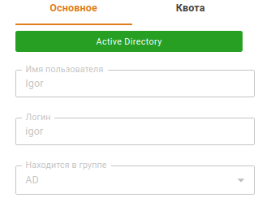
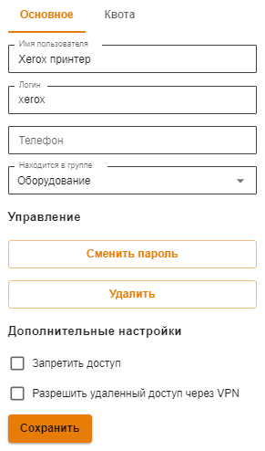
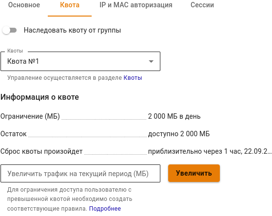

# Настройка пользователей

## Общее

Настройка пользователей осуществляется в разделе **Пользователи -> Учетные записи**. Чтобы определить параметры учетной записи пользователя, выберите её в дереве пользователей нажатием левой кнопкой мыши. В правой части экрана появятся параметры выделенной учетной записи. В случае, если вы желаете изменить параметры всех пользователей, входящих в группу, вам нужно выделить в дереве пользователей соответствующую группу. Все настраиваемые параметры разделены по двум категориям: **Основное** и **Квота**.

## Категория «Основное»

Раздел основных настроек включает в себя множество параметров, определяющих статус учетной записи пользователя. Начнем с рассмотрения базовых параметров, описанных в таблице ниже:

| Параметр                             | Описание                                                                                                                                                                                                                                                                                           |
| ------------------------------------ | -------------------------------------------------------------------------------------------------------------------------------------------------------------------------------------------------------------------------------------------------------------------------------------------------- |
| Active Directory                     | Признак пользователя, импортированного из Active Directory. У таких пользователей во вкладке **Основное** нельзя редактировать имя, логин, и перемещать в другую группу. Пример импортированного из AD пользователя представлен на скриншоте:  |
| Имя пользователя                     | Имя пользователя, для которого создается учетная запись, например, Иванов Иван. Максимальное количество символов - 128                                                                                                                                                                             |
| Логин                                | Логин, который будет применяться пользователем для прохождения процедуры авторизации в различных службах Ideco UTM. Логин необходимо вводить латинскими символами в нижнем регистре, например, i.ivanov. Максимальное количество символов - 32                                                     |
| Находится в группе                   | Группа, в которую входит данный пользователь. С помощью этого поля можно переместить пользователя в другую существующую группу                                                                                                                                                                     |
| Запретить авторизацию                | Запретить пользователю авторизоваться на шлюзе безопасности Ideco UTM. Это означает, что он не сможет пользоваться ресурсами сети Интернет, почтой и личным кабинетом                                                                                                                              |
| Сменить пароль                       | Функция изменения пароля для учетной записи пользователя                                                                                                                                                                                                                                           |
| Удалить                              | Функция для удаления текущего пользователя                                                                                                                                                                                                                                                         |
| Разрешить удаленный доступ через VPN | Разрешить подключаться к серверу Ideco UTM по VPN из интернета                                                                                                                                                                                                                                     |

Форма параметров пользователей представлена на скриншоте ниже:

## Квота

Данный раздел позволяет просматривать и увеличивать квоту пользователя, в случае использования лимитов трафика. Настройка квот трафика описана в разделе [Пользовательские квоты](../../access-rules/quotas.md#nastroika-polzovatelya-i-gruppy).

