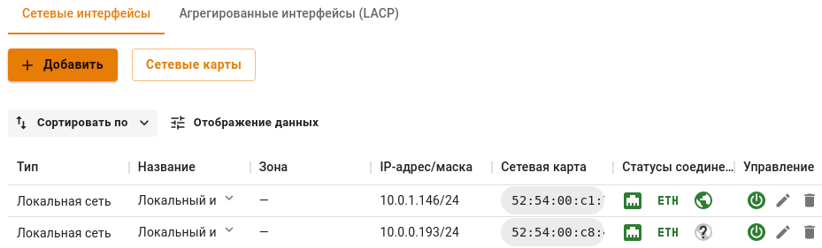
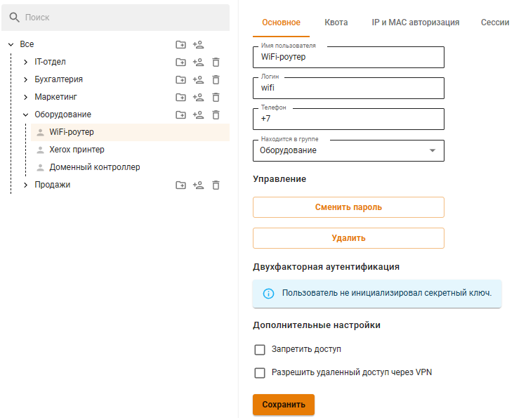
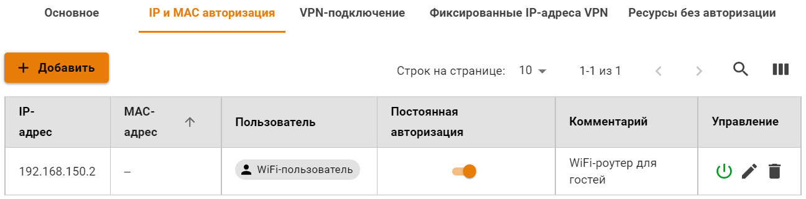

# Wi-Fi-сети

В текущей версии Ideco UTM не поддерживает Wi-Fi адаптеры. Для работы беспроводных клиентов необходимо использовать беспроводные точки доступа или \
Wi-Fi-маршрутизаторы.

Для выхода в Интернет пользователей, подключающихся по Wi-Fi, необходима их авторизация на UTM или авторизация Wi-Fi роутера - это зависит от режима работы маршрутизатора.

Режим точки доступа или bridge

В данном режиме устройство Wi-Fi предоставляет возможность беспроводным клиентам подключаться к локальной сети.

Для этого необходимо индивидуально авторизовать всех беспроводных клиентов на Ideco UTM. Проще всего сделать это с помощью авторизации по IP. Воспользуйтесь следующими рекомендациями по настройке:

* Используйте отдельную логическую сеть для клиентов Wi-Fi с настроенным [DHCP-сервером](../services/dhcp.md). При этом на локальный интерфейс Ideco UTM добавьте IP-адрес, служащий шлюзом для данной сети;
* С помощью [группового добавления пользователей](user-tree/user-management.md) с авторизацией по IP создайте группу пользователей из всего диапазона адресов, выделенного для Wi-Fi сети или настройте автоматическое создание пользователей из выдаваемого устройствам диапазона IP-адресов;
* С помощью [контент-фильтра](../access-rules/content-filter/) и [файрвола](../access-rules/firewall.md) настройте необходимые ограничения\
  для пользователей Wi-Fi;
* Если Wi-Fi роутер подключен к отдельному физическому интерфейсу UTM, то в файрволе запретите доступ из беспроводной сети в локальную сеть.

Пример настройки интерфейса для клиентов, подключающихся по Wi-Fi представлен\
на скриншоте ниже:

* **10.0.1.2/24** - шлюз для беспроводной Wi-Fi сети;
* **10.0.0.1/24** - шлюз для локальной Ethernet-сети.
### Настройка DHCP:

1. Добавьте отдельную логическую сеть для клиентов Wi-Fi;
2. Добавьте в сетевые интерфейсы шлюз созданной сети;
3. Перейдите в раздел DHCP-сервер и выберите сетевой интерфейс, настроенный на прошлом шаге;
4. Назначьте диапазон IP-адресов для DHCP-сервера и нажмите **Сохранить**.

При необходимости индивидуальной авторизации Wi-Fi пользователей (учета трафика и статистики каждого конкретного пользователя устройств) воспользуйтесь [авторизацией через веб-браузер](authorization/web-authorization.md). При таком способе авторизации Ideco UTM будет учитывать каждого пользователя, подключившегося по Wi-Fi. Учтите этот момент\
при планировании лицензирования Ideco UTM.

Режим роутера

В данном режиме устройство Wi-Fi скрывает за NAT устройства беспроводной сети. Таким образом для Ideco UTM достаточно будет авторизовать только точку доступа, как одного из пользователей.

Пример настройки пользователя в режиме роутера представлен на скриншотах ниже:

1\. Создайте пользователя для Wi-Fi роутера.

Пароль у пользователя может быть любой.

2\. В разделе **Пользователи -> Авторизация -> IP и MAC авторизация** создайте правило следующего вида:

Общие ограничения [контент-фильтра](../access-rules/content-filter/) и [файрвола](../access-rules/firewall.md) для Wi-Fi сети необходимо применить к данному пользователю.

### Настройка DHCP:

В большинстве случаев при работе маршрутизатора в таком режиме не требуется дополнительной настройки DHCP-сервера Ideco UTM, поскольку работает встроенный DHCP-сервер маршрутизатора.
Если у вас не получилось подключиться к Wi-Fi сети, то нужно проверить работу DHCP-сервера маршрутизатора.

При этом способе авторизации Ideco UTM будет использоваться одна лицензия на точку доступа Wi-Fi. Отдельно настроить фильтрацию трафика и считать статистику по трафику в отчетах для отдельных клиентов Wi-Fi будет невозможно.

