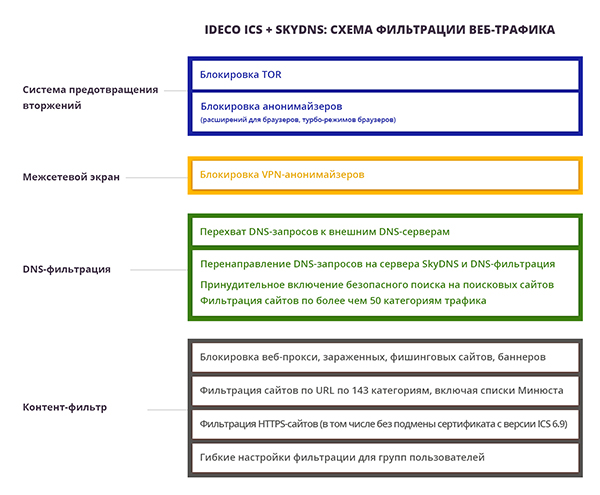

# Интеграция UTM и SkyDNS

## Чем это может быть полезно:

* **Защита от зараженных сайтов**

  Злоумышленники создают сайты, содержащие вредоносные скрипты, заражающие компьютеры. Также они взламывают хорошие сайты и устанавливают вредоносные скрипты на них. В контент‑фильтре Ideco UTM есть специальная категория для блокировки таких сайтов, также трафик может проверяться на вирусы на шлюзе, но дополнительная защита от этих угроз, тем более с помощью круглосуточно обновляемых облачных сервисов, не помешает.

* **Защита от бот-сетей**

  Злоумышленники создают сети из чужих компьютеров для использования их в нелегальной деятельности: DDoS-атак серверов, рассылки спама, похищения паролей от интернет-банков и сервисов и других целей. Для получения инструкций программа-бот подключается к управляющим серверам. DNS-фильтрация позволяет ограничить доступ к выявленным серверам для управления бот-сетями. Таким образом, даже если компьютер заражен вредоносной программой, злоумышленники не смогут им управлять.

* **Защита от нежелательных сайтов**

  [SkyDNS](https://www.skydns.ru/) предоставляет широкие возможности для настроек - больше 50 категорий сайтов. Все это может служить хорошим дополнением к стандартному и расширенному контент-фильтру, встроенному в Ideco UTM, для повышения качества фильтрации нежелательного контента. Что особенно важно, например, для образовательных учреждений, который должны обеспечивать качественную фильтрацию для исполнения соответствующих законов.

* **Соблюдение 139-ФЗ и 436-ФЗ О защите детей от информации, причиняющей вред их здоровью и развитию**

  Сервис SkyDNS полностью соответствует требованиям Правил подключения общеобразовательных учреждений к единой системе контент-фильтрации доступа к сети Интернет Министерства образования и науки РФ.

  Специально для школ и колледжей можно приобрести комплект - [Шлюз безопасности Ideco UTM + контент-фильтр SkyDNS](https://ideco.ru/products/ics/academic-edition).

## Инструкция по настройке в Ideco UTM:

1. Прописать DNS-сервер SkyDNS \(193.58.251.251\) в настройках DNS-сервера в Ideco UTM \(Веб-интерфейс: **Сервисы -&gt; DNS**\).

2. Для запрета обращения к другим DNS-серверам включить опцию перехвата DNS-запросов \(если для всей сети обязательна фильтрация через SkyDNS\).

3. В случае, если у вас внутри локальной сети или внутри сети провайдера, есть внутренняя dns-зона, не обслуживаемая внешними dns-серверами \(например, есть домен Active Directory\), нужно прописать ее в Forward-зонах.

4. На всех устройствах, которые требуется защитить, в качестве единственного DNS-сервера в сетевых настройках должен быть прописан IP-адрес локального интерфейса Ideco UTM.

Пользователи, получающие адреса автоматически через DHCP-сервер Ideco UTM или подключающиеся по VPN, получают нужные настройки автоматически. Остальным нужно прописать их вручную \(либо настроить нужные параметры на использующемся DHCP-сервере\).

5. В настройках контент-фильтра запретить пользователям напрямую обращаться к сайтам по IP-адресу \(например: `http://79.172.49.17/`\).

Создав правило:

6. Если провайдер предоставляет вам статический белый IP-адрес, то привяжите этот адрес к аккаунту SkyDNS в [личном кабинете](https://www.skydns.ru/auth/login/?next=/cabinet/guide/) на сайте SkyDNS \(в разделе **Настройки -&gt; Сети**\).

7. Настройка запрета доступа к сайтам по категориям, безопасного поиска и др. сервисов осуществляется через личный кабинет на сайте SkyDNS.

8. Если вы хотите исключить некоторые компьютеры из фильтрации, пропишите на них другой внешний DNS-сервер \(например 8.8.8.8\), и не включайте перехват DNS-запросов в настройках DNS-сервера Ideco UTM.


Если вам необходимо использовать разные настройки фильтрации для разных компьютеров в сети за Ideco UTM, то для этого вы можете использовать SkyDNS Agent. Для его работы потребуется отключить использование [прокси-сервера](service/proxy/proxy-server.md) для тех компьютеров, куда будет установлен агент. 



Для обеспечения необходимого учебным заведениям уровня фильтрации Ideco UTM и SkyDNS должны быть настроены согласно данным требованиям.


## Документация по настройке и активации сервиса SkyDNS

**Документация доступна на сайте сервиса:**

* [Активация системы по регистрационному коду](https://www.skydns.ru/guides/activation/)
* [Руководства по настройке и использованию сервиса](https://www.skydns.ru/guide/)
* [Настройка профилей и расписания фильтрации](https://www.skydns.ru/guides/profiles/)

По вопросам настройки сервиса можно обращаться в [техническую поддержку SkyDNS](https://www.skydns.ru/feedback/).

## Схема фильтрации веб-трафика при использовании SkyDNS

