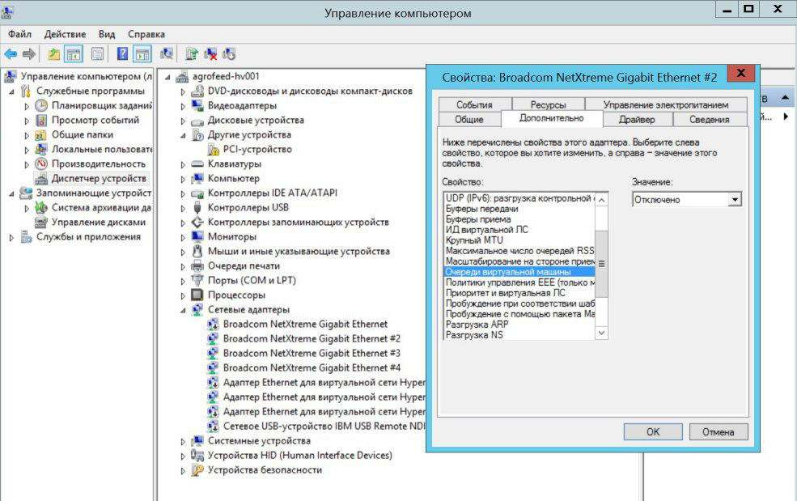

# Особенности настроек гипервизоров

Ideco UTM поддерживает работу на следующих гипервизорах: VMware (Workstation и ESXi), Microsoft Hyper-V (1-го поколения), VirtualBox, KVM, Citrix XenServer. Для работы на виртуальных машинах нет необходимости в установке дополнительных драйверов или утилит на Ideco UTM. Гостевые дополнения входят в состав дистрибутива.

Возможные особенности настроек виртуальных машин описаны в данной статье.

## Общие рекомендации

Тип ОС для создания виртуальной машины: Linux Centos 6, 64 bit.

При настройке виртуального жесткого диска сразу же выберите его оптимальный размер (не менее 64 Гб), динамическое расширение жесткого диска в дальнейшем будет невозможно без переустановки системы.

Минимальное количество оперативной памяти для работы сервера: 4 Гб (рекомендуется 8 и более, для работы системы предотвращения вторжений и антивирусной проверки трафика). Используйте статически, а не динамически выделяемую память.

Время на виртуальной машине должно соответствовать реальному (с учетом часового пояса).

Обязательно использование двух сетевых интерфейсов, адресация которых не должна пересекаться (не используйте IP-адреса на локальном и внешнем интерфейсах из одной подсети, в таком режиме сервер не может быть использован в качестве шлюза).

## Microsoft Hyper-V

Поддерживается только первое поколение виртуальных машин под Windows Server 2012R2 или выше. [Видеоинструкция](https://youtu.be/dFW\_n6dc3B4) по настройке виртуальной машины.

Всегда используйте обычный виртуальный сетевой адаптер (Network Adapter).\
Используйте устаревший сетевой адаптер (Legacy Network Adapter) только если необходима работа модулей "Контроль приложений" и "Ограничения скорости". Однако в этом случае есть вероятность существенного падения скорости. Решение проблемы - отключить "Очереди виртуальной машины" в свойствах сетевого адаптера.

## VMware ESXi

Перед установкой Ideco UTM необходимо увеличить размер видеопамяти для виртуальной машины (по умолчанию, 4 мегабайта), до 16 мегабайт.

Не рекомендуется использовать в качестве сетевых интерфейсов типы устройств "Virtio" и "VLAN". Рекомендуется использовать адаптеры типа "Intel 1000/1000e".

## Citrix XenServer

### Загрузка с установочного носителя

Иногда xenserver не может понять что нужно загружаться с ISO-образа.\
Выполните команду `xe vm-list`. Она покажет список виртуальных машин на xenserver.\
Найдите виртуальную машину с UTM и запомните ее UUID.\
Затем выполните: `xe vm-param-set uuid= HVM-boot-policy=BIOS\ order HVM-boot-params:order=dc`

После чего загрузка с установочного носителя должна начаться.
