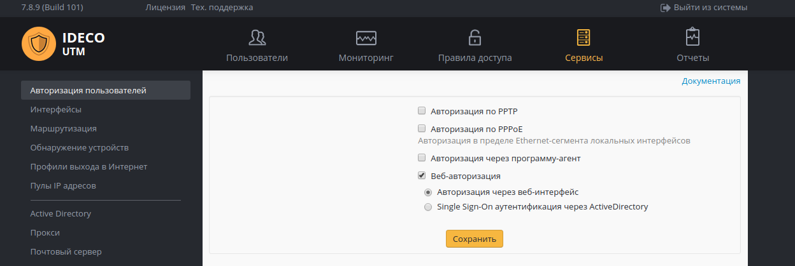
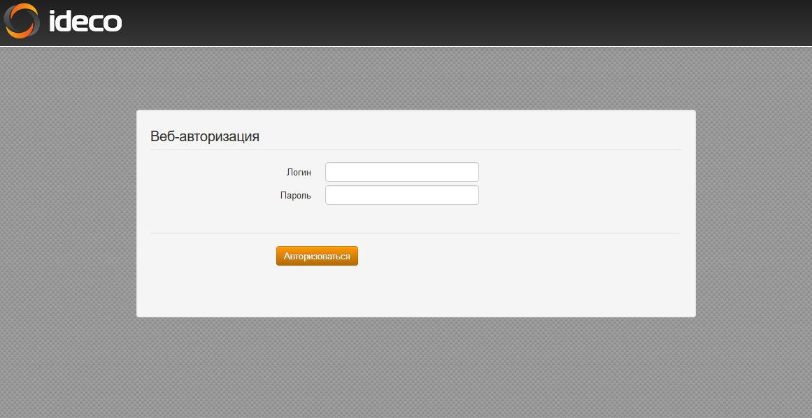
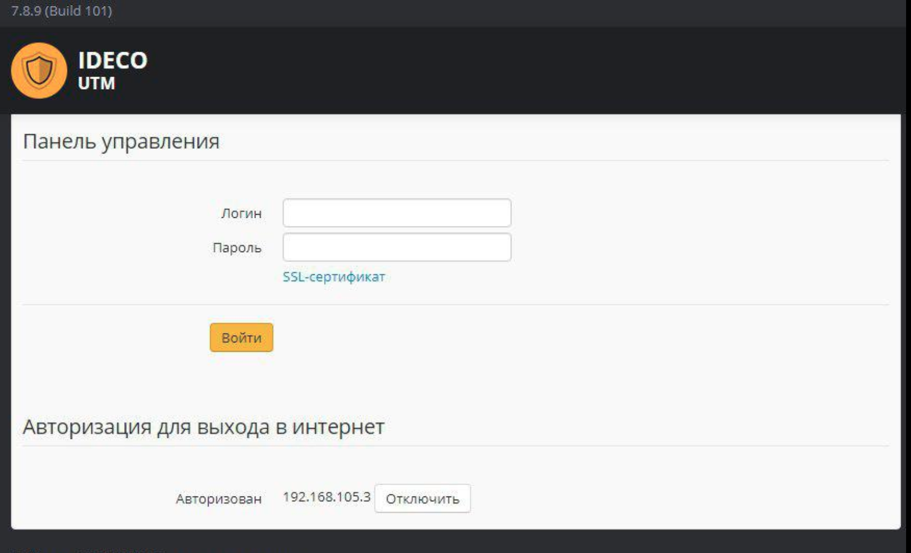

# Веб-авторизация

Данный тип авторизации предполагает, что любой запрос неавторизованного пользователя, сделанный через web-браузер, будет перенаправляться на специальную страницу авторизации Ideco UTM. Для этого типа авторизации в качестве шлюза по умолчанию обязательно должен быть указан IP-адрес локального сетевого интерфейса Ideco UTM. Также до подключения к Интернету должен работать DNS-резолвинг адресов.

Убедитесь в том, что в разделе **Сервисы -&gt; Авторизация пользователей** активированы следующие пункты: **Веб-авторизация** и **Авторизация через веб-интерфейс**, представленный ниже:

Процесс выхода пользователя в интернет представлен на фрагменте ниже:

После прохождения пользователем web-авторизации доступ в сеть Интернет будет предоставлен до тех пор, пока авторизация не будет принудительно отменена или по истечении 15-минутной не активности пользователя. Для ручной разавторизации пользователю необходимо открыть в браузере web-интерфейс Ideco UTM и нажать кнопку **Отключить**. Процесс отключения авторизации вы можете увидеть ниже.


При заходе на HTTPS-сайт, пользователь должен подтвердить доверие к сертификату Ideco UTM. Либо сертификат должен быть добавлен в доверенные корневые центры сертификации на устройстве \(например через [политики домена](../pravila_dostupa/kontent-filtr/nastroika_filtracii_https.md)\).



DNS-сервер, указанный на компьютере или устройстве пользователя, должен поддерживать разрешение интернет имен до подключения компьютера к интернету. Иначе запрос браузера [example.com](http://example.com) не будет перенаправлен на шлюз и, соответственно, в браузере не появится запрос логина-пароля. Рекомендуется указывать в качестве DNS-сервера на компьютерах и устройствах локальной сети IP-адрес локального интерфейса Ideco UTM. Проверить разрешение имен в Windows можно командой: `nslookup ya.ru`, её вывод должен содержать IP-адреса.


