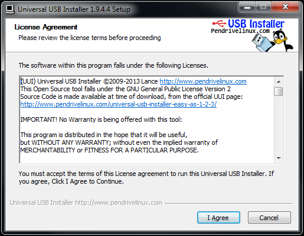
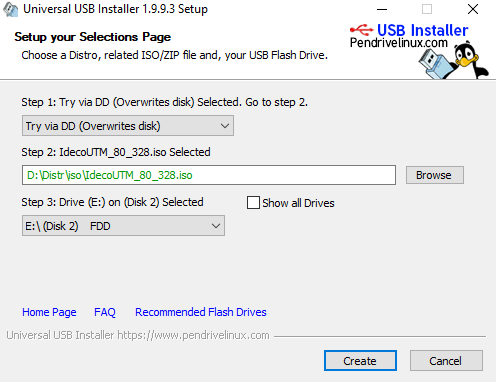

# Создание загрузочного USB flash диска

## Создание загрузочного USB flash диска с Ideco UTM в среде Windows.

Для того чтобы создать загрузочный USB flash диск в Windows и записать на него установочный образ Ideco UTM в Microsoft Windows, нужно:

В BIOS сервера включить загрузку с flash диска.

1. Скачать утилиту [Universal-USB-Installer](http://ideco.ru/assets/Universal-USB-Installer-1.9.9.3.zip).

2. Создать загрузочный usb flash диск. Примите лицензионное соглашение. 

3. Выбрать **"Try via DD \(Overwrite disk\)"** и указать путь к ISO образу Ideco UTM.

4. В UEFI \(BIOS\) сервера включить загрузку с flash диска. 

5. Загрузить сервер с созданного flash диска. Будет запущен мастер установки Ideco UTM.  

Далее действуйте согласно инструкции мастера установки. Подробнее шаги по установке Ideco UTM описаны в разделе документации [Процесс установки](installation-process.md).

## Создание загрузочного USB flash диска с Ideco UTM в среде Linux.

Для создания загрузочного USB flash диска в Linux достаточно поблочно скопировать ISO-образ Ideco UTM на устройство. Например, с помощью стандартной утилиты Linux - "dd".

