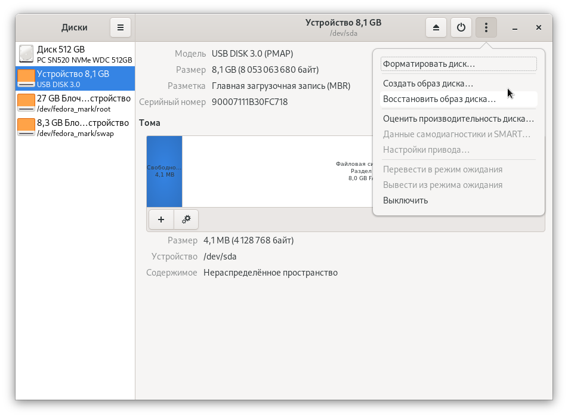

# Создание загрузочного USB flash диска

## В среде Windows


При записи ISO образа вся информация с USB накопителя будет удалена.&#x20;


1\. Скачайте программу [Rufus](https://goo.su/3dB2) и запустите скачанный файл.

2\. Выберите нужный USB flash диск в пункте **Устройства**:


3\. Выберите метод загрузки **Диск или ISO образ**.

4\. Нажмите на кнопку **Выбрать** и откройте скачанный образ Ideco UTM.

5\. Все остальные настройки остаются по умолчанию.

6\. Нажмите на кнопку **Старт**.

7\. В появившемся окне выберите пункт **Запись в режиме DD-образ**.

8\. Так же появится диалоговое окно о том, что вы подтверждаете запись на USB flash диск.

Далее, действуйте согласно инструкции мастера установки. Шаги по установке Ideco UTM описаны в статье [Процесс установки](installation-process.md).

## Создание загрузочного USB flash диска с Ideco UTM в среде Linux.

Для создания загрузочного USB flash диска в Linux достаточно поблочно скопировать ISO-образ Ideco UTM на устройство. Ниже описаны два способа:

### С помощью  команды `gnome-disks`



### Вручную

1.  Проверьте целостность образа:

    ```bash
    $ md5sum /home/ideco/IdecoUTM.iso
    8c872cb6b720f6fd6683107681645156  /home/ideco/IdecoUTM.iso
    ```

    Значение должно совпадать с тем что написано в личном кабинете откуда был загружен образ. Если значение не совпало — значит файл повреждён и его нужно скачать заново.
2.  Найдите USB-носитель в системе:

    ```bash
    $ lsblk --nodeps  -o name,size,fstype,tran,model,mountpoint /dev/sd*
    NAME  SIZE FSTYPE TRAN MODEL        MOUNTPOINT
    sdx   7,5G        usb  USB_DISK_3.0 
    sdx1  7,5G vfat                     /run/media/ideco/D661-82E2
    ```

    Видим, что есть USB-флеш-диск `/dev/sdx`. А также, что на нём есть файловая система, которая примонтирована.
3.  Отмонтируйте файловую систему:

    ```bash
    sudo umount /run/media/ideco/D661-82E2
    ```
4.  Запишите образ на носитель:

    ```bash
    $ sudo dd if=/home/ideco/IdecoUTM.iso of=/dev/sdx bs=1M oflag=direct status=progress
    ```
5.  Подготовьте носитель к извлечению:

    ```
    $ sudo eject /dev/sdx
    ```
