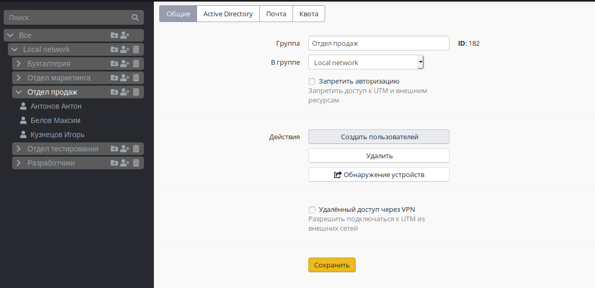
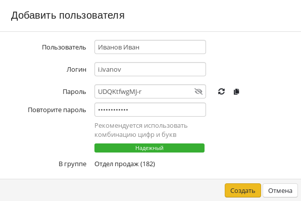
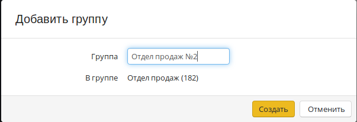

# Управление учетными записями пользователей

Для управления группами и учетными записями пользователей в дереве пользователей на каждой группе есть соответствующие кнопки:

| Обозначение | Описание |
| :---: | :--- |
|  | Создать учетную запись пользователя |
|  | Создать группу |
|  | Удалить учетную запись пользователя или группу |

## Создание учетной записи пользователя

Чтобы создать учетную запись в определенной группе, нажмите в ней на элемент управления отвечающий за создание учетной записи пользователя. Внешний вид элементов управления был проиллюстрирован выше. Так же, можно создать пользователя, выбрав эту группу, и нажав на кнопку **Создать пользователя**. Эта кнопка находится на вкладке **Общие** в настройках группы.

Попробуем создать учетную запись пользователя в группе нажатием на соответствующую иконку. Перед вами появится окно создания учетной записи пользователя, в котором нам нужно определить ряд параметров. В следующей таблице представлен перечень параметров учетной записи.

| Параметр | Описание |
| :--- | :--- |
| Имя пользователя | Укажите имя пользователя, для которого создается учетная запись, например, Иванов Иван. Максимальное количество символов - 128 |
| Логин | Укажите логин, который будет применяться пользователем для прохождения процедуры авторизации в различных службах Ideco UTM. Логин необходимо вводить латинскими символами в нижнем регистре, например: i.ivanov. Максимальное количество символов - 32 |
| Пароль | Укажите пароль. Рекомендуем использовать пароли, учитывая требования к созданию сложности паролей: минимальная длина - 10 символов; использование строчных и заглавных латинских символов; использование цифр и специальных символов. Можно автоматически сгенерировать пароль |
| Повторите пароль | Повторно укажите пароль для проверки. При автоматической генерации пароля он будет автоматически продублирован в это поле |

Форма создания учетной записи пользователя показана ниже:

Логин и пароль используются для авторизации и для подключения к web-интерфейсу Ideco UTM, если пользователь является администратором. Для учетных записей, импортированных из MS Active Directory \(AD\), проверка пароля осуществляется средствами AD.


Посмотреть или восстановить пароль учетной записи пользователя нельзя, допускается только его изменение. Также рекомендуется напоминать пользователям о том, чтобы они обязательно сразу сменили пароль через web-интерфейс.


Теперь, когда вы определили все параметры, нажмите кнопку **Создать**. Произойдет создание учетной записи, у которой автоматически будут установлены значения некоторых параметров от группы, в которой она была создана.

Возможно массовое создание пользователей для их авторизации по IP. Подробнее об этом можно прочитать в [статье](../authorization-types/ip-authorization.md) посвященной этому типу авторизации.

## Создание группы

Для создания группы нужно нажать на соответствующий элемент управления, который находятся справа от названия группы \(вы можете создать как группу в корне дерева, так и дочернюю\). Появится окно, в котором вам нужно будет указать название новой группы и нажать на кнопку **Создать**. Окно добавления группы показано на следующем фрагменте экрана.

## Массовое создание пользователей с авторизацией по IP

При необходимости возможно [массовое создание](../authorization-types/ip-authorization.md) пользователей для их авторизации по IP. Например, для сети Wi-Fi.

Либо можно воспользоваться [поиском устройств](../servisy/obnaruzhenie_ustroistv.md) для их автоматического создания при попытке выхода в сеть Интернет.

## Удаление учетной записи пользователя или группы

Для удаления учетной записи пользователя необходимо навести курсор на пользователя и нажать на соответствующий элемент управления. Так же можно выбрать нужного вам пользователя и нажать на кнопку **Удалить** на вкладке **Общие**. Появится окно с требованием подтверждения удаления, нажмите кнопку **Да**.

Удаление группы осуществляется аналогичным образом.

## Перемещение учетной записи пользователя или группы

Чтобы переместить учетную запись пользователя в другую группу, выделите этого пользователя в веб-интерфейсе, на вкладке **Общие** найдите поле **В группе** и из выпадающего списка выберите группу в которую надо переместить пользователя.

