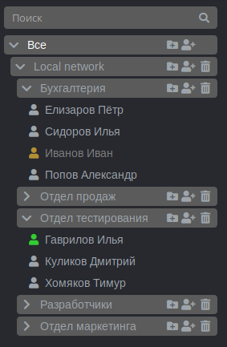

# Дерево пользователей

Пользователи в интерфейсе управления Ideco UTM отображаются в виде дерева. Пользователи могут быть организованы в группы. Уровень вложенности групп не ограничен. Дерево учетных записей пользователей доступно в разделе **Пользователи.**

В Ideco UTM реализован принцип наследования, что позволяет легко задавать и изменять общие для пользователей параметры, определяя их для родительской группы – квоты, удаленный доступ по VPN. Принцип наследования очень удобен для выполнения операций управления, осуществляемых по отношению ко всем пользователям группы.

Дерево пользователей показано ниже.

Пиктограмма пользователя может быть окрашена в разные цвета. В следующей таблице на примере пиктограммы обычного пользователя дается описание каждого цвета.

|        Состояние у/з пользователя       | Описание                                                                                                          |
| :-------------------------------------: | ----------------------------------------------------------------------------------------------------------------- |
|  | В данный момент времени пользователь прошел процедуру авторизации, и ему был предоставлен доступ в интернет       |
|  | В данный момент времени пользователь не прошел процедуру авторизации, и ему не был предоставлен доступ в интернет |
|  | Учетная запись пользователя отключена                                                                             |
