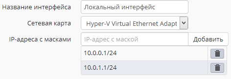
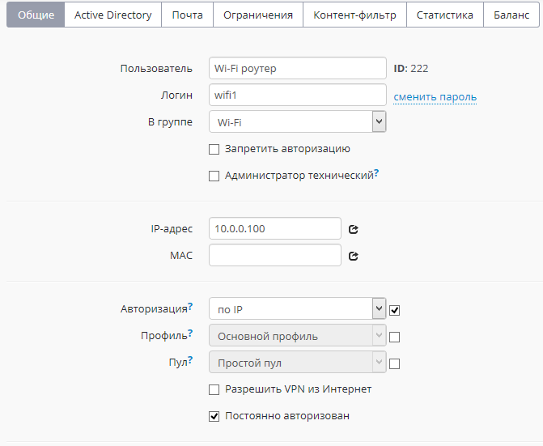

# Wi-Fi сети

В текущей версии Ideco UTM не поддерживает Wi-Fi адаптеры. Для работы беспроводных клиентов необходимо использовать специальные беспроводные точки доступа или Wi-Fi-маршрутизаторы.

Для выхода в Интернет пользователей, подключающихся по Wi-Fi, необходима их авторизация на UTM или авторизация Wi-Fi роутера - это зависит от режима работы устройства, раздающего Wi-Fi.

## Режим точки доступа (bridge)

В данном режиме устройство Wi-Fi предоставляет возможность беспроводным клиентам подключаться к локальной сети.

Таким образом на Ideco UTM необходимо будет индивидуально авторизовать всех беспроводных клиентов. Как правило, проще всего сделать это с помощью авторизации по IP. Воспользуйтесь следующими рекомендациями по настройке:

* Настройте раздачу по DHCP беспроводным клиентам определенного диапазона IP-адресов. Желательно вообще использовать отдельную логическую сеть для клиентов Wi-Fi (на локальный интерфейс Ideco UTM при этом нужно будет добавить IP-адрес, служащий шлюзом для данной сети).\
  Пример:

где адрес 10.0.0.1/24 - шлюз для локальной Ethernet-сети,\
10.0.1.2/24 - шлюз для беспроводной Wi-Fi сети.

* С помощью [группового добавления](../authorization-types/ip-authorization.md) пользователей с авторизацией по IP создайте группу пользователей из всего диапазона адресов, выделенного для Wi-Fi сети.
* Или настройте [автоматическое создание пользователей](../services/device-discovery.md) из выдаваемого устройствам диапазона IP-адресов.
* С помощью [контент-фильтра](../access-rules/content-filter/) и [файрвола](../access-rules/firewall.md) настройте необходимые ограничения для пользователей Wi-Fi.
* В системном файрволе при необходимости вы можете запретить доступ из беспроводной сети в локальную сеть, создав соответствующее правило. &#x20;

При необходимости индивидуальной авторизации Wi-Fi пользователей (учета трафика и статистики каждого конкретного пользователя устройств) необходимо воспользоваться авторизацией [через веб-браузер](../authorization-types/web-authorization.md).

При таком способе авторизации пользователей Ideco UTM будет учитывать каждого пользователя, подключившегося по Wi-Fi. Учтите этот момент при планировании лицензирования Ideco UTM (один пользователь по лицензии может авторизовать до 3-х устройств).

## Режим роутера

В данном режиме устройство Wi-Fi скрывает за NAT устройства беспроводной сети. Таким образом для Ideco UTM достаточно будет авторизовать только точку доступа, как одного из пользователей.

Общие ограничения контент-фильтра и файрвола для Wi-Fi сети необходимо применять к данному пользователю.

При этом способе авторизации Ideco UTM будет учитывать только точки доступа Wi-Fi, в качестве лицензируемых пользователей.
