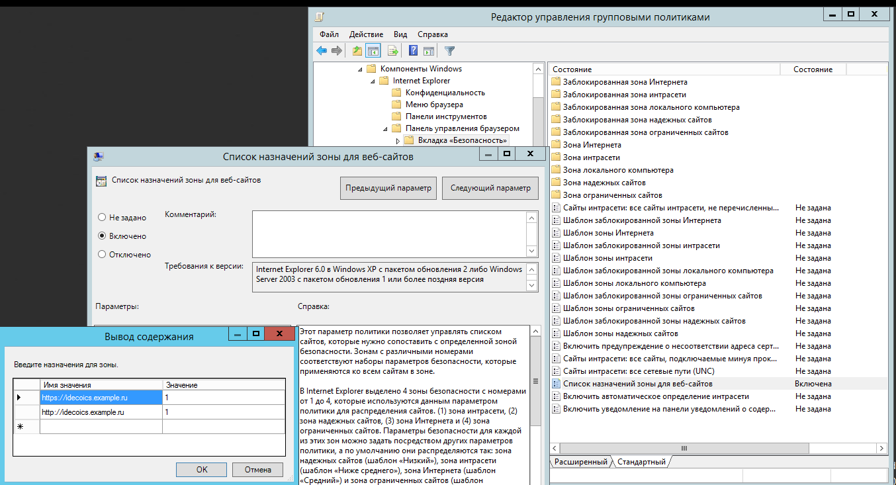

# Авторизация пользователей Active Directory

## Настройка авторизации пользователей

Для пользователей, импортированных из Active Directory, доступны все типы авторизации пользователей. Наиболее часто используемые варианты авторизации пользователей - Single Sign-On аутентификация через Active Directory с использованием Kerberos/NTLM для авторизации через веб-браузер и авторизация через журнал безопасности Active Directory \(рекомендуется одновременное использование обоих типов авторизации\).

## Настройка Ideco UTM

Для включения **Single Sign-On аутентификации** и **Авторизация через журнал безопасности Active Directory** перейдите на вкладку **Пользователи -&gt; Авторизация -&gt; Основное** и включите эти типы авторизации. Далее нажмите кнопку **Сохранить**.

## Настройка компьютеров пользователей и политик домена

### Авторизация через журнал безопасности Active Directory


Поддерживается начиная с версии контроллера домена 2008 standard edition.


Для работы авторизации через журнал безопасности необходимо выполнить настройку на основном контроллере домена:

* В настройках брандмауэра Windows на всех контроллерах домена \(или доменов\) разрешить удаленный доступ к логам безопасности.

* Добавить Ideco UTM в группу безопасности **Читатели журнала событий \(Event Log Readers\)**.

* После настройки доступа к журналу, необходим перезапуск службы **Авторизация через журнал безопасности Active Directory** на Ideco UTM, для этого отключите эту настройку и заново включите.
* Если вы изменяли политики безопасности контроллеров домена по сравнению со стандартными, то нужно включить логирование в политиках безопасности, активировав следующий параметр: **Default Domain Controllers Policy -&gt; Computer Configuration-&gt;Policies-&gt;Windows Settings-&gt;Security Settings-&gt; Advanced Audit Policy Configuration -&gt; Audit Policies -&gt; Logon/Logoff -&gt; Audit Logon -&gt; Success**.

  Путь для русскоязычной версии: **Политика Default Domain Controllers Policy -&gt; Конфигурация Windows -&gt; Параметры безопасности -&gt; Конфигурация расширенной политики аудита -&gt; Политики аудита -&gt; Вход/выход -&gt; Аудит входа в систему -&gt; Успех**.

* Также необходимо включить следующие параметры: **Default Domain Controllers Policy -&gt; Computer Configuration-&gt;Policies-&gt;Windows Settings-&gt;Security Settings-&gt; Advanced Audit Policy Configuration -&gt; Audit Policies -&gt; Account logon -&gt; "Audit Kerberos Authentication Service" и "Audit Kerberos Service Ticket Operations" -&gt; Success**. 

  Путь для русскоязычной версии: **Политика Default Domain Controllers Policy -&gt; Конфигурация Windows -&gt; Параметры безопасности -&gt; Конфигурация расширенной политики аудита -&gt; Политики аудита -&gt; Вход учетной записи -&gt;  "Аудит службы проверки подлинности Kerberos" и "Аудит операций билета службы керберос" -&gt; Успех**.

* Для обновления политик контроллеров доменов выполните команду `gpupdate /force`.
* Если авторизация пользователей при логине не происходит, нужно проверить в журнале безопасности наличие событий  4768, 4769, 4624.

### Веб-авторизация \(SSO или NTLM\)

Для работы авторизации через веб-браузер \(с использованием Kerberos либо NTLM\) необходима настройка Internet Explorer \(остальные браузеры подхватывают его настройки\). Обязательно используйте эти настройки, даже если обычно пользователи авторизуются через журнал безопасности, в некоторых случаях будет необходима их авторизация через браузер.

Для того чтобы настроить авторизацию через веб-браузер, необходимо выполнить следующие действия:

1. Зайдите в свойствах браузера на вкладку **Безопасность**.
2. Выберите **Местная интрасеть -&gt; Сайты -&gt; Дополнительно**.
3. Добавьте в открывшемся окне ссылку на Ideco UTM под тем именем, под которым вы ввели его в домен. Нужно указывать два URL: c `http://` и с `https://`.

На скриншоте ниже Ideco UTM введен в домен `example.ru` под именем `idecoics`.

Также данную настройку можно сделать с помощью групповых политик Active Directory сразу же для всех пользователей. Для этого необходимо выполнить следующие действия: 

1. В групповых политиках для пользователей перейдите по пути **Конфигурация пользователя -&gt; Политики -&gt; Административные шаблоны -&gt; Компоненты Windows -&gt; Internet Explorer -&gt; Панель управления браузером -&gt; Вкладка безопасность -&gt; Список назначений зоны для веб-сайтов**. 
2. Введите назначение зоны для DNS-имени Ideco UTM \(в примере idecoics.example.ru\) со значением равным 1 \(интрасеть\). Необходимо указать два назначения, для схем работы по http и https. 


При входе на HTTPS-сайт, для авторизации необходимо разрешить браузеру доверять сертификату Ideco UTM \(чтобы не делать это каждый раз, можно добавить корневой сертификат Ideco UTM в доверенные корневые сертификаты устройства. Например, с помощью политик домена\). Можно также использовать [скрипты для автоматической авторизации](auto-authorization-and-de-authorization-script.md) пользователей при логине. 


На странице настроек браузера **Mozilla Firefox** \(about:config в адресной строке\) настройте следующие параметры:

* **network.automatic-ntlm-auth.trusted-uris** и **network.negotiate-auth.trusted-uris** добавьте адрес локального интерфейса Ideco UTM \(например `idecoUTM.example.ru`\).
* **security.enterprise\_roots.enabled** в значении true позволит Firefox доверять системным сертификатом и авторизовать пользователей при переходе на HTTPS-сайты.
* **security.enterprise\_roots.enabled** = true.

Также для пользователей, импортированных через AD, возможны следующие способы авторизации:

* **Через Ideco Agent** - подходит для авторизации пользователей терминальных серверов \(с использованием Remote Desktop IP Virtualization на терминальном сервере\).
* **Авторизация по IP-адресу** - подходит в случае, если пользователи всегда работают с фиксированных IP-адресов. IP-адреса на UTM необходимо прописывать вручную каждому пользователю.
* **Авторизация по PPTP** - если в сети предъявляются повышенные требования к конфиденциальности информации, передаваемой между шлюзом и устройствами пользователей, или используется слабо защищенный от перехвата трафика WiFi.

## Настройка авторизации пользователей при прямых подключениях к прокси-серверу

Настройка прозрачной авторизации пользователей при прямых подключениях к прокси-серверу аналогична настройке прозрачной **Single Sign-On** авторизации, описанной выше в инструкции. Единственная особенность - указание в качестве адреса прокси-сервера **не IP-адреса Ideco UTM, а его DNS-имени**.

### Настройка браузера Mozilla Firefox для авторизации по NTLM при прямом подключении к прокси-северу

Для компьютеров, которые **не находятся в домене Active Directory**, в случае необходимости их авторизации под доменным пользовательским аккаунтом, на странице настроек браузера **Mozilla Firefox** \(about:config в адресной строке\) настройте следующие параметры:

* **network.automatic-ntlm-auth.allow-proxies** = false;
* **network.negotiate-auth.allow-proxies** = false.


Не отключайте данные опции для компьютеров, входящих в домен Active Directory, т.к. в таком случае будет использоваться устаревший метод авторизации по NTLM.


## Возможные причины ошибок при авторизации

* Если в Internet Explorer появляется окно с текстом **Для получения доступа требуется аутентификация**, и авторизация происходит только при ручном переходе по ссылке на авторизацию, то по каким-то причинам не происходит редирект в браузере на страницу авторизации \(он может быть ограничен настройками безопасности браузера\). В таком случае, установите параметр **Активные сценарии** в Internet Explorer в значение **Включить**.

* Доменному пользователю должно быть разрешено авторизоваться на Ideco UTM. На контроллере домена зайдите в свойства выбранных пользователей во вкладку **Учетная запись** -&gt; **Вход на...**, выберите пункт **только на указанные компьютеры** и пропишите имя рабочей станции для входа в систему.

Пример данной настройки представлен на скриншоте ниже:

* При авторизации через журнал безопасности контроллера домена Active Directory пользователи будут авторизованы при попытке выхода в Интернет \(любым трафиком\). Автоматической авторизации без прохождения трафика через UTM не происходит, т.к. используется конкурентная политика авторизации.

