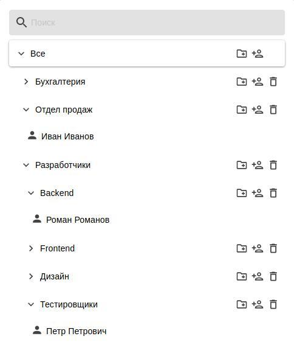

# Дерево пользователей

Пользователи могут быть организованы в группы. Уровень вложенности групп не ограничен. Дерево учетных записей пользователей доступно в разделе **Пользователи -&gt; Учетные записи**.

В Ideco UTM реализован принцип наследования, что позволяет легко задавать и изменять общие для пользователей параметры, определяя их для родительской группы, например, квоты или удаленный доступ по VPN. Принцип наследования очень удобен для выполнения операций управления, осуществляемых по отношению ко всем пользователям группы.

Пример дерева пользователей представлен ниже:

Пиктограмма пользователя может быть окрашена в разные цвета. В таблице ниже представлено описание каждого цвета пиктограммы пользователя:

| Состояние учетной записи пользователя | Описание |
| :---: | :--- |
|  | В данный момент времени пользователь прошел процедуру авторизации, и ему был предоставлен доступ в Интернет. |
|  | В [настройках пользователей](customization-of-users.md)  выбран запрет на авторизацию. |
|  | В данный момент времени пользователь не прошел процедуру авторизации, и ему не был предоставлен доступ в Интернет. |

