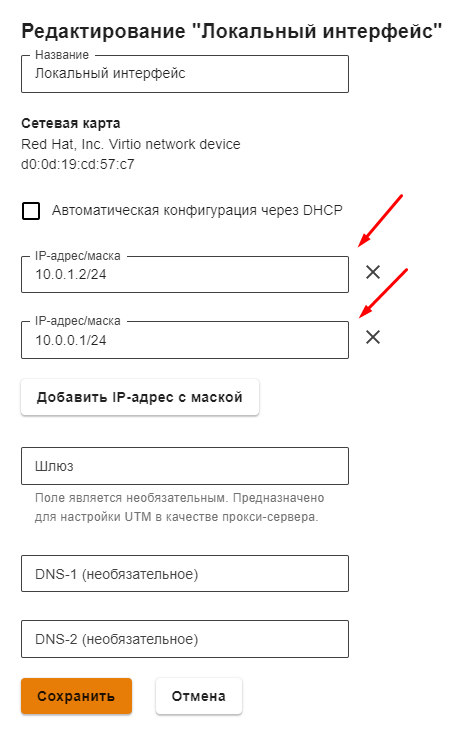
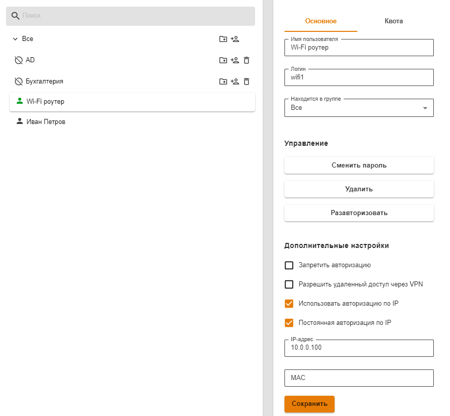

# Wi-Fi-сети

В текущей версии Ideco UTM не поддерживает Wi-Fi адаптеры. Для работы беспроводных клиентов необходимо использовать специальные беспроводные точки доступа или Wi-Fi-маршрутизаторы.

Для выхода в Интернет пользователей, подключающихся по Wi-Fi, необходима их авторизация на UTM или авторизация Wi-Fi роутера - это зависит от режима работы устройства, раздающего Wi-Fi.

## Режим точки доступа \(bridge\)

В данном режиме устройство Wi-Fi предоставляет возможность беспроводным клиентам подключаться к локальной сети.

Для этого необходимо индивидуально авторизовать всех беспроводных клиентов на Ideco UTM. Как правило, проще всего сделать это с помощью авторизации по IP. Воспользуйтесь следующими рекомендациями по настройке:

* Настройте раздачу по DHCP определенного диапазона IP-адресов клиентам, подключающимся беспроводным способом. Для настройки DHCP-сервера перейдите в соответствующий [раздел](../servisy/dhcp.md) документации.
* Желательно использовать отдельную логическую сеть для клиентов Wi-Fi. При этом, на локальный интерфейс Ideco UTM нужно добавить IP-адрес, служащий шлюзом для данной сети. 
* С помощью [группового добавления пользователей](user-management.md) с авторизацией по IP создайте группу пользователей из всего диапазона адресов, выделенного для Wi-Fi сети или настройте автоматическое создание пользователей из выдаваемого устройствам диапазона IP\_адресов.
* С помощью [контент-фильтра](../pravila-dostupa/kontent-filtr/) и [файрвола](../pravila-dostupa/fairvol.md) настройте необходимые ограничения для пользователей Wi-Fi.
* В файрволе, при необходимости, вы можете запретить доступ из беспроводной сети в локальную сеть.

Пример настройки интерфейса для клиентов, подключающихся по Wi-Fi представлен на скриншоте ниже:

* **10.0.1.2/24** - шлюз для беспроводной Wi-Fi сети;
* **10.0.0.1/24** - шлюз для локальной Ethernet-сети.

При необходимости индивидуальной авторизации Wi-Fi пользователей \(учета трафика и статистики каждого конкретного пользователя устройств\) необходимо воспользоваться [авторизацией через веб-браузер](user-authorization/veb-avtorizaciya.md). При таком способе авторизации пользователей Ideco UTM будет учитывать каждого пользователя, подключившегося по Wi-Fi. Учтите этот момент при планировании лицензирования Ideco UTM.

## Режим роутера

В данном режиме устройство Wi-Fi скрывает за NAT устройства беспроводной сети. Таким образом для Ideco UTM достаточно будет авторизовать только точку доступа, как одного из пользователей.

Пример настройки пользователя в режиме роутера представлен на скриншоте ниже:

Общие ограничения [контент-фильтра](../pravila-dostupa/kontent-filtr/) и [файрвола](../pravila-dostupa/fairvol.md) для Wi-Fi сети необходимо применять к данному пользователю.

При этом способе авторизации Ideco UTM будет учитывать только точки доступа Wi-Fi в качестве лицензируемых пользователей.

