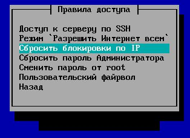

# Защита от bruteforce-атак

Интегрированный модуль fail2ban блокирует попытки злоумышленников подобрать пароль к сервисам SSH, веб-интерфейсу администратора, VPN-подключениям, SMTP, IMAP, POP3 и веб-почте.

После 6-ти неудачных попыток ввода пароля в течении 15 минут, IP-адрес подбирающего блокируется на 45 минут.

Модуль не настраивается в веб-интерфейсе.

Посмотреть логи работы службы можно в веб-интерфейсе во вкладке **Мониторинг &gt; Журналы &gt; Служба защиты от подбора паролей**. Либо в консоли сервера по адресу: /var/log/fail2ban/fail2ban.log

Сбросить блокировки можно из локального меню шлюза: Правила доступа &gt; Сбросить блокировки по IP

 \#\# Attachments:

 !\[\]\(images/icons/bullet\_blue.gif\) \[блокировки по IP.JPG\]\(attachments/11239447/11239446.jpg\) \(image/jpeg\)

