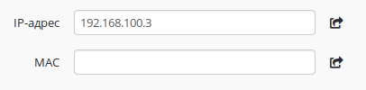
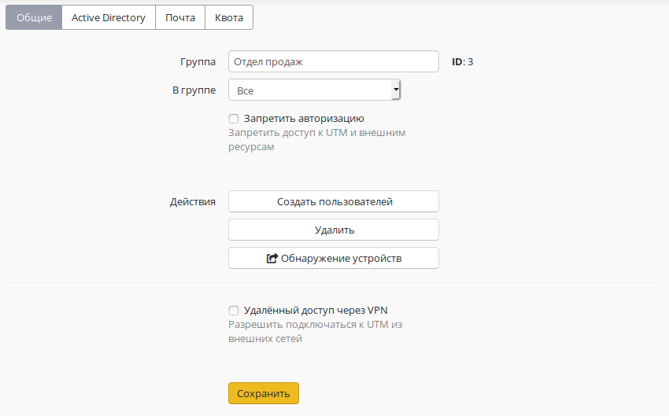
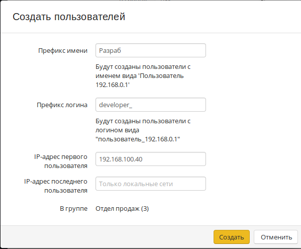
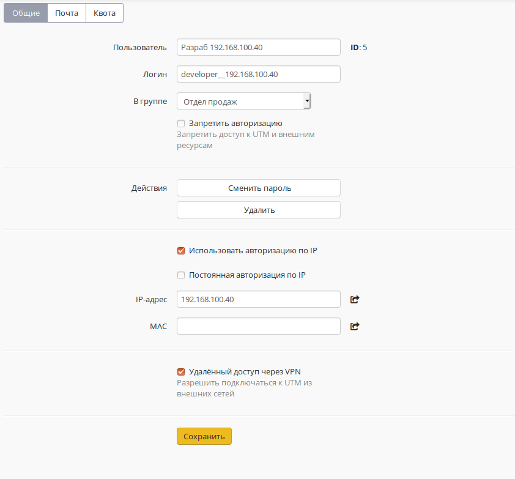

# Авторизация по IP-адресу

Данный тип авторизации предполагает, что авторизация устройства
пользователя будет осуществляться по его IP-адресу или
IP+MAC-адресу.

Чтобы включить авторизацию по IP-адресу для пользователя, перейдите в
общие настройки соответствующей учетной записи и включите авторизацию
по IP. Также необходимо назначить IP-адрес устройству, с которого
пользователь будет получать доступ в сеть Интернет. Это можно
сделать вручную или воспользоваться возможностью автоматического
назначения адреса из подсети основного локального интерфейса, нажав
на соответствующую кнопку в web-интерфейсе. Форма назначения IP-адреса
устройства представлена ниже.

Для включения дополнительной привязки по MAC-адресу его также необходимо
указать в соответствующем поле. Вы можете сделать это вручную или
автоматически. Учтите, что для автоматического получения
MAC-адреса сетевое устройство должно быть включено и находиться в
одном сетевом сегменте с UTM.

Вы можете воспользоваться [поиском устройств](./Обнаружение_устройств.md) для
автоматического создания пользователей при их попытке выхода в Интернет.

Под одним пользователем можно авторизовать только одно устройства по
IP-адресу (одновременно с данным типом авторизации можно авторизовать
еще два устройства любым другим методом авторизации).

### Добавление группы устройств с авторизацией по IP

Возможно добавление пользователей из диапазона IP-адресов (например,
сети, раздаваемой точками доступа беспроводным устройствам по
Wi-Fi).

Для этого нужно нажать кнопку "**Создать пользователей**" в нужной
группе в дереве пользователей.

Откроется окно с настройками создаваемых пользователей:

  - **Префикс имени**. Пользователи будут созданы с именем вида
    "Пользователь IP-адрес".
  - **Префикс логина.** Пользователи будут созданы с логином вида
    "user\_ip-адрес".
  - **IP-адрес первого и последнего пользователя.** Максимальное
    количество IP-адресов в диапазоне не должно превышать 1024.

В случае, если некоторые IP-адреса из диапазона уже используются другими
пользователями Ideco UTM, они будут пропущены при создании.

Пользователи будут созданы с настройками, наследуемыми от группы и
указанным IP-адресом:

## Attachments:

[c\_u\_013.png](attachments/1278073/1441869.png) (image/png)  

[batch-users-options.png](attachments/1278073/5472432.png) (image/png)  

[batch-user-creation-example.png](attachments/1278073/5472434.png)
(image/png)  

[Selection\_023.png](attachments/1278073/5472435.png) (image/png)  

[IP-авторизация.jpg](attachments/1278073/6587153.jpg)
(image/jpeg)  
 [Авто
назначение.png](attachments/1278073/11436157.png)
(image/png)  
 [Создать
пользователей.png](attachments/1278073/11436159.png)
(image/png)  

[Автосоздание.png](attachments/1278073/11436161.png)
(image/png)  
 [Созданный
пользователь.png](attachments/1278073/11436163.png)
(image/png)  

