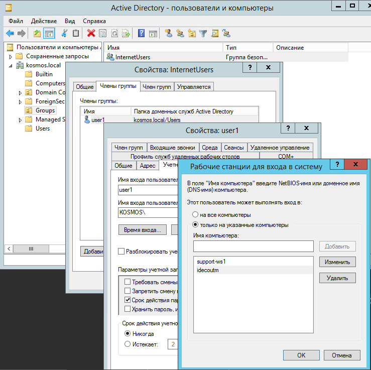

# Авторизация пользователей

  - [Настройка авторизации
    пользователей](#id-Авторизацияпользователей-Настройкаавторизациипользователей)
      - [Настройка Ideco
        UTM](#id-Авторизацияпользователей-НастройкаIdecoUTM)
      - [Настройка компьютеров пользователей и политик
        домена](#id-Авторизацияпользователей-Настройкакомпьютеровпользователейиполитикдомена)
          - [Авторизация по логам контроллера домена
            AD](#id-Авторизацияпользователей-АвторизацияпологамконтроллерадоменаAD)
          - [Веб-авторизация (SSO или
            NTLM)](#id-Авторизацияпользователей-Веб-авторизация\(SSOилиNTLM\))
  - [Настройка авторизации пользователей при прямых подключениях к
    прокси-серверу](#id-Авторизацияпользователей-Настройкаавторизациипользователейприпрямыхподключенияхкпрокси-серверу)
      - [Настройка браузера Mozilla Firefox для авторизации по NTLM при
        прямом подключении к прокси-северу на
        UTM](#id-Авторизацияпользователей-НастройкабраузераMozillaFirefoxдляавторизациипоNTLMприпрямомподключениикпрокси-северунаUTM)
  - [Возможные ошибки
    авторизации](#id-Авторизацияпользователей-Возможныеошибкиавторизации)

## Настройка авторизации пользователей

Для пользователей, импортированных из Active Directory, доступны все
[типы авторизации](./Типы_авторизации.md) пользователей. Наиболее часто
используемый вариант авторизации пользователей - **Single Sign-On
аутентификация через Active Directory** - с использованием
Kerberos/NTLM для авторизации через веб-браузер и логов контроллера
домена (рекомендуется одновременное использование обоих типов
авторизации). Необходимые настройки Ideco UTM и политик Active
Directory описаны в данной статье.

### Настройка Ideco UTM

  - Включите данный тип авторизации на вкладке **Сервисы -\> Авторизация
    пользователей -\> Включить веб-авторизацию -\> Single Sign-On
    аутентификация через Active Directory**. И нажмите кнопку
    "Сохранить".  
      
      
      

  - На вкладке Сервер - Active Directory - Установите флажок "Разрешить
    авторизацию по логам".  
      
    
    

### Настройка компьютеров пользователей и политик домена

#### Авторизация по логам контроллера домена AD

*Поддерживается начиная с версии контроллера домена 2008 standard
edition и UTM 7.6.*

Для работы авторизации по логам безопасности необходимо выполнить
настройку на основном контроллере домена:

  - В настройках брандмауэра Windows **на всех контроллерах домена (или
    доменов)** разрешить удаленный доступ к логам безопасности  
      
      
      

  - Добавить Ideco UTM в группу безопасности "Читатели журнала событий"
    ("Event Log Readers")  
      
      
      

  - После настройки доступа к логам, необходим **перезапуск службы
    авторизации по логам на Ideco UTM**, для этого снимите и снова
    установите флажок  "Разрешить авторизацию по логам", на вкладке
    Сервисы -\> Active Directory.

  - Если вы изменяли политики безопасности контроллеров домена
    по-сравнению со стандартными, то нужно включить логирование
    в политиках безопасности, нужно активировать следующий параметр:  
    Default Domain Controllers Policy -\> Computer
    Configuration-\>Policies-\>Windows Settings-\>Security Settings-\>
    Advanced Audit Policy Configuration -\> Audit Policies -\>
    Logon/Logoff -\> Audit Logon -\>Success

  - Также необходимо включить следующие параметры: \*\*Default Domain
    Controllers Policy -\> Computer Configuration-\>Policies-\>Windows
    Settings-\>Security Settings-\> Advanced Audit Policy Configuration
    -\> Audit Policies -\> Account login -\> "Аудит службы проверки
    подлинности Kerberos" и "Аудит операций билета службы керберос"
    -\>Success\*\*

  - Для обновления политик контроллеров доменов нужно выполнить
    команду:  
    gpupdate /force

  - Если авторизация пользователей при логине не происходит, нужно
    проверить в журнале безопасности наличие событий 4768, 4769,
    4624
    
      
      

#### Веб-авторизация (SSO или NTLM)

Для работы **авторизации через веб-браузер** (с использованием Kerberos
либо NTLM) необходима настройка Internet Explorer (остальные браузеры
подхватывают его настройки). Обязательно используйте эти настройки,
даже если обычно пользователи авторизуются по логам безопасности, в
некоторых случаях будет необходима их авторизация браузером: 

  - Зайдите в свойства браузера на вкладку "Безопасность".
  - Выберите "Местная интрасеть" и нажмите кнопку "Сайты".
  - В открывшемся окне нажмите кнопку "Дополнительно".
  - Добавьте в открывшемся окне ссылку на Ideco UTM под тем именем, под
    которым вы ввели его в домен. На примере: Ideco UTM введен в домен
    [example.ru](http://exemple.com) под именем idecoUTM.  
    Нужно указывать два URL: c http:// и с https://.

Также данную настройку можно сделать с помощью групповых политик Active
Directory сразу же для всех пользователей. В групповых политиках для
пользователей нужно настроить:

**Конфигурация пользователя - Политики - Административные шаблоны -
Компоненты Windows - Internet Explorer - Панель управления
браузером - Вкладка безопасность - Список назначений зоны для
веб-сайтов.**  
**Введите назначение зоны для DNS-имени Ideco UTM (в примере
[idecoUTM.example.ru](http://idecoics.exemple.ru)) значение 1
(интрасеть). Необходимо указать два значения, для схем работы
по http и https:**

**  
**

 

При заходе на HTTPS-сайт, для авторизации необходимо разрешить браузеру
доверять сертификату Ideco UTM (чтобы не делать это каждый раз, можно
добавить корневой сертификат Ideco UTM в доверенные корневые
сертификаты устройства. Например, с помощью [политик домена](./Настройка_фильтрации_HTTPS.md)). Можно использовать
[скрипты](./Скрипты_автоматической_авторизации_разавторизации.md) для
автоматической авторизации пользователей при логине.

Для браузера **Mozilla Firefox** в about:config требуются настроить два
параметра: **network.automatic-ntlm-auth.trusted-uris** и
**network.negotiate-auth.trusted-uris**, добавив в них адрес локального
интерфейса Ideco UTM (например
**[idecoUTM.example.ru](http://idecoics.example.ru)**).  
Параметр **security.enterprise\_roots.enabled** в значении true позволит
Firefox-у доверять системным сертификатом и авторизовать пользователей
при переходе на HTTPS-сайты.

Настройте about:config в firefox следущим образом:

    security.enterprise_roots.enabled = true
    network.automatic-ntlm-auth.trusted-uris = Доменное имя Ideco UTM в вашей сети, например idecoUTM.example.ru
    network.negotiate-auth.trusted-uris = Доменное имя Ideco UTM в вашей сети, например idecoUTM.example.ru

  
  

Также для пользователей, импортированных через AD, возможны все способы
авторизации:

  - [Авторизация через Ideco Agent](./Авторизация_через_Ideco_Agent.md) -
    подходит для авторизации пользователей терминальных серверов (с
    использованием Remote Desktop IP Virtualization на терминальном
    сервере).
  - [Авторизация по IP-адресу](./Авторизация_по_IP-адресу.md) - подходит в
    случае, если пользователи всегда работают с фиксированных
    IP-адресов. IP-адреса на UTM необходимо прописывать вручную
    каждому пользователю.
  - [Авторизация по PPTP](./Авторизация_по_PPTP.md) - если в сети
    предъявляются повышенные требования к конфиденциальности
    информации, передаваемой между шлюзом и устройствами пользователей,
    или используется слабо защищенный от перехвата трафика WiFi.

## Настройка авторизации пользователей при прямых подключениях к прокси-серверу

Настройка прозрачной авторизации пользователей при прямых подключениях к
прокси-серверу аналогична настройке прозрачной **Single Sign-On**
авторизации, описанной выше в инструкции.

Единственной особенностью является необходимость указания в качестве
адреса прокси-сервера **не IP-адреса Ideco UTM, а его DNS-имени**.

### Настройка браузера Mozilla Firefox для авторизации по NTLM при прямом подключении к прокси-северу на UTM

Для компьютеров, которые **не находятся в домене Active Directory**, в
случае необходимости их авторизации под доменным пользовательским
аккаунтом в браузере Firefox необходимы следующие его настройки:

на странице настроек браузера (about:config в адресной строке)
установите следующим параметрам значение ***false***:

    network.automatic-ntlm-auth.allow-proxies
    network.negotiate-auth.allow-proxies

Не отключайте данные опции для компьютеров, входящих в домен Active
Directory, т.к. в таком случае будет использоваться устаревший метод
авторизации по NTLM.

## Возможные ошибки авторизации

  - Если пользователь видит окно Internet Explorer с текстом "Для
    получения доступа требуется аутентификация" и авторизация
    происходит только при ручном переходе по ссылке на авторизацию,
    значит по каким-то причинам не происходит редирект в браузере на
    страницу авторизации (он может быть ограничен настройками
    безопасности браузера). Параметр "Активных сценариев" в
    Internet Explorer должен быть установлен в значение "Включить":  
    
  - Доменному пользователю должно быть разрешено авторизоваться на Ideco
    UTM (введенном в домен под выбранным при входе в домен именем), в
    случае, если вы ограничиваете возможность авторизации
    пользователей  избранными компьютерами.  
    
  - При авторизации по логам безопасности контроллера домена Active
    Directory пользователи будут авторизованы при попытке выхода в
    Интернет (любым трафиком), после их логина на компьютере.  
    Автоматической авторизации без прохождения трафика через UTM не
    происходит, т.к. используется конкурентная политика
    авторизации. При этом "лишние" лицензии заняты не будут.

## Attachments:

[ad-log01.png](attachments/6357001/6357051.png) (image/png)  

[ad-log02.png](attachments/6357001/6357052.png) (image/png)  
 [через
web.PNG](attachments/6357001/6357132.png) (image/png)  

[sso\_auth.png](attachments/6357001/6586892.png) (image/png)  

[sec\_log.png](attachments/6357001/6586899.png) (image/png)  
 [активные
сценарии.jpg](attachments/6357001/6586989.jpg) (image/jpeg)  

[allow-pc.png](attachments/6357001/7110786.png) (image/png)  
 [типы
авторизации.png](attachments/6357001/11436104.png)
(image/png)  
 [разрешить
логи.png](attachments/6357001/11436106.png) (image/png)  

[AD.png](attachments/6357001/11436107.png) (image/png)  

[image.png](attachments/6357001/17072221.png) (image/png)  
 [image2020-5-28
12:50:26.png](attachments/6357001/17072241.png) (image/png)  

