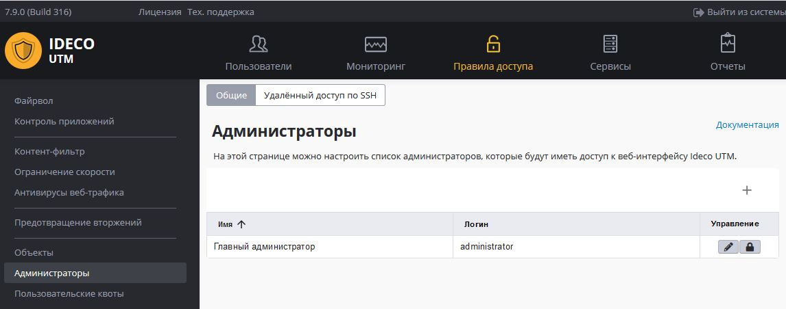

# Администраторы

Существует возможность задать учетные данные нескольких администраторов
сервера Ideco UTM, для доступа к веб-интерфейсам настроек.

Предустановленную запись администратора нельзя удалить, можно только
сменить ее данные - имя, логин, пароль.

Создать дополнительных администраторов сервера и управлять учетными
записями можно в разделе "Правила" - "Администраторы" - "Общие".

Добавить нового администратора можно нажав кнопку обозначенную знаком
"+".

## Attachments:

[administrator.JPG](attachments/1278056/11239439.jpg) (image/jpeg)  

