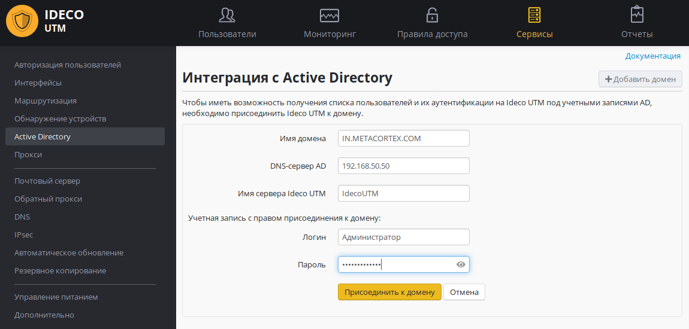
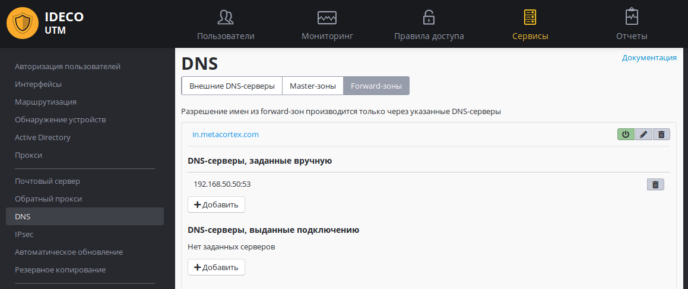

# Ввод сервера в домен

Перейдите на вкладку ***"Сервисы -\> Active Directory"**,* нажмите на
кнопку ***"Добавить домен"*** и заполните данные формы для ввода
сервера Ideco UTM в домен:

В качестве имени домена введите полное, а не сокращенное наименование
домена. DNS name домена, а не NetBIOS name: имя домена, а не
контроллера домена. Например: mydomain.example.

Логин/пароль пользователя с правом присоединения к домену не сохраняется
на сервере и используется один раз для присоединения к домену.
Пользователь может не быть администратором домена, но должен
обладать правами на присоединения компьютеров к домену.

DNS-сервер AD - сервер, обладающий ролью DNS-сервера в Active Directory
(как правило, один из контроллеров домена), доступный с локального
интерфейса Ideco UTM.

Внимание: хотя бы один контроллер домена должен находиться в локальной
сети Ideco UTM (или быть доступен через локальный интерфейс с помощью
настроенной маршрутизации).

Процесс присоединения к домену после нажатия одноименной кнопки может
занять некоторое время - от 30 секунд до 1 минуты.

Если вам не удалось ввести сервер в домен, создайте в настройках
DNS-сервера Forward-зону для вашего домена.

Возможно присоединение сервера к нескольким доменам Active Directory, с
некоторыми особенностями работы, описанными в статье.

## Настройка DNS для разрешения имен локального домена

**В Ideco UTM Forward-зона DNS создается автоматически при вводе сервера
в домен, и настраивать ее вручную нет необходимости.**

**Создавайте ее вручную только в случае, если вы по ошибке удалили
данную зону из настроек DNS-сервера или если у вас не получилось
присоединить сервер к домену.**

В настройках DNS-сервера на Ideco UTM для корректной работы
синхронизации пользователей и их авторизации на сервере
необходимо настроить разрешение имен локального домена. Для этого в
настройках DNS-сервера необходимо прописать Forward-зону и DNS-серверы
для нее (как правило, основной и резервные контроллеры домена).

 

В примере:

  - Имя зоны: in.metacortex.com - имя домена Active Directory.
  - 192.168.8.8 - IP-адрес контроллера домена.

При такой настройке компьютеры могут использовать Ideco UTM в качестве
основного DNS-сервера, при этом разрешение локальных и интернет-имен
будет работать корректно, в том числе и для всех сервисов
предоставляемых Active Directory.

## Attachments:

 [интеграция с
AD.png](attachments/6356997/11436087.png) (image/png)  
 [форвард зона для
AD.png](attachments/6356997/11436090.png) (image/png)  

