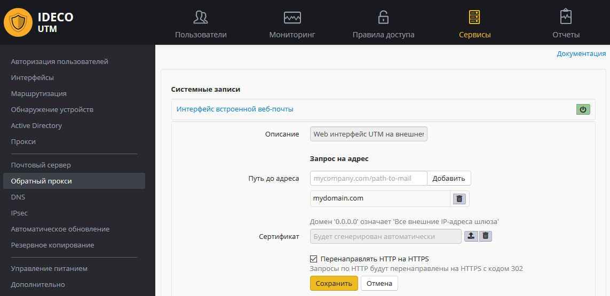
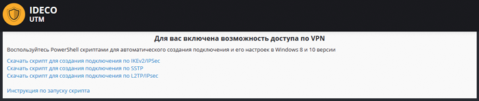

# Веб-кабинет пользователя

Для быстрой настройки пользовательских подключений вы можете включить
доступ к веб-интерфейсу Ideco UTM.

В личном кабинете, доступном по реквизитам учетных записей Ideco UTM
(локальных или доменных, в случае [интеграции с Active Directory](./Интеграция_с_Active_Directory.md)) пользователи смогут
скачать готовые PowerShell-скрипты для создания пользовательских
подключений и ссылку на
[инструкцию](./Инструкция_по_запуску_PowerShell-скриптов.md)
по настройке VPN и запуску скриптов.

Включить доступ из сети интернет к личному кабинету и веб-интерфейсу
администрирования Ideco UTM можно в модуле "Сервисы" - "Обратный
прокси" - "Системные записи".

Добавьте домен (только домен, без добавления URL) в "Путь до адреса" в
системную запись "Web интерфейс UTM на внешнем интерфейсе". А затем
включите эту запись.

Несколько минут может потребоваться для автоматического получения
сертификата в Let’s Encrypt. После чего можно будет заходить
через веб-браузер на настроенный вами домен.

При заходе под учетной записью пользователей (в т.ч. импортированных из
Active Directory) они получат возможность скачать скрипты создания
VPN-подключений и ссылку на инструкцию по их выполнению.

При заходе под учетными записями администраторов - они получат
возможность удаленного администрирования сервера Ideco UTM.

## Attachments:

[webcabinet.PNG](attachments/17072149/17072193.png) (image/png)  

[user\_vpn\_portal.png](attachments/17072149/17072195.png) (image/png)  

