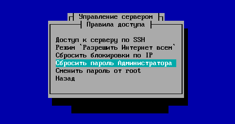
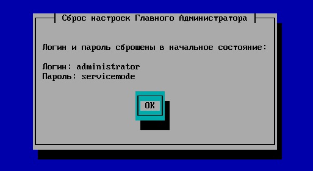

# Восстановление пароля администратора

# Как восстановить доступ к Ideco UTM, если не известны пароли от локальной консоли и веб-интерфейса

При утере пароля от локальной консоли и веб-интерфейса возможно
восстановить пароли, имея физический доступ к серверу.

Для этого нужно сделать следующее:

1.  После включения сервера, перед началом загрузки Ideco UTM, при
    появлении меню загрузчика GRUB с выбором ядра linux для
    загрузки системы, нажмите англоязычную клавишу ***"e"*** на
    клавиатуре.

2.  Далее ещё раз нажмите клавишу "e".

3.  Вам станет доступна правка параметров загрузки выбранного ядра.
    Допишите в конец существующего списка p=1.

4.  После внесения изменений нажмите "Enter", а затем на клавишу "b".
    Дождитесь загрузки системы и появления приглашения для ввода
    нового пароля суперпользователя root.

5.  Задайте новый пароль. После этого он будет изменён, и вы сможете
    входить в локальное меню по новому паролю.
    
    

    
    

    
    Обязательно задайте сложный пароль (длиной не менее 8-ми символов, с
    буквами и цифрами). Иначе злоумышленники могут получить доступ к
    вашему серверу.
    
    

    
    

6.  Для сброса пароля от веб-интерфейса необходимо в локальном меню
    перейти в раздел "Правила доступа" и выбрать пункт "Сбросить
    пароль Администратора".  
    

7.  Логин и пароль от веб-интерфейса будут сброшены в начальное
    состояние (логин: ***administrator***, пароль:
    ***servicemode***).  
    

8.  После авторизации **обязательно** смените пароль для входа в
    веб-интерфейс (см. раздел "Первоначальная
    настройка").

## Attachments:

[remotehelp2.png](attachments/1704031/1835057.png) (image/png)  

[remotehelp4.PNG](attachments/1704031/1835059.png) (image/png)  

[remotehelp5.PNG](attachments/1704031/1835060.png) (image/png)  

[password.PNG](attachments/1704031/4981172.png) (image/png)  

[1.png](attachments/1704031/10813442.png) (image/png)  

[2.png](attachments/1704031/10813443.png) (image/png)  

[3.png](attachments/1704031/10813444.png) (image/png)  

[4.png](attachments/1704031/10813445.png) (image/png)  

[5.png](attachments/1704031/10813448.png) (image/png)  

[6.png](attachments/1704031/10813449.png) (image/png)  

