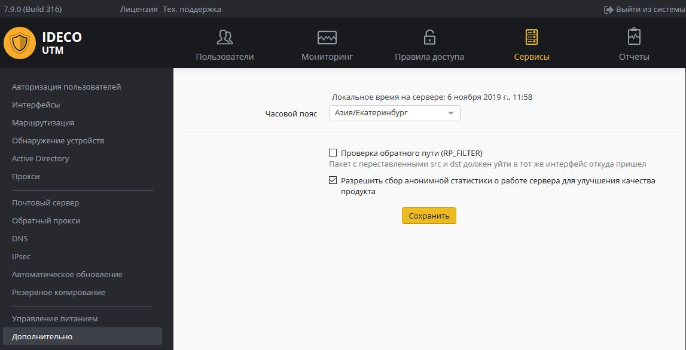

# Дополнительно

# Настройка дополнительных параметров работы сервера

Настройка осуществляется через веб-интерфейс в разделе **«Сервисы ➔
Дополнительно»**

  - **Часовой пояс** - установите верный часовой пояс для корректного
    сбора логов и статистики.
  - **Проверка обратного пути (RP\_FILTER)** - проверять обратный путь
    проходящих пакетов. Ответные пакеты должны направляться в тот же
    интерфейс, из которого поступил запрос.**  **
  - Разрешить сбор анонимной статистики о работе сервера для улучшения
    качества продукта - разрешает серверу отправлять информацию об
    используемых модулях. При этом не отправляется информация о
    пользователях, трафике проходящем через сервер, сетевых
    интерфейсах и идентификаторы сервера и лицензии.

 

 

 

 

## Attachments:

[sec\_param\_01\_ng.png](attachments/4981010/4981715.png) (image/png)  

[security.JPG](attachments/4981010/6357089.jpg) (image/jpeg)  

[1\_general\_settings.png](attachments/4981010/6586628.png)
(image/png)  

[fail2ban.png](attachments/4981010/6586939.png) (image/png)  

[advanced.JPG](attachments/4981010/8388617.jpg) (image/jpeg)  

[Дополнительно.JPG](attachments/4981010/11239441.jpg)
(image/jpeg)  
 [блокировки по
IP.JPG](attachments/4981010/11239442.jpg) (image/jpeg)  

