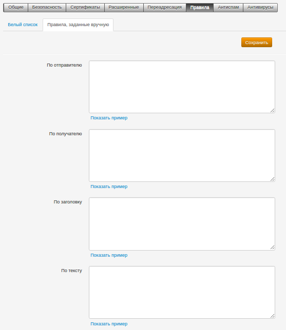
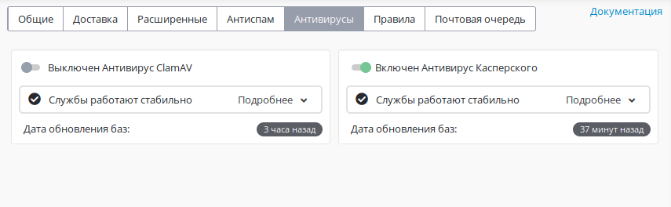
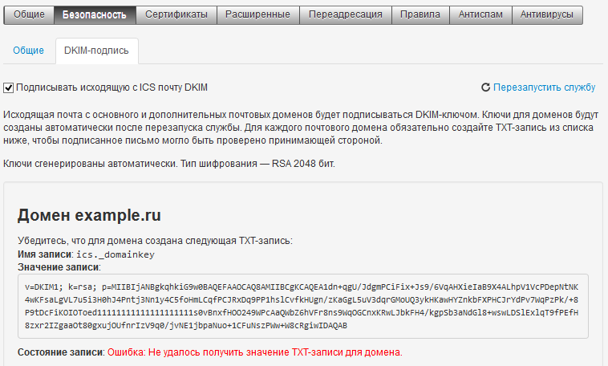

# Дополнительные возможности и антиспам

### Почтовые правила для ограничения почты

Перейдя в раздел ***Сервисы -\> Почтовый сервер -\> Правила -\> Правила,
заданные вручную***, вы увидите интерфейс написания регулярных выражения
(regexp) почтового сервера (в нашем случае postfix).

Для работы с почтовыми правилами необходимо знать, что такое регулярные
выражения:

**Регуля́рные выраже́ния** (англ. *regular expressions, regexp*) —
формальный язык поиска и осуществления манипуляций с подстроками в
тексте, основанный на использовании метасимволов. По сути, это
строка-образец (англ. *pattern*, по-русски её часто называют
«шаблоном», «маской»), состоящая из символов и метасимволов и
задающая правило поиска.

В нашем случае, при помощи регулярных выражений мы находим в письмах
интересующие нас слова или символы, после чего разрешаем или
запрещаем такую почту.

В Ideco UTM мы предоставляем интерфейс для написания регулярных
выражений с парой простейших примеров. Составление регулярных
выражений - это обязанность администратора.
Техническая поддержка не консультирует
пользователей по этим вопросам.

Regexp можно написать:

1.  По адресу отправителя.
2.  По адресу получателя.
3.  По заголовку письма.
4.  По тексту письма.

Однако, фактически regexp стоит писать только с использованием латинских
символов и цифр, поскольку используется кодировка ASCII, поэтому
почтовые правила будут эффективны только в ограничении доменов и
почтовых адресов. В качестве контент-фильтрации по ключевым словам из
кириллических символов они будут неэффективны.

Рекомендуем ориентироваться на руководство по regexp:
<http://www.postfix.org/regexp_table.5.html>

### Глобальные списки доступа (черный/белый)

В составе Ideco UTM действует ряд антиспам-фильтров на разных стадиях
обработки входящих писем по протоколу SMTP:

  - Предварительный Высокоэффективный фильтр **postscreen**. Работает на
    стадии создания подключения к нашему почтовому серверу другими
    почтовыми серверами из интернета.  
    На этой стадии ведутся проверки удаленных серверов на их присутствие
    в списках DNSBL и фильтруются подключения, нарушающие протокол SMTP
    (быстрая посылка команд, неверные команды и т.д.).
  - Фильтры и проверки на соблюдение прокола SMTP почтового
    сервера **postfix** (проверка адреса отправителя и
    получателя, правильность заголовков письма и того, как
    представился удаленный почтовый сервер).
  - Почтовые фильтры (мильтры), такие как грейлистинг, антиспам
    Касперского, DKIM-сервер.

В совокупности перечисленные методы борьбы со спамом осуществляют
надежное и эффективное исключение нежелательных писем из
переписки ваших клиентов. Но могут возникать и *ложные
срабатывания*, когда легитимное письмо (отправитель или сервер
отправителя) были приняты нашим сервером за спам. Мы делаем упор на
минимизацию возможности ложных срабатываний в нашем почтовом сервере
в ущерб проникновению особо тонких спам-техник, поэтому большого
количества ложных срабатываний ожидать не стоит.

Но все же, если такое случится, мы предусмотрели возможность исключения
адресов или серверов клиентов из всех вышеперечисленных спам-фильтров.
Для этого занесите IP-адрес почтового сервера отправителя (как правило
на него указывает MX-запись домена отправителя) или доменное имя
отправителя в белый список в разделе ***"Сервисы -\> Почтовый
сервер -\> Правила -\> Белый список"***. На фрагменте ниже показан
пример добавления адресов отправителей в белый список. На них не будут
действовать проверки на спам, поэтому заносите в этот список только
отправителей, которым вы действительно доверяете.

Помимо единого белого списка для почтового сервера и связанных с ним
антиспам служб, есть возможность настраивать черный список для
почты.Оба списка для контроля доступа находятся в разделе Сервисы
-\> Почтовый сервер -\> Правила.Таким образом можно контролировать
списки доступа (ACL) для почтового сервера, приоритетно разрешая
прием от определенных источников почты, или блокировать входящие
письма от других источников.

Источниками в обоих списках доступа могут выступать:- IP-адрес сервера
отправителя. Это адрес того SMTP-сервера, который непосредственно
отправляет письмо на UTM из Интернет по SMTP. Как правило,
MX-запись домена указывает на этот хост. В случае с почтовыми
распределенными сетями (CDN), IP-адрес SMTP-сервера меняется каждый
раз при отправке нового письма, даже если адрес отправителя остался
прежним. Пример почтовых CDN: gmail.com,
accountprotection.microsoft.com.- Домен отправителя письма. Например:
yandex.ru, gmail.com, mail.ru.- Почтовый адрес (ящик) отправителя.
Например admin@ideco.ru, hr@pinguem.ru.

Возможности указывать IP-сети и диапазоны IP-адресов нет.Маски
(\*.domain.ru) и домены первого уровня (.ru) не поддерживаются.Почтовый
адрес указывать не рекомендуется, так как в анализе писем по протоколу
SMTP он находится на одной из верхних стадий, легко подделывается
удаленной стороной и, в целом, эксперты не рекомендуют принимать
решение о блокировке/разрешении почтовой транзакции по почтовому адресу
отправителя.Рекомендуется оперировать IP-адресами почтовых клиентов или
их доменами.

На фрагментах ниже показан пример добавления адресов отправителей в
белый и черный списки.На источники в белом списке не будут
действовать проверки на спам, поэтому заносите в этот список
только отправителей, которым вы действительно доверяете.Обратите
внимание, что в черный список внесен домен, отправитель из которого
приоритетно разрешен в белом списке.В таком случае почта на UTM будет
приходить только от этого отправителя, а от остальных отправителей в
этом домене - блокироваться.Для сохранения изменений в каждом из
списков нужно нажать кнопку Сохранить. Изменения вступают в силу
сразу, не требуя перезапуска почтовой службы.

  

При занесении одинаковых источников в белый и черный списки (два
одинаковых IP или почтовых адреса), белый список имеет приоритет
над черным списком, и письма от источника будут разрешены и приняты
почтовым сервером.

При занесении пересекающихся источников в оба списка корреляции между
источниками не происходит. Приоритет будет отдан сначала IP-адресам,
затем ящикам и затем доменам.  
Т.е. если запрещен IP-адрес почтового сервера и разрешен домен, который
он обслуживает, то письма от него будут блокироваться (блокировка по
IP-адресу имеет приоритет). Обратный пример: Разрешен IP-адрес, но
запрещен домен. Письма блокируются, просто на более поздней
стадии, при проверке почтового домена.  
Другой пример: в белый список внесен домен, в черный внесен ящик из
этого домена. Письма с ящика будут заблокированы. Обратный пример:
письма от ящика, занесенного в белый список, будут разрешены даже если
домен, которому принадлежит ящик, занесен в черный список.

Схема обработки писем в почтовом сервере представлена в статье [Схема фильтрации почтового трафика](./Схема_фильтрации_почтового_трафика.md).  
Обратите внимание, что **Черный** и **Белый** списки срабатывают после
нескольких предварительных этапов фильтрации.

### Антиспам Касперского

На вкладке активируется и запускается "Антиспам Касперского".
Единственный коммерческий антиспам в составе нашего продукта.
Активируется ключом, который можно получить в отделе продаж нашей
компании вместе с лицензией на антиспам. Базы обновляются
несколько раз в день. Детальная настройка антиспама не
предусмотрена. Модуль предварительно сконфигурирован нашими
специалистами для оптимальной работы с почтовым сервером и для
большинства типичных конфигураций почтового сервера. Если
почтовый сервер работает в режиме SMTP-релея, то вся входящая
транзитная корреспонденция так же проверяется модулем.

### Антивирусы для почтового трафика

В составе сервера доступны два антивируса: 

Некоммерческий open-source антивирус ***Clamav***. Базы обновляются
несколько раз в день. 

***Антивирус***** Касперского**, предоставляемый на коммерческой основе.
Приобрести лицензию на его использование можно в отделе продаж нашей
компании. Базы также обновляются несколько раз в день. 

Оба антивируса проверяют входящую корреспонденцию как в обычном режиме
работы почтового сервера, так и в режиме SMTP-релея.

### DKIM-подпись

Настраивается в разделе ***"Сервисы -\> Почтовый сервер -\> Безопасность
-\> DKIM-подпись"***. Подписывает исходящую с сервера корреспонденцию
уникальной для вашего почтового домена подписью так, что другие
почтовые серверы в Интернет могут убедиться, что ваша почта
легитимна и заслуживает доверия. Для функционирования технологии
вам потребуется создать TXT запись для вашего домена у держателя зоны
со значением, которое сформирует для вашего почтового домена наш
сервер. TXT записи будут сформированы для основного почтового
домена, настроенного на UTM, и дополнительных почтовых доменов
(если указаны). Сервер также проверит, правильно ли была указана
запись для вашей зоны и резолвится ли она в Интернет.

Объем TXT-записи достаточно велик и многие регистраторы/держатели зон
испытывают сложности с предоставлением интерфейса клиентам для
указания TXT-записей длиннее 256 символов. Зачастую они
предоставляют возможность указания TXT-записей длиной до 256
символов согласно стандарту RFC1035. Но другой стандарт, RFC4408,
предполагает объединение строк в случаях, когда нужно использовать
длинные TXT-записи при настройки SPF и DKIM. Оперируйте этой
информацией в диалоге с держателем вашей доменной зоны. Как
правило, держатели зон находят способ создания длинных TXT записей.

### Проверка настроек почтового сервера

Рекомендуется проверить корректность всех настроек DNS и почтового
сервера с помощью сервиса: mail-tester.com

При правильной настройке почтовый сервер на Ideco UTM должен получить 10
баллов из 10.

## Attachments:

[mail\_regexp\_rules.png](attachments/4982675/4982668.png) (image/png)  

[whitelist.png](attachments/4982675/4982670.png) (image/png)  

[mail\_antispam.png](attachments/4982675/4982671.png) (image/png)  

[mail\_av.png](attachments/4982675/4982672.png) (image/png)  

[dkim.png](attachments/4982675/4982673.png) (image/png)  

[acl002.png](attachments/4982675/6062192.png) (image/png)  

[mail\_n.png](attachments/4982675/6357068.png) (image/png)  

[Антивирус(новый).png](attachments/4982675/11239432.png)
(image/png)  

[Антиспам(новый).png](attachments/4982675/11239433.png)
(image/png)  

[Антивирус(новый).png](attachments/4982675/11239435.png)
(image/png)  

[Антиспам(новый).png](attachments/4982675/11239434.png)
(image/png)  

[Антиспам(новый).png](attachments/4982675/11239431.png)
(image/png)  

[Антивирус(новый).png](attachments/4982675/11239430.png)
(image/png)  

