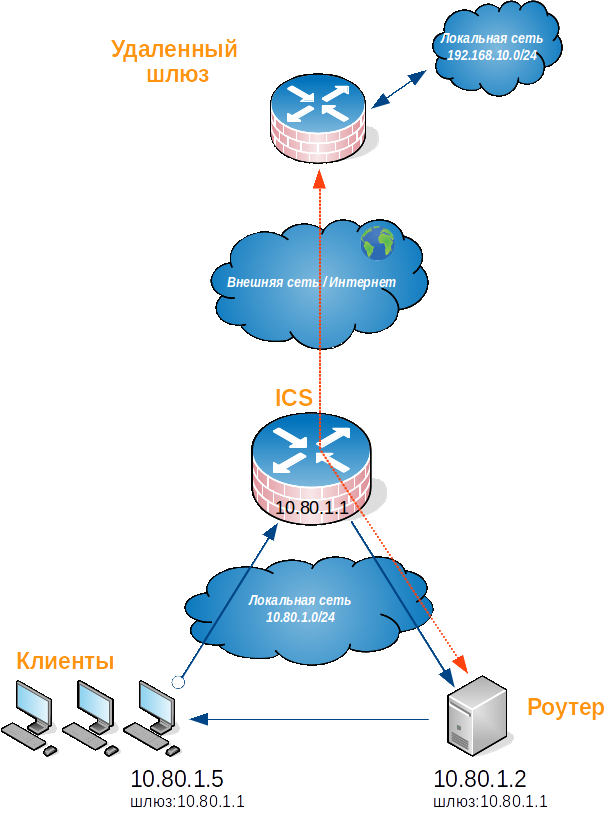
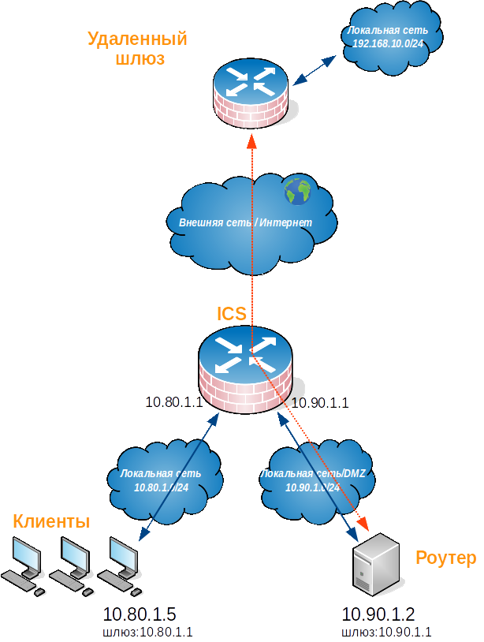
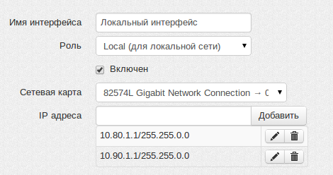

# Доступ в удаленные сети через роутер в локальной сети

## Избавление от непосредственной маршрутизации м/у роутером и хостами локальной сети.

Допустим, в локальной сети UTM есть роутер устанавливающий связь с
другими сетями (часто с помощью туннеля). UTM является шлюзом по
умолчанию для клиентов сети. Вы хотите настроить маршрутизацию на UTM
так чтобы клиенты получали доступ в удаленную сеть через роутер. Роутер
и клиенты локальной сети UTM должны быть в разном адресном пространстве
иначе возникнет эффект асимметричной маршрутизации при которой часть
трафика от клиентов до роутера пойдет через шлюз а часть будет идти
непосредственно от роутера абонентам сети. Разная маршрутизация на
разных участках прохождения трафика сделает прохождение пакетов
между двумя локальными сетями невозможной.

Рассмотрим ситуацию, в которой UTM является шлюзом для локальной сети
10.80.1.0/16. В этой сети есть роутер с адресом 10.80.1.2, который имеет
доступ в удаленную сеть 192.168.10.0/24. Требуется обеспечить доступ
хостов сети 10.80.1.0/16 в сеть 192.168.10.0/14 и обратно. Вариант
неправильной топологии подобной сети, при которой возникает
непосредственная или асимметричная маршрутизация м/у роутером
и клиентами локальной сети, показан ниже.

Оранжевым показана двусторонняя связь роутера с удаленным шлюзом (или
тоже роутером) посредством которой обеспечивается доступ к удаленной
сети 192.168.10.0/24. Это может быть туннель к шлюзу расположенному в
Интернет или маршрут до роутера в соседнюю сеть предприятия.

Синими стрелками показаны участки прохождения трафика от хостов
локальной сети UTM (10.80.1.0/16) идущие в удаленную сеть
(192.168.10.0/24) через UTM (10.80.1.1), затем через роутер (10.80.1.2),
и участок возвращаемого хостам локальной сети трафика непосредственно от
роутера минуя UTM, что приводит к непринятию такого трафика хостами
локальной сети.

Для того чтобы эта схема работала, надо вынести роутер в отдельную
локальную сеть (DMZ), чтобы избежать непосредственной
маршрутизации между роутером и клиентами локальной сети.
Чтобы настроить DMZ на UTM - нужно добавить еще один IP-адрес на
локальный интерфейс UTM (10.90.1.0/16) к локальной сети которого
подключен роутер. На роутере настроить IP-адрес из адресного
пространтсва новой сети (10.90.1.2), шлюзом указать
дополнительный IP-адрес настроенный на локальном интерфейсе
UTM из этой сети (10.90.1.1). Физически роутер и клиенты локальной сети
будут находиться в одном сегменте, имея при этом разную адресацию и
шлюзы.

Можно поступить иначе и физически изолировать локальную сеть клиентов
UTM и роутер, подключив к Ideco дополнительную сетевую карту, настроив
на ее основе дополнительный локальный интерфейс, настроить отдельную
адресацию в этой сети. Шлюзом для роутера будет являться адрес
настроенный на дополнительном локальном интерфейсе, физически
роутер будет находиться в сегменте дополнительной сетевой карты. Но
как правило схемы с виртуальной изоляцией сетей на основе одного
физического интерфейса достаточно.

Топология сети после организации DMZ на основе создания дополнительной
сети (10.90.1.0/16) на локальном интерфейсе UTM проиллюстрирована
ниже.

## Необходимые настройки на UTM

Несколько виртуальных локальных сетей на одном физическом локальном
интерфейсе UTM выглядят как показано ниже. 

Изолировав роутер в DMZ все готово для указания маршрута на UTM до
удаленной сети за роутером.  
Локальная сеть клиентов имеет адресацию 10.80.1.0/16, адрес роутера в
DMZ - 10.90.1.2, а удаленная сеть к которой роутер имеет доступ имеет
адресацию 192.168.10.0/24. В таком случае маршрут на UTM будет
следущим:

  - DST сеть (назначение) : 192.168.10.0/24
  - Шлюз: 10.90.1.2

Или в виде однострочной записи для локального меню UTM:

> `192.168.10.0/24 10.90.1.2`

При желании можно добавить SRC сеть (источник), в нашем случае
"10.80.1.0/16", но не обязательно. Теперь трафик между сетями UTM
(10.80.1.0/16) и 192.168.10.0/24 во всех направлениях будет идти через
UTM и роутер. Непосредственной маршрутизации ни на одном участке
прохождения пакетов по маршруту не случится.

Всегда избегайте указания сети 0.0.0.0/0 в маршрутах.

## Настройки на клиентских машинах

Хосты сетей которые теперь обслуживает UTM (10.80.1.0/16 и 10.90.1.0/16)
физически включены в один ethernet-сегмент обслуживаемый этим локальным
интерфейсом. Шлюзом и DNS-сервером для хостов этих сетей является
соответствующий своей сети адрес на локальном интерфейсе UTM.
Например, для хоста с адресом 10.80.1.10 шлюзом и DNS будет
являться 10.80.1.1, а для хоста с адресом 10.90.1.15 шлюзом и
DNS будет являться 10.90.1.1.

При добавлении новых локальных сетей (например, 192.168.0.0/24), на
Ideco необходимо добавлять адрес этой сети на существующий или новый
локальный интерфейс (например, 192.168.1.1). Этот адрес будет
являться шлюзом и DNS-сервером для сетевых устройств из этого
адресного пространства (например, для хоста с адресом 192.168.1.10).

## Attachments:

[triangle\_routing\_01.png](attachments/2261350/2424922.png)
(image/png)  

[triangle\_routing\_02.png](attachments/2261350/2424923.png)
(image/png)  

[triangle\_routing\_03.png](attachments/2261350/2424924.png)
(image/png)  

